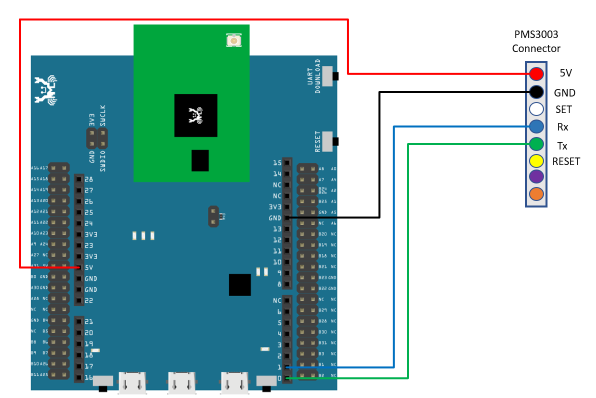
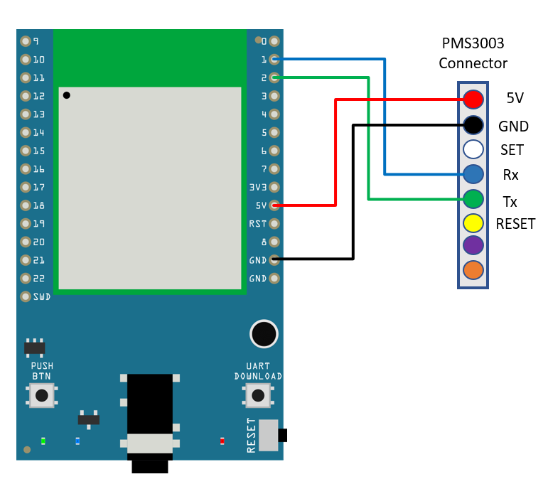
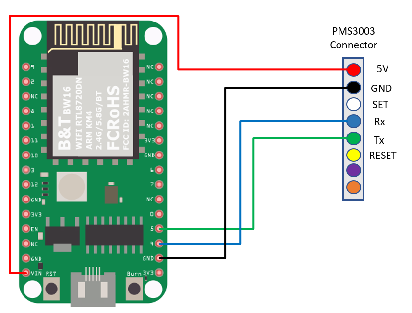
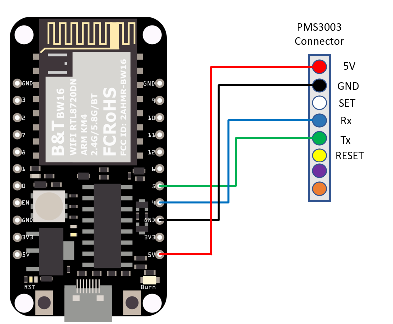
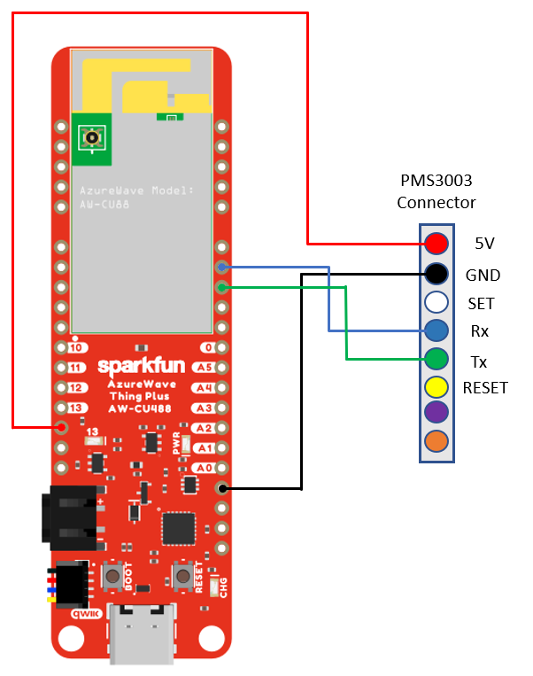
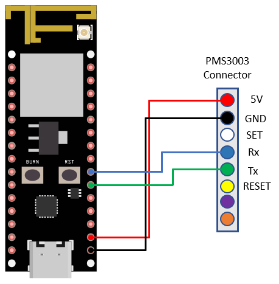
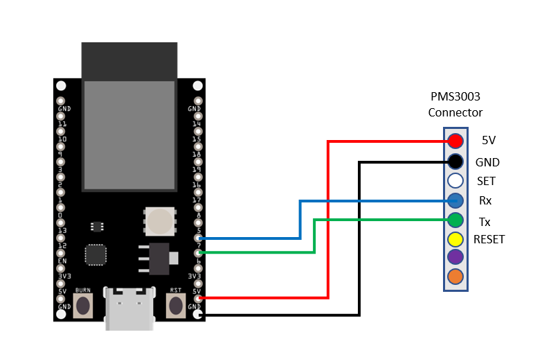
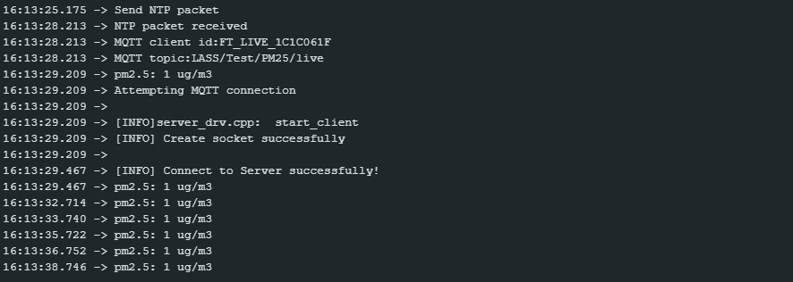
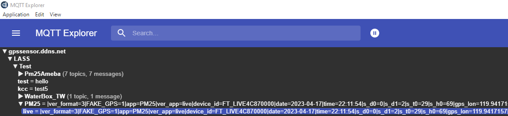

MQTT - Upload PM2.5 Data to LASS System
=======================================

.. contents::
  :local:
  :depth: 2

Materials
---------

- AmebaD [AMB21 / AMB22 / AMB23 / AMB25 / AMB26 / BW16 / AW-CU488 Thing Plus] x 1
- PlanTower PMS3003 or PMS5003 x1

Example
-------

**Introduction**
~~~~~~~~~~~~~~~~

The LASS stands for “Location Aware Sensor System”. It is an open project and was started only for the interest of public welfare. 

Practically, LASS is based on MQTT protocol to collect all kinds of uploaded data, and for those who need these data can subscribe top as well.

In this example, we use applications mentioned at our website, including:

- MQTT: a MQTT-Broker to connect to LASS. The Client is “FT1_0XXXX”, the XXXX are the four last digits of Ameba's Wi-Fi MAC, and the outTopic is “LASS/Test/Pm25Ameba/clientID“, where clientID is the actual Ameba’s MQTT client ID.

- NTP: uploaded data must have time notation

- PM2.5: uploaded data includes PM2.5 information

**Procedure**
~~~~~~~~~~~~~

Open the example. ``“File” → “Examples” → “AmebaMQTTClient” → “lass_basic”``

LASS requires GPS information. There is no GPS sensor included in this example, so you must manually provide GPS information. Use Google Map to find the coordinates of where you plan to place your Ameba. You can see in this example that the latitude is 24.7814033, and the longitude is 120.9933676

|image01|

Fill in GPS info at gps_lat and gps_lon.
Then connect sensors according to UART-PlanTower PMS3003 wiring example.

.. only:: amb21

**AMB21 / AMB22** Wiring Diagram:
  
|image02|

.. only:: end amb21

.. only:: amb23

**AMB23** Wiring Diagram:

|image03|

.. only:: end amb23

.. only:: bw16-typeb

**BW16** Wiring Diagram:

|image04|

.. only:: end bw16-typeb

.. only:: bw16-typec

**BW16-TypeC** Wiring Diagram:

|image05|

.. only:: end bw16-typec

.. only:: aw-cu488

**AW-CU488 Thing Plus** Wiring Diagram:

|image06|

.. only:: end aw-cu488

.. only:: amb25

**AMB25** Wiring Diagram:

|image07|

.. only:: end amb25

.. only:: amb26

**AMB26** Wiring Diagram:

|image08|

.. only:: end amb26

Compile the code and upload it to Ameba. After pressing the Reset button, Ameba will attempt to read PM2.5 data every minute and upload it to LASS MQTT-Broker.
Open Serial Monitor to see the uploaded data, including client id, topic, and current PM2.5 status.

|image09|

We can also use “MQTT Explorer” to verify if the data is properly uploaded.

Enter “gpssensor.ddns.net” as the MQTT-Broker server and “LASS/Test/PM25/live” as the subscribe topic to receive data.

The time uses UTC format, and the PM2.5 data stores in s_d0. In the figure, s_d0 = 9 represents that the PM2.5 is 9, meaning that the entire publish/ subscribe process is working successfully.

|image10|

.. |image01| image:: ../../../../_static/amebad/Example_Guides/MQTT/MQTT_Upload_PM2.5_Data_To_LASS_System/image01.png
   :width: 959
   :height: 668
   :scale: 80%

