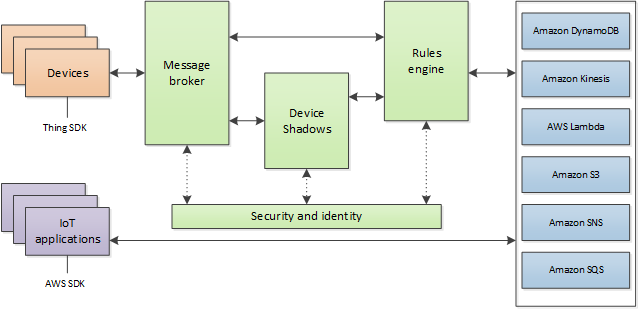

MQTT - Use Amazon AWS IoT Shadow Service
========================================

.. contents::
  :local:
  :depth: 2

Materials
---------

- AmebaD [AMB21 / AMB22 / AMB23 / AMB25 / AMB26 / BW16 / AW-CU488 Thing Plus] x 1

Example
-------

**Introduction**
~~~~~~~~~~~~~~~~

Amazon AWS IoT provides cloud services and device support that you can use to implement IoT solutions. AWS provides many cloud services to support IoT-based applications.
AWS IoT Core provides the services that connect your IoT devices to the AWS Cloud so that other cloud services and applications can interact with your internet-connected devices.

|image01|

(Picture from https://docs.aws.amazon.com/iot/latest/developerguide/aws-iot-how-it-works.html )
In the architecture, Ameba belongs to the upper-left “Things” block. A TLS secure channel will be established between “Things” and the MQTT Message Broker. Afterwards, “Things” and “Message Broker” communicate using MQTT Protocol via this secure channel. Behind the “Message Broker”, the “Thing Shadows” keeps messages temporarily when Ameba is offline and sends the control message to Ameba next time it is connected. The “Rules Engine” allows you to place restrictions to the behaviour of Things or to connect Things to other services of Amazon.

**AWS IoT Core setting**

First, create an account and sign up for AWS IoT service: https://aws.amazon.com/iot-core/. Afterwards, log in to the Amazon Management Console and click “IoT Core” found under services -> Internet of Things. Then select a nearby region. The is a Get Started online documents to refer for details. Note that the following steps needs to be done.

- Create thing. Use “ameba” as the thing name. Add “attribute”, use “led” as name and “0” as value. 

- Create policy. Use “amebaPolicy” as name, “iot:*” as action, and “*” as resource ARN.

- Create TLS certificate. Record “public keys”, “private key”, “certificate” and “root CA”.

- After active, attach Policy and Thing.

Find out the information of Rest API Endpoint to set Amazon Alexa:

- REST API endpoint: 
  
  -	For example, in the value “https://a1a7oo4baosgyy.iot.us-east-1.amazonaws.com/things/ameba/shadow”, the part “a1a7oo4baosgyy.iot.us-east-1.amazonaws.com” is the MQTT Broker server address.

- MQTT topic: 
  
  -	For example, the value “$aws/things/ameba/shadow/update” represents the MQTT topic we will use in the AWS IoT Shadow service (if we use MQTT only, without AWS IoT Shadow service, then we can specify other topic name). It is recommended to use “$aws/things/ameba/shadow/update” here.

**Ameba setting**

Open “File” → “Examples” → “AmebaMQTTClient” → “Amazon_AWS_IoT_Basic”

In the sample code, 
- Setup the WiFi network SSID and Password.

- “Thing_Name” set as “ameba”.

- “mqttServer” set as the MQTT broker server address found earlier in AWS IoT.

- “rootCABuff” set as the recorded “root CA”.

- “certificate”. Fill in the recorded certificate (i.e., client certificate), usually its file name ends with “-certificate.pem.crt” (e.g., “efae24a533-certificate.pem.crt”). Open the certificate with a text editor, and adjust its format as follows to use in the sketch:

  -	Add the new line character “\n” at the end of each line.
  
  -	Add double-quote at the beginning and the end of each line.
 
  -	To concatenate each line as a string, add “\” at the end of each line.
  
  -	The last line ends with semicolon.

- “privateKeyBuff”. Adjust the format of the “private key” in the same way as certificate.

**Compile and run**

Upload the code and press the reset button on Ameba once the upload is complete.
Open the serial monitor in the Arduino IDE and observe as Ameba connects to the AWS IoT server and sends updates on the LED state variable.

|image02|

**Alternatives**

Ameba can also retrieve the current LED status variable from the AWS shadow. This is done by sending a message to the “shadow/get” topic. Refer to the Amazon_AWS_IoT_with_ACK example code for more information.

Code Reference
--------------

Change led state:
In this example, we use GPIO interface to control the led. We set led_pin to 10 and led_state to 1 by default in the sample code.

.. code-block:: c++

  pinMode(led_pin, OUTPUT);

  digitalWrite(led_pin, led_state);

Set up certificate:
Note that we use the WiFiSSLClient type of wifiClient.

.. code-block:: c++

  WiFiSSLClient wifiClient;

WiFiSSLClient inherits Client, so it can be passed as the parameter of PubSubClient constructor.
Next, set up TLS certificate required in connection.

.. code-block:: c++

  wifiClient.setRootCA((unsigned char*)rootCABuff);

  wifiClient.setClientCertificate((unsigned char*)certificateBuff, (unsigned char*)privateKeyBuff);

Configure MQTT Broker server
Then MQTT PubClient set MQTT Broker server to connect

.. code-block:: c++

  client.setServer(mqttServer, 8883);
  
  client.setCallback(callback);

Connect to MQTT Broker server:
In loop(), call reconnect() function and try to connect to MQTT Broker server and do the certificate verification.

.. code-block:: c++

  while (!client.connected()) {

Subscribe & Publish
Next, subscribe to topics.

.. code-block:: c++

  for (int i=0; i<5; i++) {

  client.subscribe(subscribeTopic[i]);

  }

There are some common topics:
“$aws/things/ameba/shadow/update/accepted”,

“$aws/things/ameba/shadow/update/rejected”,

“$aws/things/ameba/shadow/update/delta”,

“$aws/things/ameba/shadow/get/accepted”,

“$aws/things/ameba/shadow/get/rejected”

Related documentation:
https://docs.aws.amazon.com/iot/latest/developerguide/what-is-aws-iot.html 

Then publish current status:

.. code-block:: c++

  sprintf(publishPayload, "{\"state\":{\"reported\":{\"led\":%d}},\"clientToken\":\"%s\"}", led_state, clientId);
  
  client.publish(publishTopic, publishPayload);

Listen to topic and make response:
In the callback function, we listen to the 5 subscribed topics and check if there are messages of “/shadow/get/accepted”:

.. code-block:: c++

  if (strstr(topic, "/shadow/get/accepted") != NULL) {

If there is, the message is from the control side. If the attribute state in the message is different from current state, publish the new state.

.. code-block:: c++

  updateLedState(desired_led_state);

.. |image02| image:: ../../../../_static/amebad/Example_Guides/MQTT/MQTT_Use_Amazon_AWS_IoT_Shadow_Service/image02.png
   :width: 851
   :height: 546
