MQTT - Use Google Cloud IoT
===========================

.. contents::
  :local:
  :depth: 2

Materials
---------

- AmebaD [AMB21 / AMB22 / AMB23 / AMB25 / AMB26 / BW16 / AW-CU488 Thing Plus] x 1

Example
-------

1. Select or create a Cloud Platform project
In the Google Cloud Console, select an existing project or create a new project. You will need a Project ID to use with Ameba.
  
|image01|

If creating a new project, enter a project name, and take note of the Project ID generated.

|image02|

2. Enable billing for your project 

Billing needs to be enabled for your project to use Google Cloud Platform features. Follow the guide in Google cloud documentation to enable billing. https://cloud.google.com/billing/docs/how-to/modify-project

3. Enable the Cloud IoT Core API

In Google Cloud console, click on the top left menu button and search for IoT Core.
  
|image03|

Click enable to activate Google Cloud IoT API for your project.
  
|image04|

4. Create a Cloud Pub/Sub topic
In Google Cloud console, click on the top left menu button and search for Pub/Sub.
  
|image05|

Create a new topic for your project and give it a suitable topic ID.
   
|image06|
   

|image07|
   
After the topic is created, go to the permissions tab of the info panel, and add “cloud-iot@system.gserviceaccount.com” with the role of “Pub/Sub Publisher”.

|image08|

|image09|

|image10|

5.Create a device registry 
Go back to the IoT Core settings page and create a new registry.

|image03|

|image11|

Choose a suitable **Registry ID** and select a server** Region** in which to store data. Remember the **Registry ID** and **Region** for use with Ameba later. For the Pub/Sub topic, select the topic created in the previous step.

|image12|

6. Create a public/private key pair 
Using Openssl in a terminal in Windows/Linux/MacOs, run the following commands to generate a private and public key pair. Two files will be created by these commands, “ec_private.pem” containing the private key, and “ec_public.pem” containing the public key.

.. code-block:: console
   
   $ openssl ecparam -genkey -name prime256v1 -noout -out ec_private.pem
   $ openssl ec -in ec_private.pem -pubout -out ec_public.pem

|image13|
   
Run the next command to extract out the private key, and remember the highlighted string of hexadecimal numbers for use with Ameba later.

.. code-block:: console

   $ openssl ec -in ec_private.pem -noout -text

|image14|

7. Create a device 
Go back to the IoT Core settings page and create a new device. 
   
|image15|
   
Give the device a suitable **Device ID** and remember it for use with Ameba later.
   
|image16|
   
In the authentication section of the additional options, upload the previously generated “ec_public.pem” public key.
   
|image17|
   
8. Create a Cloud Pub/Sub subscription 
To observe messages sent by Ameba, create a subscription in Pub/Sub.

|image18|

Choose a suitable subscription ID and select the previously created topic.
   
|image19|

**Example**
~~~~~~~~~~~

Open the example in ``“File” → “Examples” → “AmebaMQTTClient” → “Google_Cloud_IoT”``.

|image20|

Enter the required information in the highlighted sections below.

|image21|

In the yellow section, enter the SSID and password required to connect to your WiFi network.
In the green section, enter the Project ID, server Region, Registry ID and Device ID previously configured in Google Cloud console.
In the blue section, enter the hexadecimal string previously extracted from the private key.
Upload the code and press the reset button on Ameba once the upload is finished. Open the serial monitor and observe as Ameba connects and sends messages to Google Cloud IoT.

|image22| 

In Google Cloud console, go to Pub/Sub subscriptions, select the previously created subscription, and click view messages. Here you can view the messages sent by Ameba.

|image23|

|image24|

Code Reference
--------------

In ``setup()``, we set up RootCA which is required to form a TLS connection with Google’s servers.

.. code-block:: c++

   wifiClient.setRootCA((unsigned char*)rootCABuff);

In ``loop()``, each loop checks the Internet status and re-connect to it when the environment has a problem.

.. code-block:: c++

   if (WiFi.status() != WL_CONNECTED) {
      while (WiFi.begin(ssid, pass) != WL_CONNECTED)
      {
         delay(1000);
      }
      Serial.println("Connected to wifi");
   }

To publish messages, mqtt_id , clientPass and pub_topic are required.
mqtt_id is generated by printing the project ID, server location, registry ID and device ID in the required format:

.. code-block:: c++

   mqtt_id = (char *)malloc(strlen("projects/") + strlen(project_id) + strlen("/locations/us-central1/registries/") + strlen(registry_id) + strlen("/devices/") + strlen(device_id) + 1);
   sprintf(mqtt_id, "projects/%s/locations/us-central1/registries/%s/devices/%s", project_id, registry_id, device_id);

clientPass is generated using a JSON web token (JWT) generator function, which requires the project ID and current time, and signs it with the private key:

.. code-block:: c++
   
   clientPass = CreateJwt(project_id, timeClient.getEpochTime(), priv_key);

pub_topic is generated by printing the project ID and topic in the required format:

.. code-block:: c++
   
   pub_topic = (char *)malloc(strlen("/devices/") + strlen(device_id) + strlen("/events") + 1);
   sprintf(pub_topic, "/devices/%s/events", device_id); 

MQTT Server setting:

.. code-block:: c++

   client.setServer(GOOGLE_MQTT_SERVER, GOOGLE_MQTT_PORT);
   client.setPublishQos(MQTTQOS1);
   client.waitForAck(true);

Connect to google cloud and publish messages:

.. code-block:: c++

   if (client.connect(mqtt_id, clientUser, clientPass.c_str())){
      // ...
	   for(int i = 0; i < count; i++){
         // ...
         sprintf(payload, "This is Ameba's %d message!!", i);
         ret = client.publish(pub_topic, payload);
         // ...
      }
      // ...
      client.disconnect();
   }
   free(mqtt_id);
   free(pub_topic);

.. |image01| image:: ../../../../_static/amebad/Example_Guides/MQTT/MQTT_Use_Google_Cloud_IoT/image01.png
   :width: 1352
   :height: 1125
   :scale: 60%
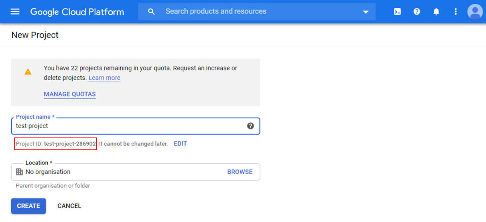
.. |image03| image:: ../../../../_static/amebad/Example_Guides/MQTT/MQTT_Use_Google_Cloud_IoT/image03.png
   :width: 1352
   :height: 1125
   :scale: 60%
.. |image04| image:: ../../../../_static/amebad/Example_Guides/MQTT/MQTT_Use_Google_Cloud_IoT/image04.png
   :width: 1352
   :height: 1125
   :scale: 60%
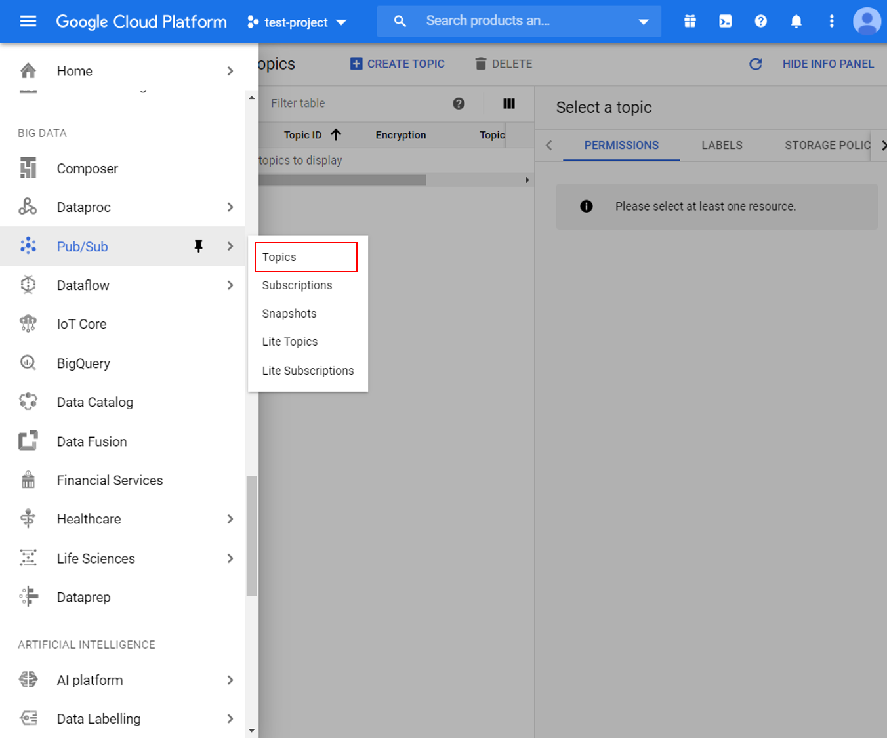
.. |image06| image:: ../../../../_static/amebad/Example_Guides/MQTT/MQTT_Use_Google_Cloud_IoT/image06.png
   :width: 1352
   :height: 1125
   :scale: 60%
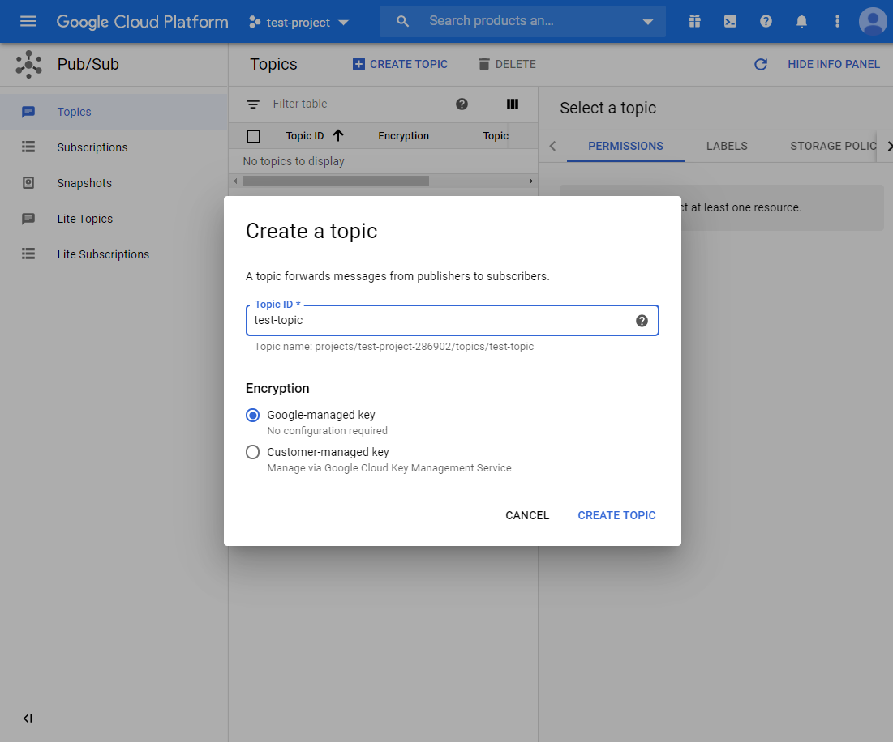
.. |image08| image:: ../../../../_static/amebad/Example_Guides/MQTT/MQTT_Use_Google_Cloud_IoT/image08.png
   :width: 1622
   :height: 1125
   :scale: 50%
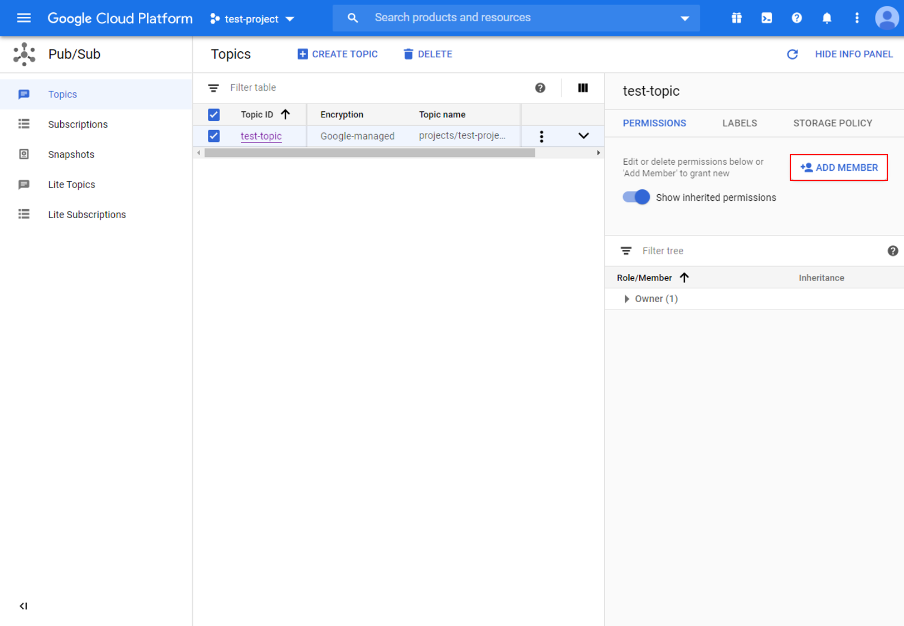
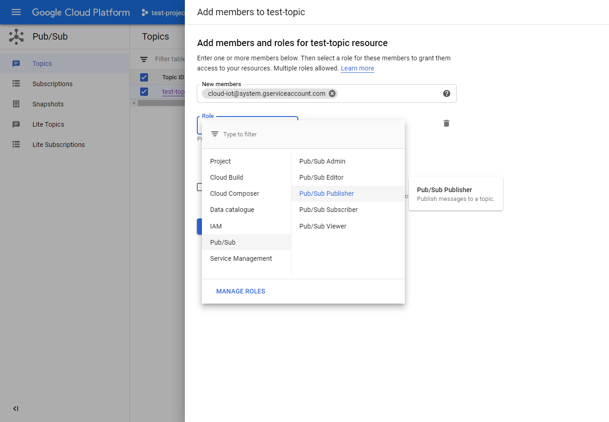
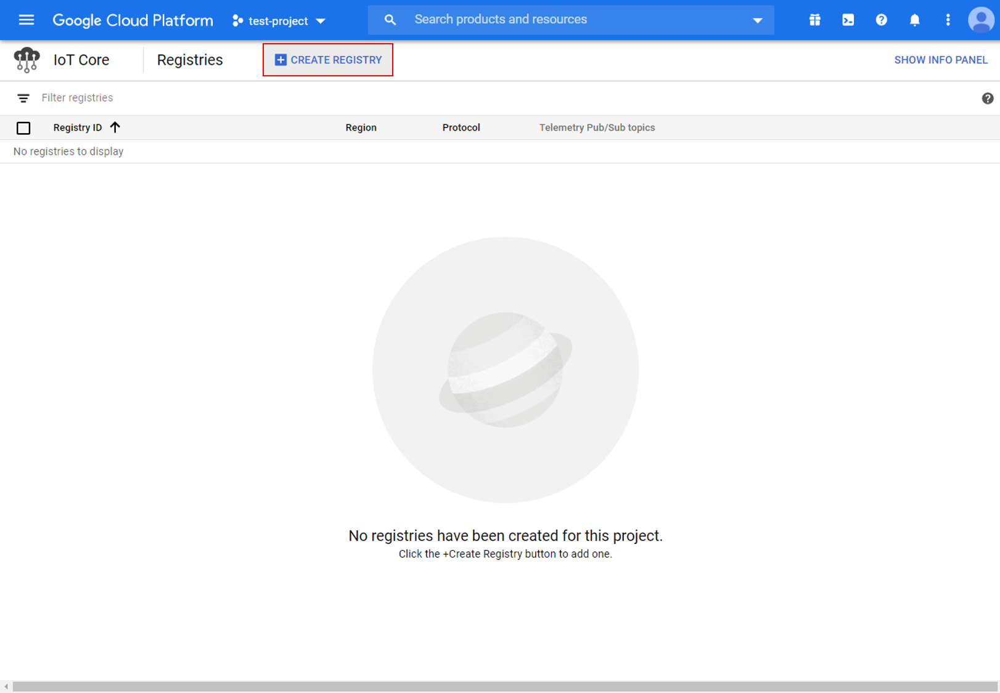
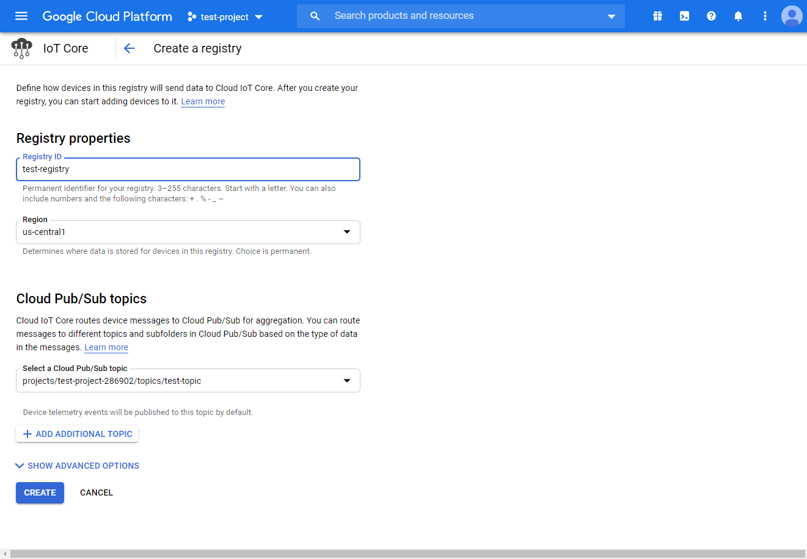
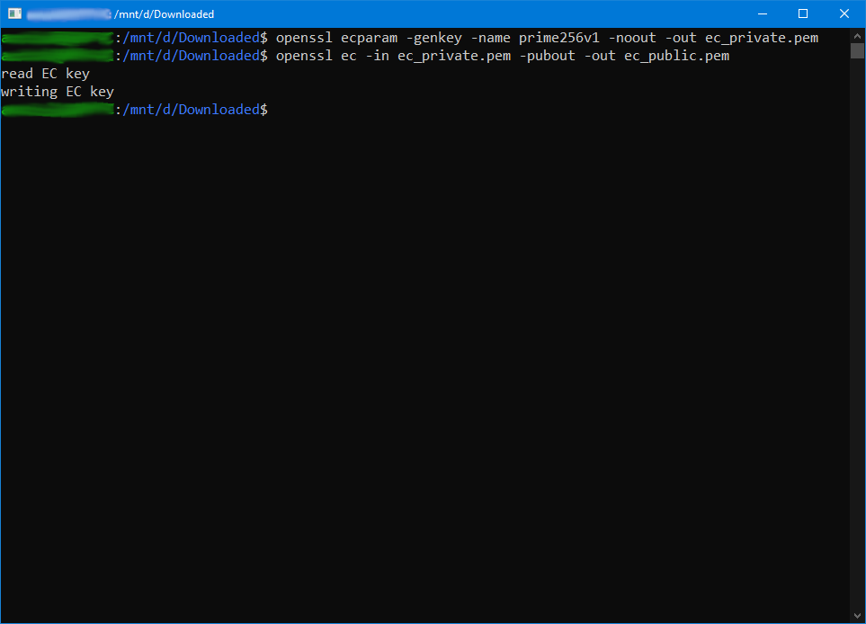
.. |image14| image:: ../../../../_static/amebad/Example_Guides/MQTT/MQTT_Use_Google_Cloud_IoT/image14.png
   :width: 963
   :height: 694
   :scale: 80%
.. |image15| image:: ../../../../_static/amebad/Example_Guides/MQTT/MQTT_Use_Google_Cloud_IoT/image15.png
   :width: 1622
   :height: 1125
   :scale: 50%
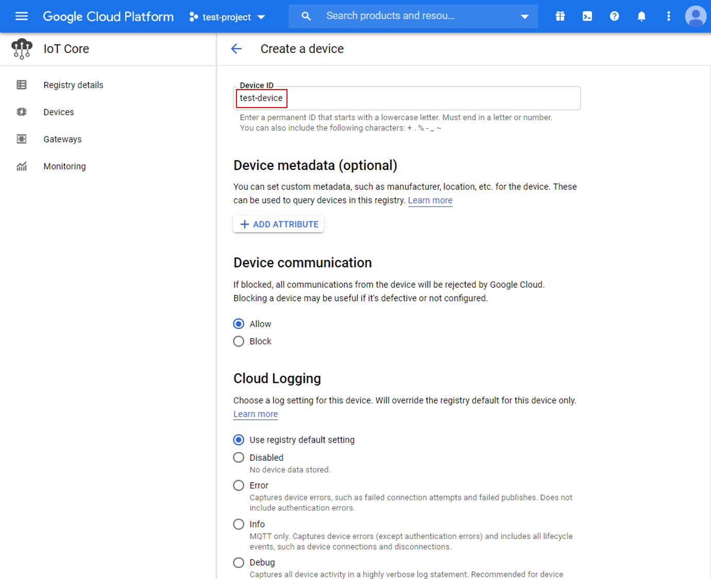
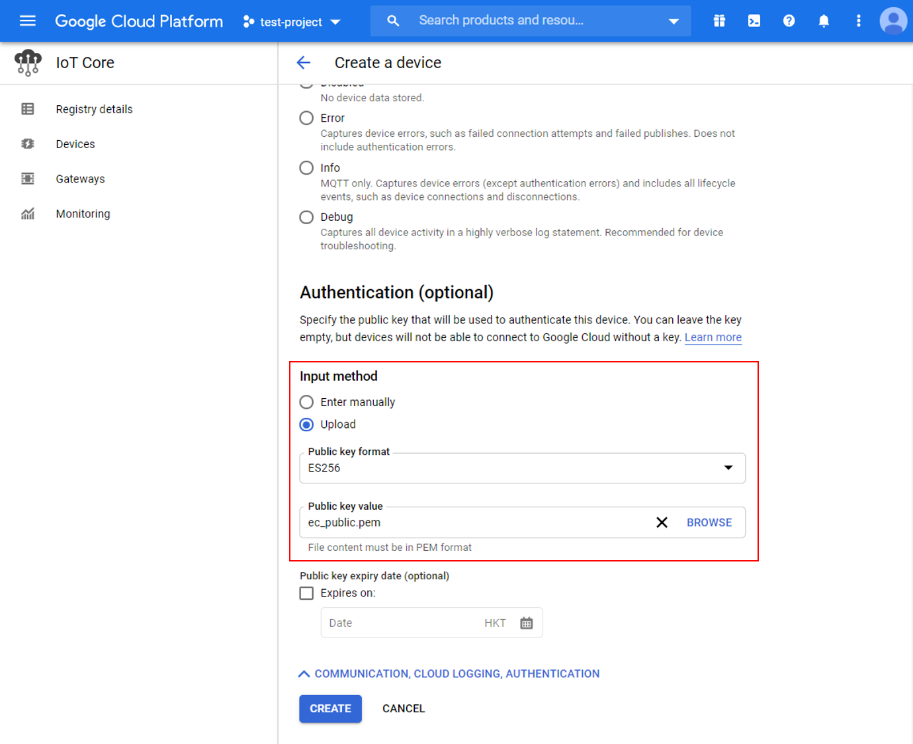
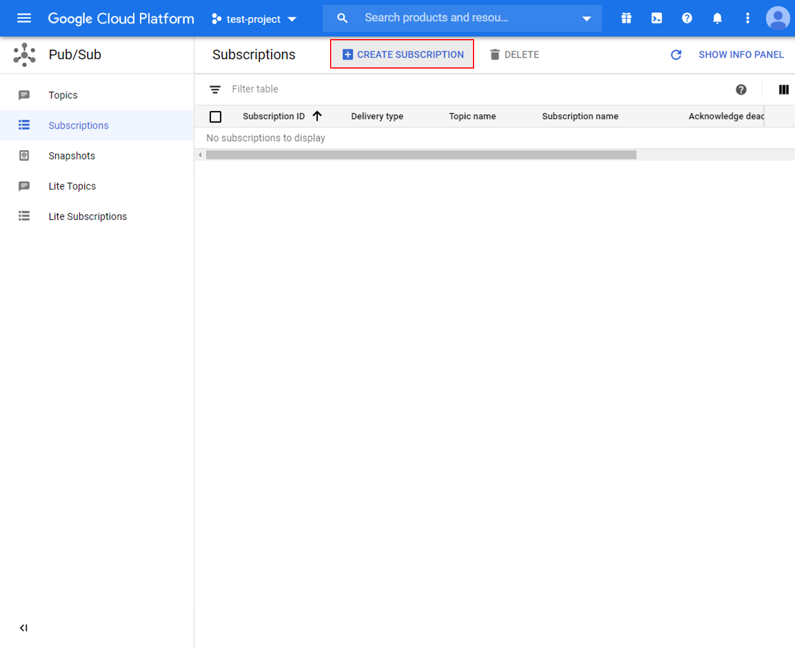
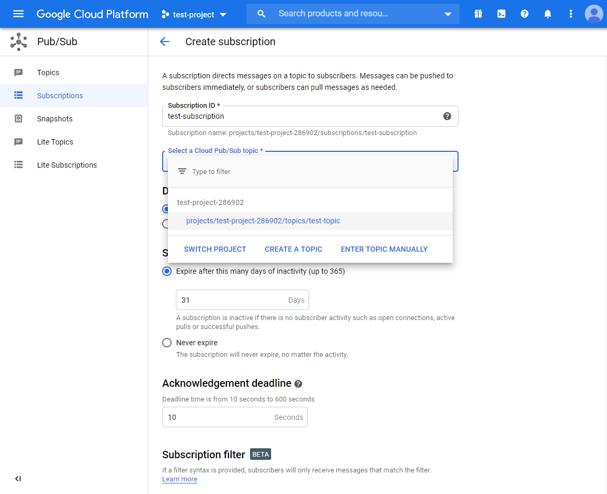
.. |image20| image:: ../../../../_static/amebad/Example_Guides/MQTT/MQTT_Use_Google_Cloud_IoT/image20.png
   :width: 737
   :height: 1202
.. |image21| image:: ../../../../_static/amebad/Example_Guides/MQTT/MQTT_Use_Google_Cloud_IoT/image21.png
   :width: 737
   :height: 1062
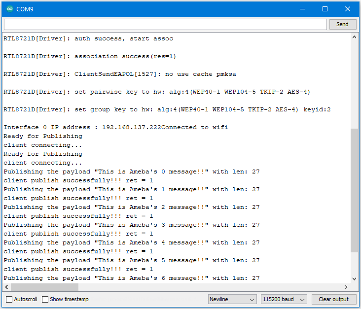
.. |image23| image:: ../../../../_static/amebad/Example_Guides/MQTT/MQTT_Use_Google_Cloud_IoT/image23.png
   :width: 1586
   :height: 1125
   :scale: 50%
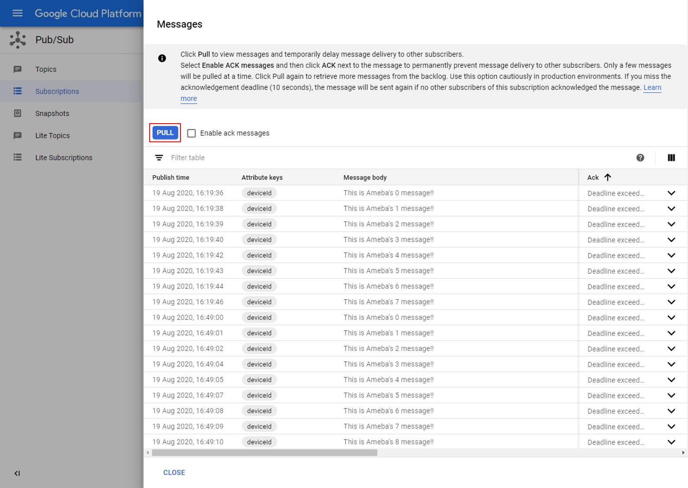
