OTA - Update Firmware to Ameba via OTA
======================================

Materials
---------

- AmebaD [AMB21 / AMB22 / AMB23 / AMB26 / BW16 / AW-CU488 Thing Plus] x 1

Example
-------

OTA (Over-The-Air) refers to the online upgrade mechanism via Internet. Arduino IDE offers OTA feature, which follows the workflow in the figure below:

|image01|

1. Arduino IDE established the mDNS (multicast Domain Name Services) and multicast it’s IP address. This IP address will be used for OTA server to bind with an incoming TCP socket in a Local Area Network (LAN).

2. Since mDNS service is running on Ameba, Ameba responds to the mDNS search and opens the specific TCP port for connection.

3. Ameba works as OTA client and establishes a TCP connection that waits for an incoming TCP socket connection from the OTA server.

4. Once the previously established network port can be found in Arduino IDE. By clicking the "Upload" button in Arduino IDE, user prepared OTA image will be sent via OTA server to the specific IP and network port. Upon the upload procedure is finished, Ameba will boot from the OTA image automatically.

The workflow consists of 3 parts: mDNS, TCP and OTA image process. Details related to mDNS is described in the mDNS example guide: [MDNS - Set up mDNS Client on Arduino IDE]. TCP socket programming is used in transferring image, which is programmed in OTA server tool and OTA API.

In the next section, we will discuss on how to process the OTA image and introduce some basic knowledge on Ameba flash memory layout and boot flow.

Ameba Flash Memory Layout
~~~~~~~~~~~~~~~~~~~~~~~~~

The default flash memory size of AmebaD is 2MB, ranges from 0x0800_0000 to 0x0820_0000 -

1. As shown in the figure below, Ameba program occupies three parts of the flash memory:

|image02|

- Boot Image (KM0 Boot and KM4 Boot): That is, the bootloader. When Ameba boots up, it places the boot image to memory and performs initialization. Furthermore, it determines where to proceed after the bootloader. Bootloader looks at the OTA address and determines which image will be executed afterwards. At the end of the bootloader, it places the image to memory and proceeds to execute it.

- Backup: Backup Flash area starts from 0x0800_2000 - 0x0800_3000-1, reserved for system use. When program system data, this area will be used as backup area.

- System Data: System data block starts from 0x0800_3000 - 0x0800_4000-1, user should program this area carefully.

- Default Image 2 (KM0 IMG2 and KM4 IMG2): The developer code is placed in this part; the address starts from 0x0800_6000 or 0x0810_6000. The first 16-byte is for image header, which comprises the bootloader Signature for flash calibration. The Signature is used to verify whether the image is valid.

- OTA Image (OTA1 and OTA2): The data in this part is also developer code. By default, this part of memory starts from 0x0800_0000. The main differences between OTA image and Default Image 2 are the OTA image contains special 32 Bytes firmware file header.

Generate Cloud OTA Image
~~~~~~~~~~~~~~~~~~~~~~~~

Steps to generate a Cloud OTA image are as follows:

1. Compile user’s sketch. "km0_km4_image2.bin" will be generated upon Arduino's sketch Verify (compilation) process done in the file path: C:\Users\USERNAME\AppData\Local\Arduino15\packages\realtek\tools\ameba_d_tools\x.x.x. This file will be used as the source binary to be converted to an OTA binary later.

2. Retrieve the "ImageTool.exe" from GitHub ambd_sdk: https://github.com/ambiot/ambd_sdk/tree/dev/tools/AmebaD/Image_Tool, double click to open it.

3. Select "OTA_All" as Generate Target type (in red).

4.  Input Image Version, the default value is "0xFFFFFFFF".

5. Click Browse button to select target images to be converted to an OTA binary. The address can be ignored. The Memory Layout bar will show the relative positions of the two images. If they overlap, the overlapped area is in red colour for warning.

6. Click Generate button to specify the name and path of the output file. After the operation is done, the cloud image (OTA_All.bin) is generated at your specified folder. We recommend placing it in the default tools folder for Arduino Ameba:
    a. Windows
    C:\Users\username\AppData\Local\Arduino15\packages\realtek\tools\ameba_d_tools\x.x.x\
    b. Linux
    /home/username/.arduino15/packages/Realtek/tools/ameba_d_tools/x.x.x/
    c. MacOS
    /Users/username/Library/Arduino15/packages/Realtek/tools/ameba_d_tools/x.x.x/

When navigating to the designated tools folder on your target operating system, create a new folder called "misc" and put the OTA image (OTA_All.bin) within it.

|image03|

Open the example: "File" -> "Examples" -> "AmebaOTA" -> "OTA_Basic":
Fill in the Wi-Fi SSID and password in the sample code for network connection and establish the mDNS service.

|image04|

There are some parameters related to OTA:
- OTA_PORT: Arduino IDE will find Ameba via mDNS. Ameba will tell Arduino IDE that it opens TCP port 8020 to wait for OTA image. This port number is also matching with the port number of OTA server.

|image05|

Then we use USB upload program to Ameba. Click "Tools" -> "Ports", check the serial port to use:

|image06|

Upon opening the serial monitor and pressing the "Reset" button, Ameba connects to the AP and obtains an IP address assigned via DHCP: "192.168.xxx.xxx" as shown below.

|image07|

Upon the mDNS service is established successfully, this IP address will be multicast and appears in Arduino IDE "Tools" -> "Port" -> "Network Ports: My Ameba at 192.168.xxx.xxx".

|image08|

|image09|

If you cannot find the network port of Ameba, please confirm:

- Whether your computer and Ameba are in the same LAN?
- Try to restart Arduino IDE.
- Check log message in Serial Monitor to see whether your board is connected to the AP or establish mDNS successfully.

The Ameba board with mDNS is currently functioning as an OTA server, which is listening for incoming TCP socket connections from potential OTA clients. To establish an OTA client, you can select "Tools" -> "Port" -> "Network Ports: My Ameba at 192.168.xxx.xxx" in the Arduino IDE from any of the three supported operating systems (Windows, Linux, and macOS), and then click "Upload".
The OTA client will establish a TCP connection to Ameba's network IP and port 8020, and then transmit the OTA firmware. Once the OTA process is complete, the Arduino IDE will display the message "Client Disconnected" without any error messages.

|image10|

Once the OTA transmission is complete and you see the log message "[beginOTA] Update task exit" in your serial monitor, the board will perform a soft reset automatically and reboot from the OTA image in your flash memory.

|image11|

According to the OTA boot select diagram, AmebaD is default boot from OTA2 when there are valid images in OTA2 sections.

|image12|

Therefore, please Enable the "Erase Flash" options in Arduino IDE if you wish to upload new images via the Serial Port.

|image13|

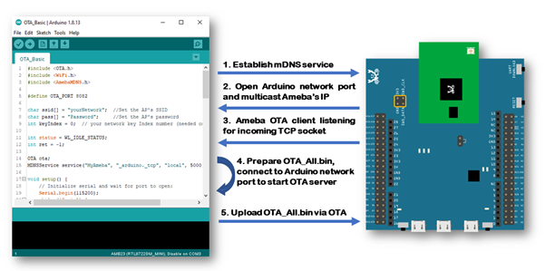
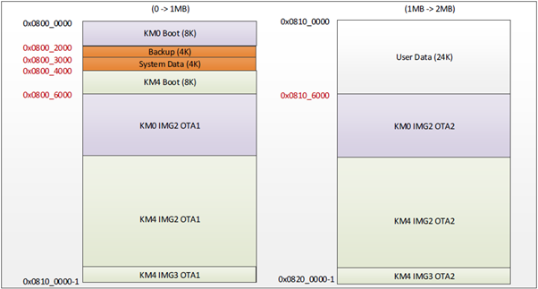
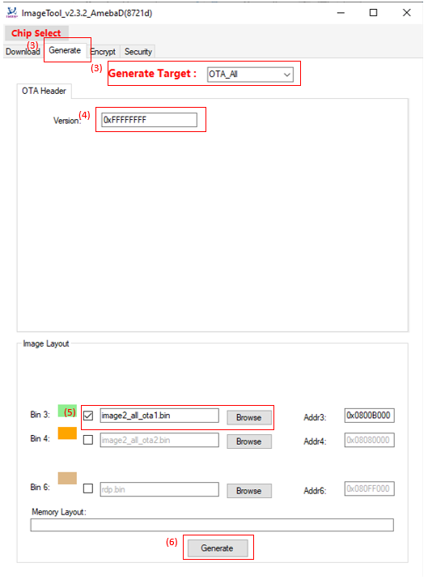
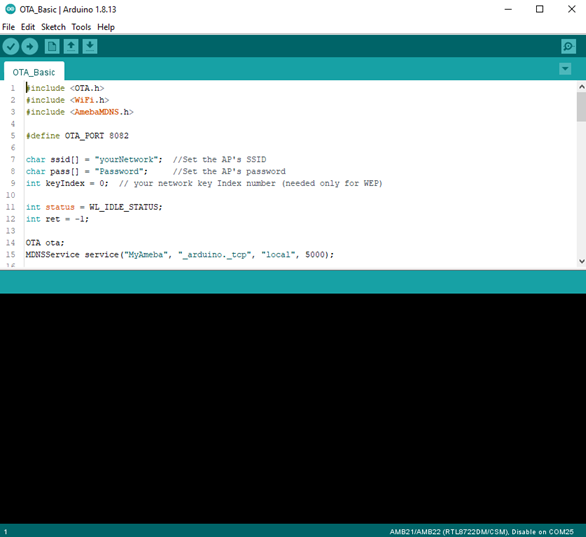
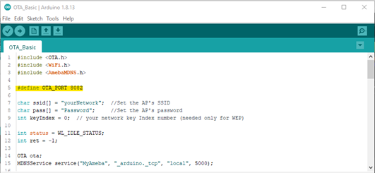
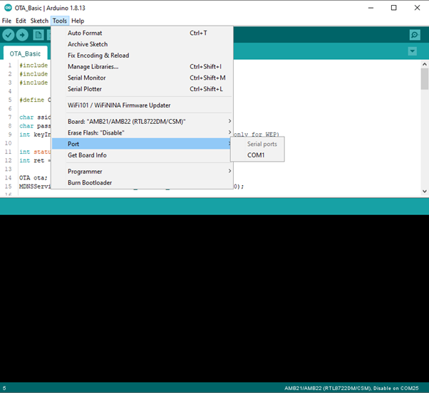
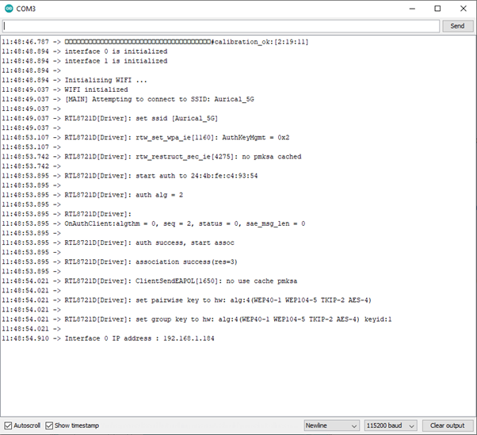
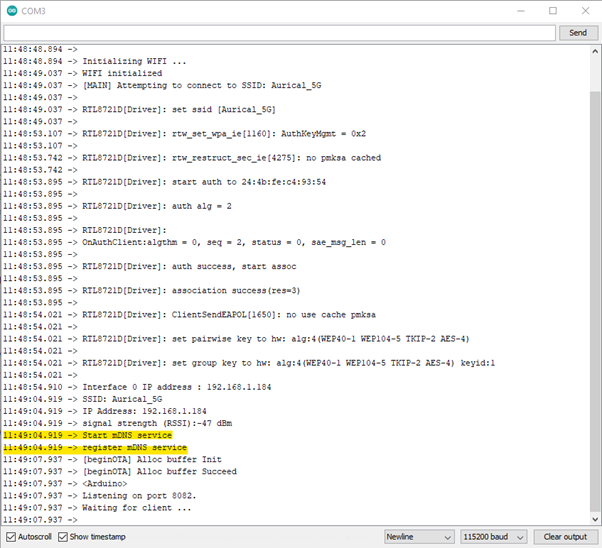
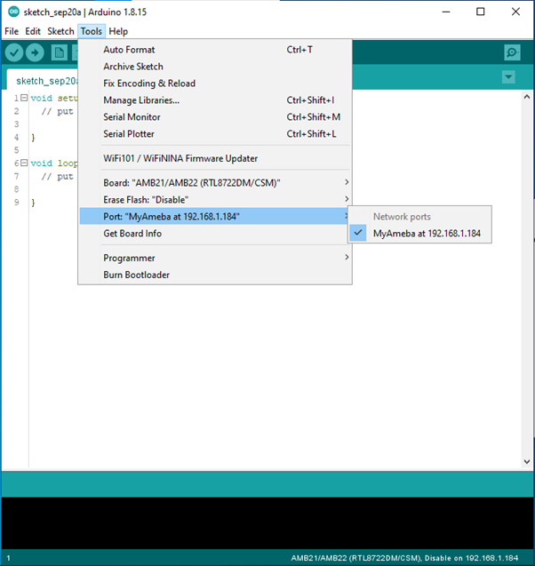
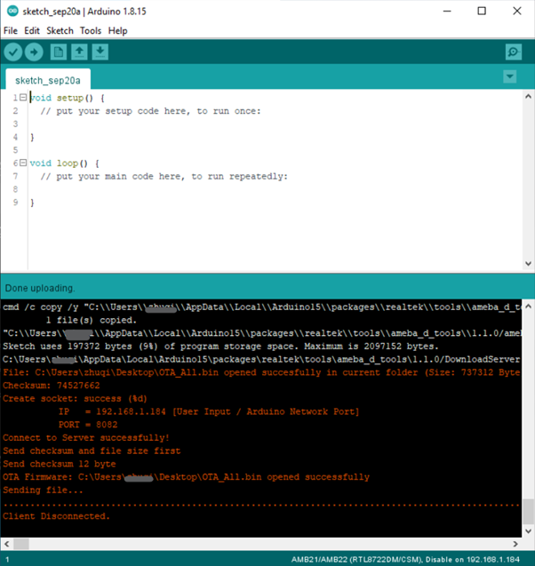
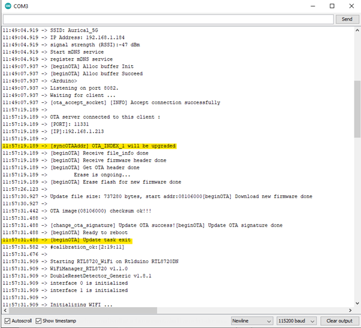
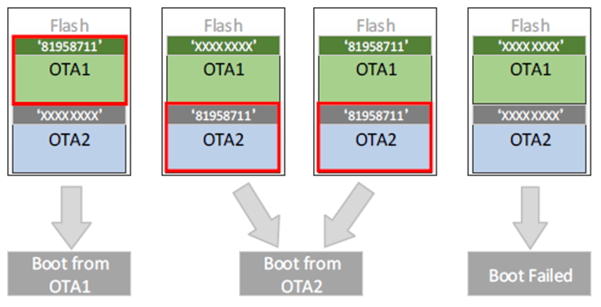
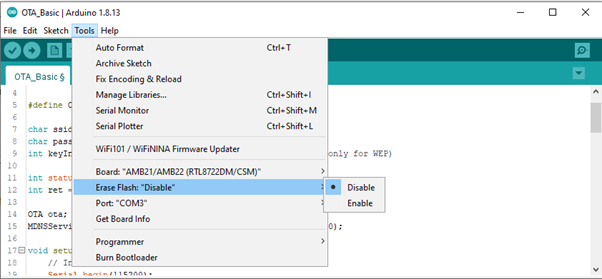
