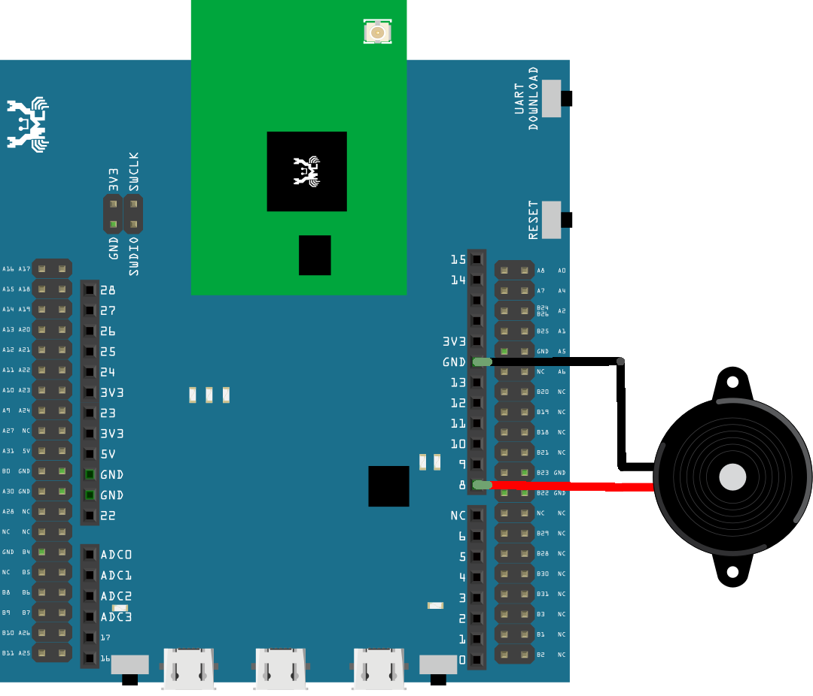
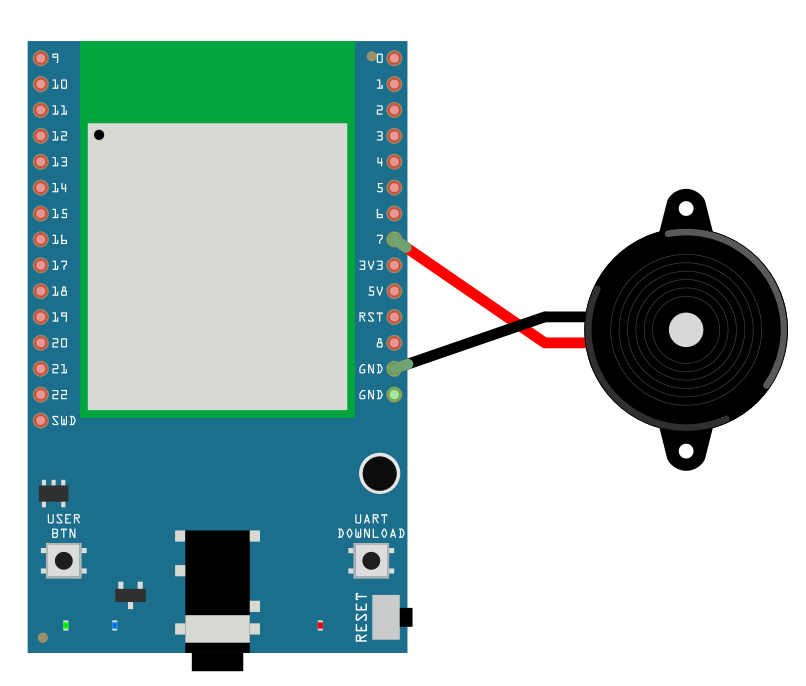

PWM - Play Music by Buzzer
==========================

Materials
---------

- AmebaD [AMB21 / AMB22 / AMB23 / AMB25 / AMB26 / BW16 / AW-CU488 Thing Plus] x 1
- Buzzer x1

Example
-------

**Introduction**
~~~~~~~~~~~~~~~~

A sound is composed of volume, tone and timbre. Volume is determined by the amplitude of the sound wave. Tone is determined by the frequency of the sound wave. Timbre is determined by the waveform of the sound wave.

In this example, we use PWM to control the buzzer to emit sound with desired tone. As PWM outputs square waves, if we wish to emit tone C4 (frequency=262Hz), we must use PWM to output square waves with wavelength 1/262 = 3.8ms:

|image01|

We use PWM to output sound waves with different frequency, so as to play music through the buzzer.
Connect the buzzer to the PWM output pin shown in the following diagrams.

.. only:: amb21

**AMB21 / AMB22** Wiring Diagram:

|image02|

.. only:: end amb21

.. only:: amb23

**AMB23** Wiring Diagram:

|image03|

.. only:: end amb23

.. only:: bw16-typeb

**BW16** Wiring Diagram:

|image04|

.. only:: end bw16-typeb

.. only:: bw16-typec

**BW16-TypeC** Wiring Diagram:

|image05|

.. only:: end bw16-typec

.. only:: aw-cu488

**AW-CU488 Thing Plus** Wiring Diagram:

|image06|

.. only:: end aw-cu488

.. only:: amb25

**AMB25** Wiring Diagram:

|image07|

.. only:: end amb25

.. only:: amb26

**AMB26** Wiring Diagram:

|image08|

.. only:: end amb26

Open the example code in :guilabel:`Examples -> AmebaAnalog -> TonePlayMelody`
Compile and upload to Ameba, press the reset button. Then you can hear the buzzer playing music.

Code Reference
--------------

Ameba implement the tone() and noTone() API of Arduino:
https://www.arduino.cc/en/Reference/Tone
https://www.arduino.cc/en/Reference/NoTone

In the sample code, we initiate a melody array, which stores the tones to make. Another array, noteDurations, contains the length of each tone, 4 represents quarter note (equals to 3000ms/4 = 750ms, and plus an extra 30% time pause), 8 represents eighth note.

.. |image01| image:: ../../../../_static/amebad/Example_Guides/PWM/PWM_Play_Music_by_buzzer/image01.png
   :width: 710
   :height: 184

.. |image04| image:: ../../../../_static/amebad/Example_Guides/PWM/PWM_Play_Music_by_buzzer/image04.png
   :width: 905
   :height: 678

