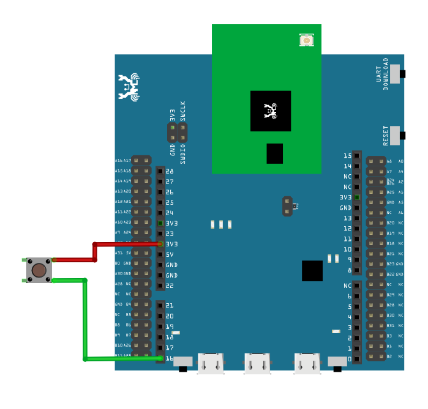
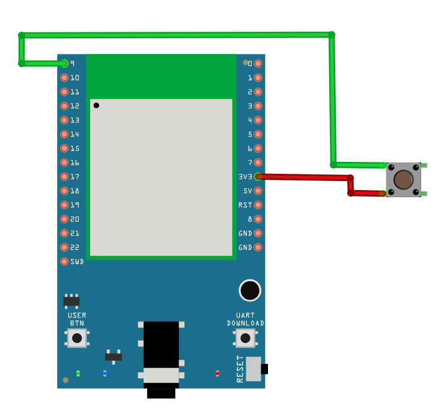
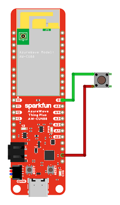
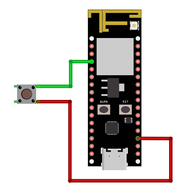
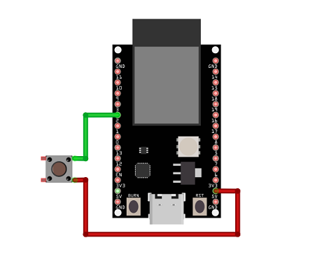
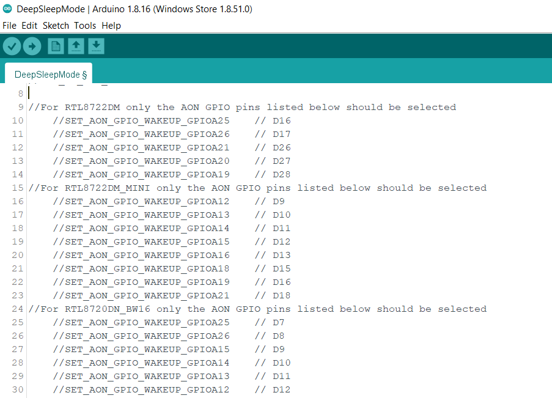
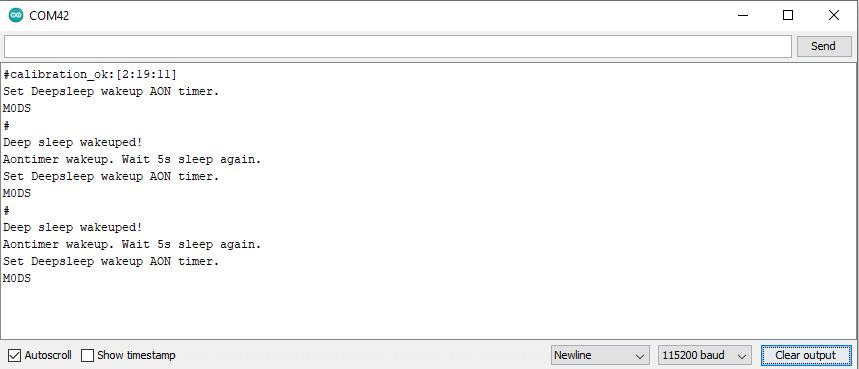
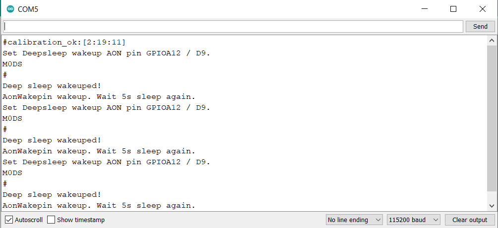
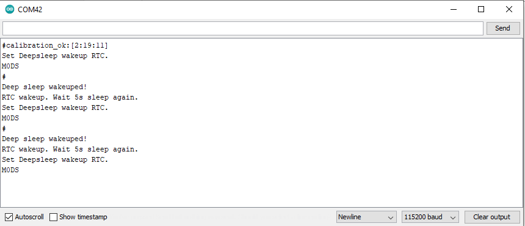

Power Save - Deep Sleep Mode
=============================

.. contents::
  :local:
  :depth: 2
  
Materials
---------

- AmebaD [AMB21 / AMB22 / AMB23 /  AMB25 / AMB26 / BW16 / AW-CU488 Thing Plus] x 1

Example
-------

AmebaD supports 2 low power modes which are deep sleep mode and sleep mode. Deep Sleep mode turns off more power domain than sleep mode. The power consumptions of Deep Sleep mode is around 7μA to 8μA as compared to normal state which is around 22mA. This example describes how to enter Deep Sleep mode and configure the wakeup source.

Open “File” -> “Examples” -> “AmebaPowerSave” -> “DeepSleepMode”

|image01|

Set condition values as below.
“DS_WAKEUP_SOURCE” is used to set the wakeup source, user can choose 3 wakeup sources,
AON Timer (SET_DS_AON_TIMER_WAKEUP);
AON GPIO pins (SET_AON_GPIO_WAKEUP_PAxx) with xx being the pin no.(e.g. SET_AON_GPIO_WAKEUP_PA25);
RTC Timer(SET_DS_RTC_WAKEUP);

**Using AON Timer as wakeup source**

AON Timer can be set from 0 to 32760000ms range by AON_TIMER_SLEEP_DURATION.

**Using AON GPIO pins as wake up source**

For AMB21, there are 5 pins that can be set as AON pins and active high for wakeup, PA25(D16), PA26(D17), PA21(D26), PA20(D27), PA(D28).

For AMB23, there are 8 pins that can be set as AON pins and active high for wakeup, PA12(D9), PA13(D10), PA14(D11), PA15(D12), PA16(D13), PA18(D15), PA19(D16), PA21(D18).

For BW16/BW16 type C, there is only 6 pins that can be set as AON pin and active high for wakeup, PA_25 (D7), PA_26 (D8), PA_15 (D9), PA_14 (D10), PA_13 (D11), PA_12 (D12).

For AW-CU488 Thing Plus, there is only 10 pins that can be set as AON pin and active high for wakeup, PA_18(D0), PA_16(D1), PA_17(D2), PA_13(D3), PA_12(D4), PA_26(D5), PA_25(D6), PA_19(D8), PA_15(D28), PA_14(D29).

For AMB25 and AMB26, there is only 6 pins that can be set as AON pin and active high for wakeup, PA12(D3), PA13(D2), PA14(D1), PA15(D0), PA25(D7), PA26(D6).

**Wiring Diagram**

.. only:: amb21

|image02|

.. only:: end amb21  

.. only:: amb23
    
|image03|

.. only:: end amb23 

.. only:: amb25
    
|image07|

.. only:: end amb25 

.. only:: amb26
    
|image08|

.. only:: end amb26 

.. only:: bw16-typeb
    
|image04|

.. only:: end bw16-typeb

.. only:: bw16-typec
    
|image05|

.. only:: end bw16-typec

.. only:: aw-cu488

|image06|

.. only:: end aw-cu488 

These AON pins can be set by using SET_AON_GPIO_WAKEUP_PA25 or the pin that you want to use as shown in the picture below.

|image09|

**Using RTC Timer as wakeup source**

RTC Timer wakeup source can wake up the RTOS from deep sleep mode using the time set in the RTC alarm, which including day, hour, minute, and sec. All 4 values can be set by DS_RTC_ALARM_DAY, DS_RTC_ALARM_HOUR, DS_RTC_ALARM_MIN, and DS_RTC_ALARM_SEC.

|image10|

When all the condition values are set, the system will run and switch between normal and deep sleep mode which is controlled by the wakeup source. The serial monitor will display the switching log as shown below.

**AON Timer**

|image11|

**AON GPIO Pin**

|image12|

**RTC Timer**

|image13|

Code Reference
---------------

Please refer to the `API Documents <https://ameba-doc-arduino-sdk.readthedocs-hosted.com/en/latest/amb21/API_Documents/index.html>`_ PowerSave section for detail description of all API.

.. |image01| image:: ../../../../_static/amebad/Example_Guides/PowerSave/Power_Save_Deep_Sleep_Mode/image01.png
   :width:  689 px
   :height:  704 px

.. |image04| image:: ../../../../_static/amebad/Example_Guides/PowerSave/Power_Save_Deep_Sleep_Mode/image04.png
   :width:  423 px
   :height:  535 px
.. |image05| image:: ../../../../_static/amebad/Example_Guides/PowerSave/Power_Save_Deep_Sleep_Mode/image05.png
   :width:  376 px
   :height:  392 px

.. |image10| image:: ../../../../_static/amebad/Example_Guides/PowerSave/Power_Save_Deep_Sleep_Mode/image10.png
   :width:  665 px
   :height:  262 px

