Power Save - Deep Sleep for DHT and E-Paper
============================================

Materials
---------

- AmebaD [AMB21 / AMB22 / AMB23 /  AMB25 / AMB26 / BW16 / AW-CU488 Thing Plus] x 1

- DHT11 or DHT22 or DHT21 x 1

- Waveshare 2.9inch E-Paper HAT (D) x 1

Example
--------

Ameba-D supports low power modes which are deepsleep mode. Deepsleep mode turns off most of the system power domain. The power consumptions of core module in DeepSleep Mode are around 7uA to 8uA compared to normal state around 22mA. This example gives demo of system switch between "working" and "sleep"(power save).Using DHT sensor to read data and display on Eink screen when system is awake. After 5 seconds system auto enter DeepSleep Mode for power save. System will wake up by wakeup source.( Aon timer, Aon Pins or RTC timer).

There are 2 versions of DHT sensor, one with 4 pins and another one with 3 pins mounted to a small PCB. The PCB mounted version has included a 10K Ohm pull up resistor for the signal line. Take note that if you are using a DHT sensor that is not mounted on a PCB, you will have to add in a 10K Ohm pull up resistor. You may refer to the wiring diagrams below.

.. only:: amb21

**DHT sensor not mounted on PCB board**

|image01|

**DHT sensor mounted on PCB board**

|image02|

.. only:: end amb21

.. only:: amb23

**DHT sensor not mounted on PCB board**

|image03|

**DHT sensor mounted on PCB board**

|image04|

.. only:: end amb23

.. only:: amb25

**DHT sensor not mounted on PCB board**

|image05|

**DHT sensor mounted on PCB board**

|image06|

.. only:: end amb25

.. only:: amb26

**DHT sensor not mounted on PCB board**

|image07|

**DHT sensor mounted on PCB board**

|image08|

.. only:: end amb26

.. only:: bw16-typeb

**DHT sensor not mounted on PCB board**

|image09|

**DHT sensor mounted on PCB board**

|image10|

.. only:: end bw16-typeb

.. only:: bw16-typec

**DHT sensor not mounted on PCB board**

|image11|

**DHT sensor mounted on PCB board**

|image12|

.. only:: end bw16-typec

.. only:: aw-cu488

**DHT sensor not mounted on PCB board**

|image13|

**DHT sensor mounted on PCB board**

|image14|

.. only:: end aw-cu488

Download the Eink zip library, `AmebaEink.zip <https://github.com/Ameba-AIoT/ameba-arduino-d/tree/master/Arduino_zip_libraries>`__

Open :guilabel:`File -> Examples -> AmebaPowerSave -> DeepSleep_DHT_Eink_Example`

|image15|

Set condition values as picture below.

"DS_WAKEUP_SOURCE" is used to set the wake-up source, user can choose from 3 wake up sources,

- AON Timer (SET_DS_AON_TIMER_WAKEUP);
- AON GPIO pins (SET_AON_WAKEPIN_WAKEUP);
- RTC Timer(SET_DS_RTC_WAKEUP);

**Using AON Timer as wakeup source**

AON timer can be set from 0 to 32760000 range (unit ms) by AON_TIMER_SLEEP_DURATION.

**Using AON GPIO pins as wake up source**

For AMB21/AMB22, there are 5 pins that can be set as AON pins and active high for wakeup, GPIOA25(D16), GPIOA26(D17), GPIOA21(D26), GPIOA20(D27), GPIOA(D28).

For AMB23, there are 8 pins that can be set as AON pins and active high for wakeup, GPIOA12(D9), GPIOA13(D10), GPIOA14(D11), GPIOA15(D12), GPIOA16(D13), GPIOA18(D15), GPIOA19(D16), GPIOA21(D18).

For BW16/BW16-TypeC, there is only 6 pins that can be set as AON pin and active high for wakeup, GPIOA_25 (D7), GPIOA_26 (D8), GPIOA_15 (D9), GPIOA_14 (D10), GPIOA_13 (D11), GPIOA_12 (D12).

For AW-CU488 Thing Plus, there is only 10 pins that can be set as AON pin and active high for wakeup, GPIOA_18(D0), GPIOA_16(D1), GPIOA_17(D2), GPIOA_13(D3), GPIOA_12(D4), GPIOA_26(D5), GPIOA_25(D6), GPIOA_19(D8), GPIOA_15(D28), GPIOA_14(D29).

For AMB25, there is only 6 pins that can be set as AON pin and active high for wakeup, GPIOA_12(D3), GPIOA_13(D2), GPIOA_14(D1), GPIOA_15(D0), GPIOA_25(D7), GPIOA_26(D6).

These AON pins can be set by using SET_AON_GPIO_WAKEUP_GPIOA25 or the pin that you want to use as shown in the picture below.

|image16|

**Using RTC Timer as wakeup source**

RTC Timer wakeup system is by setting alarm. The alarm has 4 values to be set, day, hour, min and sec. All 4 values can be set by DS_RTC_ALARM_DAY, DS_RTC_ALARM_HOUR, DS_RTC_ALARM_MIN, and DS_RTC_ALARM_SEC.

DHTPIN is used to set DHT sensor data pin. User can choose any GPIO pins.

DHTTYPE is used to set DHT sensor type. (DHT11, DHT22 and DHT33)

|image17|

When finished the condition values setting, system will run and switch between normal working mode and deepsleep mode controlled by wakeup source. Eink screen will display the temperature and humidity data measured from DHT sensor when system is awake.

Code Reference
---------------

Please refer to the `API Documents <https://ameba-doc-arduino-sdk.readthedocs-hosted.com/en/latest/amb21/API_Documents/index.html>`__ PowerSave section for detail description of all API.

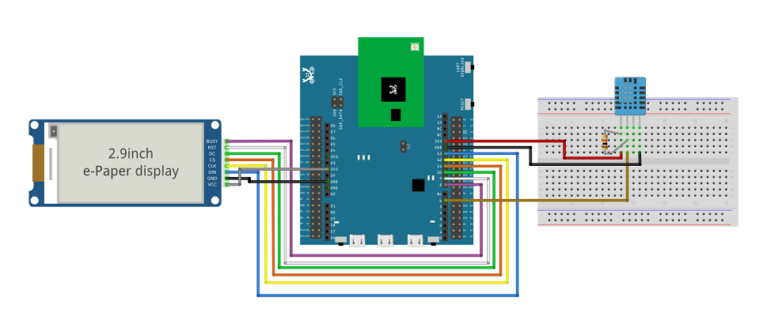
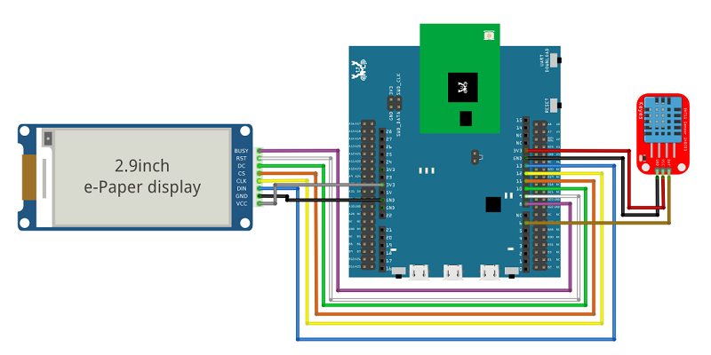
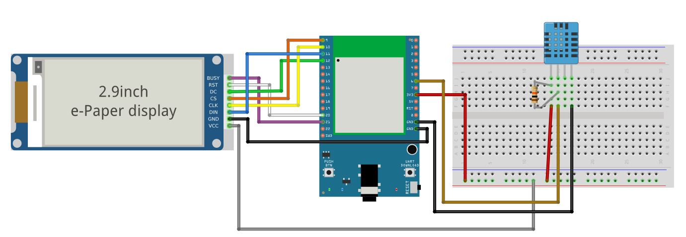
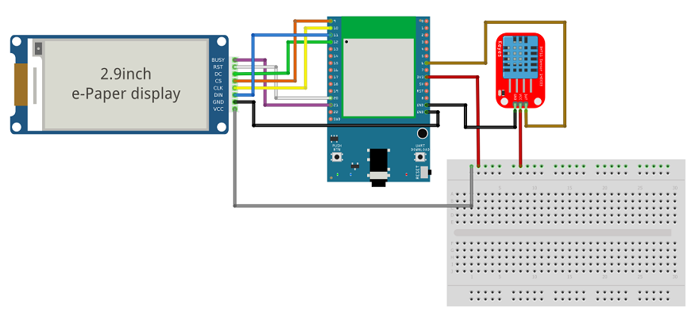
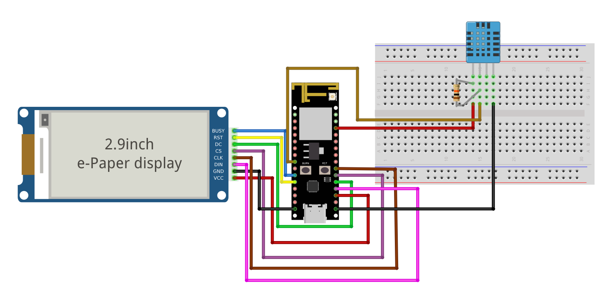
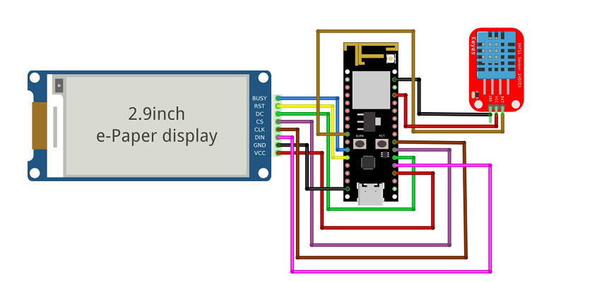
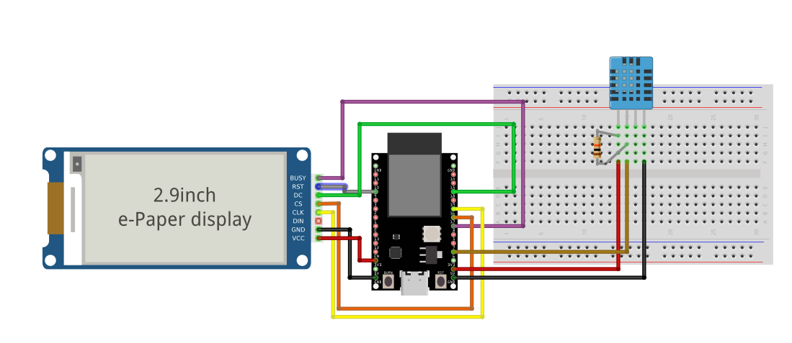
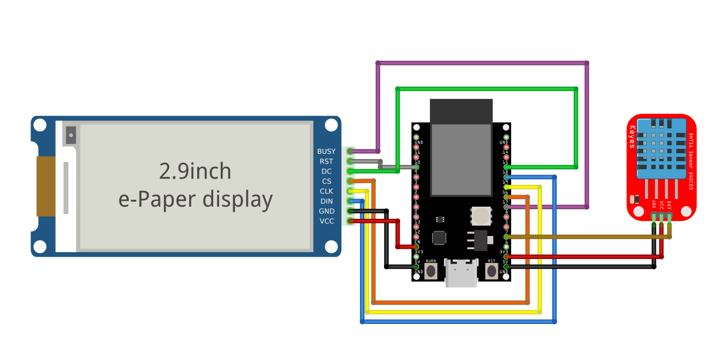
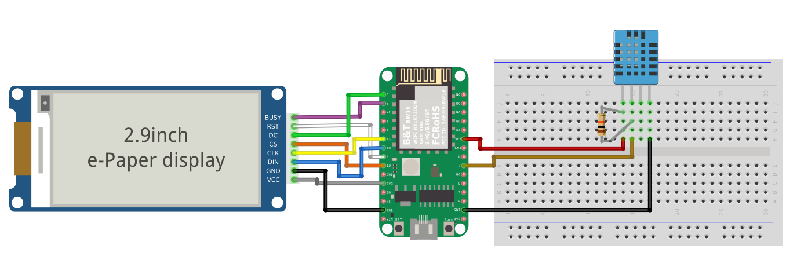
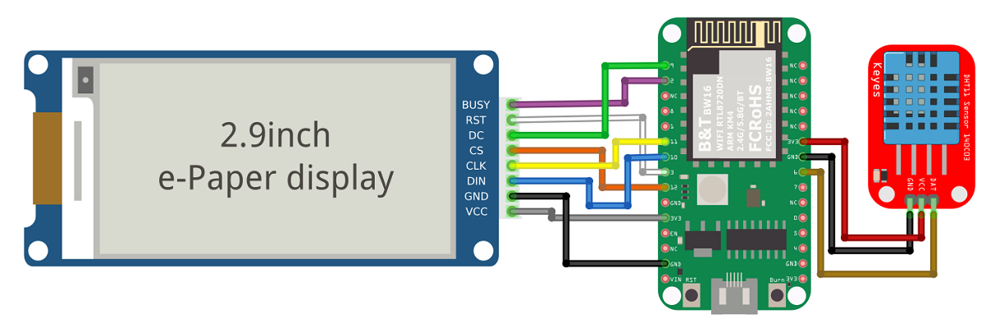
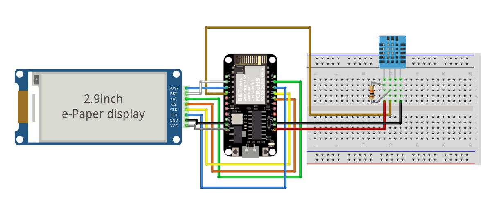
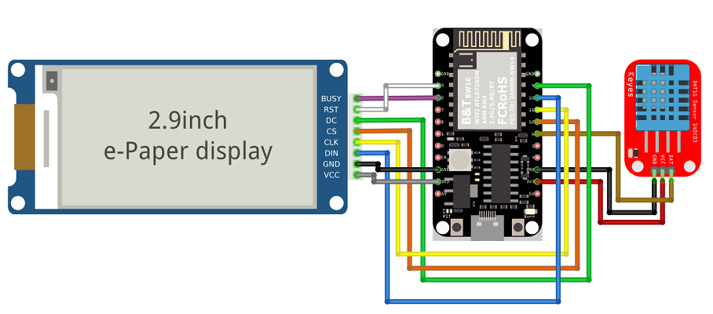
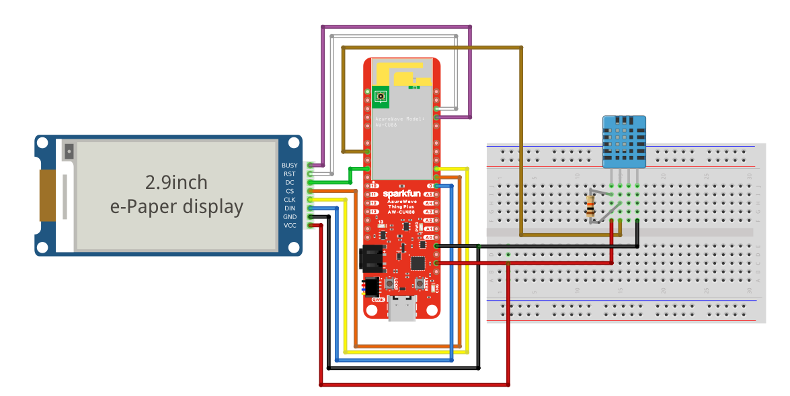
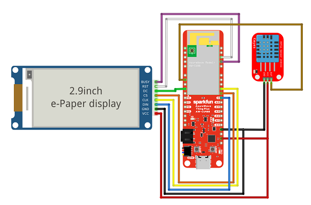
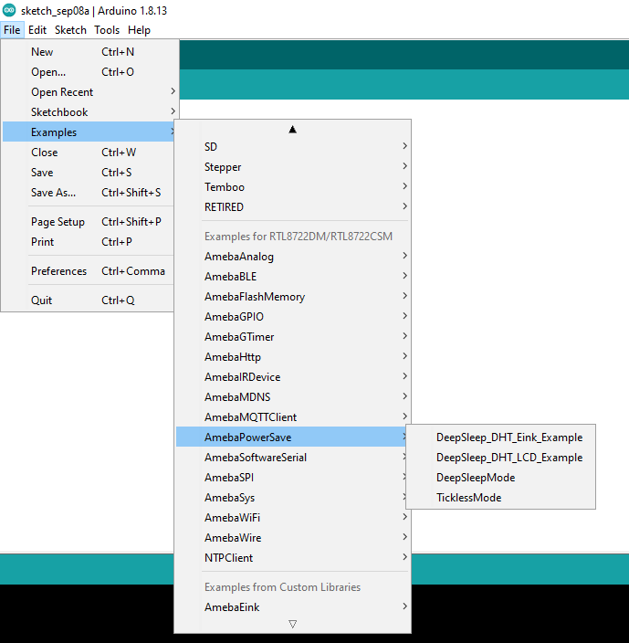
.. |image16| image:: ../../../../_static/amebad/Example_Guides/PowerSave/Power_Save_Deep_Sleep_For_DHT_Epaper/image16.png
   :width:  957 px
   :height:  647 px
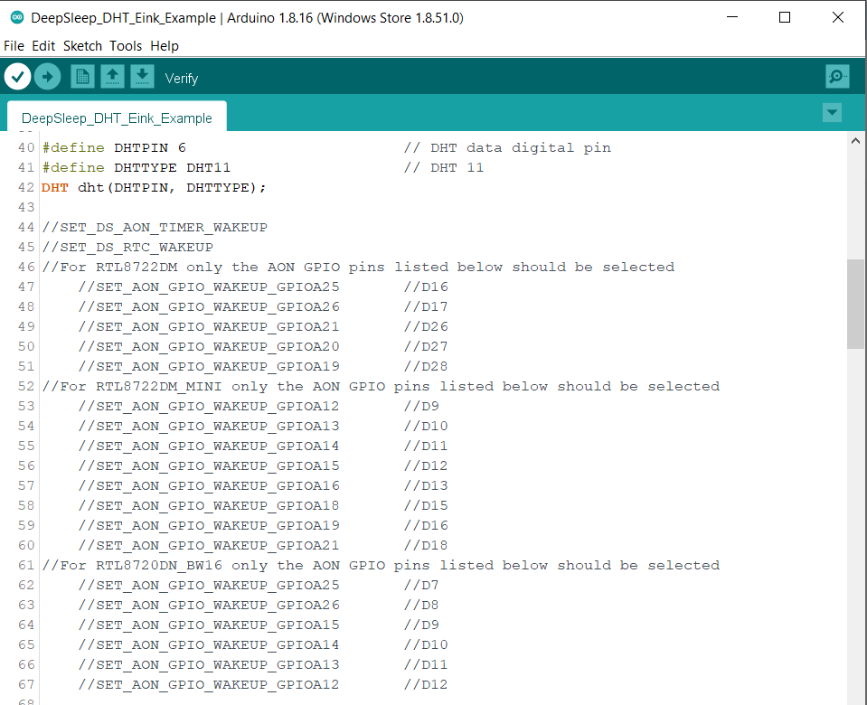
