Power Save - Tickless Mode
============================

Materials
---------

- AmebaD [AMB21 / AMB22 / AMB23 /  AMB25 / AMB26 / BW16 / AW-CU488 Thing Plus] x 1

Example
-------

Ameba-D supports two low power modes which are deepsleep mode and sleep mode. The power consumptions of Tickless Sleep Mode is around 28uA to 30uA compared to normal state around 15mA. This example describes how to use freertos tickless with UART interruptible interface.

Open "File" -> "Examples" -> "AmebaPowerSave" -> "TicklessMode"

|image01|

Set condition values as picture below.
"TL_WAKEUP_SOURCE" is used to set the wake-up source, user can chose 3 wake up sources now,
LOGUART(SET_TL_UART_WAKEUP);
RTC Timer(SET_TL_RTC_WAKEUP);
• AON pins (SET_AON_GPIO_WAKEUP_PAxx) with xx being the pin no. (e.g. SET_AON_GPIO_WAKEUP_PA25);

**Using LOGUART as wakeup source**

When the LOGUART is selected as the wakeup source, the "TL_Suspend_function" will select the corresponding tickless wake up source. The board will remain in the Active Mode for the duration of TL_SYSACTIVE_TIME (default set as 10 000 ms) before entering sleep mode again. To wake up, press "Enter" button on your keyboard in the Arduino Serial Monitor.

**Using RTC Timer as wakeup source**

RTC Timer wakeup source can wake up the RTOS from tickless mode using the time set in the RTC alarm, which including day, hour, minute, and sec. All 4 values can be set by DS_RTC_ALARM_DAY, DS_RTC_ALARM_HOUR, DS_RTC_ALARM_MIN, and DS_RTC_ALARM_SEC. The board will remain in the active mode for TL_SYSACTIVE_TIME (default set as 10 000 ms) before entering to sleep mode again. RTOS will wake up after the preset RTC wake up time has reached.

|image02|

**Using AON GPIO pins as wakeup source**

For AMB21, there are 5 pins that can be set as AON pins and active high for wakeup, PA25(D16), PA26(D17), PA21(D26), PA20(D27), PA(D28).

For AMB23, there are 8 pins that can be set as AON pins and active high for wakeup, PA12(D9), PA13(D10), PA14(D11), PA15(D12), PA16(D13), PA18(D15), PA19(D16), PA21(D18).

For BW16/BW16 type C, there is only 6 pins that can be set as AON pin and active high for wakeup, PA25(D7), PA26(D8), PA15(D9), PA14(D10), PA13(D11), PA12(D12).

For AW-CU488 Thing Plus, there is only 10 pins that can be set as AON pin and active high for wakeup, PA18(D0), PA16(D1), PA17(D2), PA13(D3), PA12(D4), PA26(D5), PA25(D6), PA19(D8), PA15(D28), PA14(D29).

For AMB25 and AMB26, there is only 6 pins that can be set as AON pin and active high for wakeup, PA12(D3), PA13(D2), PA14(D1), PA15(D0), PA25(D7), PA26(D6).

**Wiring Diagram**

.. only:: amb21

|image03|

.. only:: end amb21

.. only:: amb23

|image04|

.. only:: end amb23

.. only:: amb25

|image05|

.. only:: end amb25

.. only:: amb26

|image06|

.. only:: end amb26

.. only:: bw16-typeb

|image07|

.. only:: end bw16-typeb

.. only:: bw16-typec

|image08|

.. only:: end bw16-typec

.. only:: aw-cu488

|image09|

.. only:: end aw-cu488

|image10|

TL_SYSACTIVE_TIME is for setting time duration of the system to keep alive. (Unit ms)

**LOGUART**

|image11|

**RTC Timer**

|image12|

**AON GPIO Pins**

|image13|

Code Reference
---------------

Please refer to the `API Documents <https://ameba-doc-arduino-sdk.readthedocs-hosted.com/en/latest/amb21/API_Documents/index.html>`__ PowerSave section for detail description of all API.

.. |image01| image:: ../../../../_static/amebad/Example_Guides/PowerSave/Power_Save_Tickless_Mode/image01.png
   :width:  689 px
   :height:  704 px
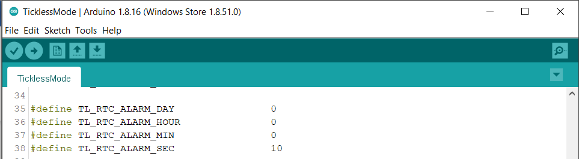
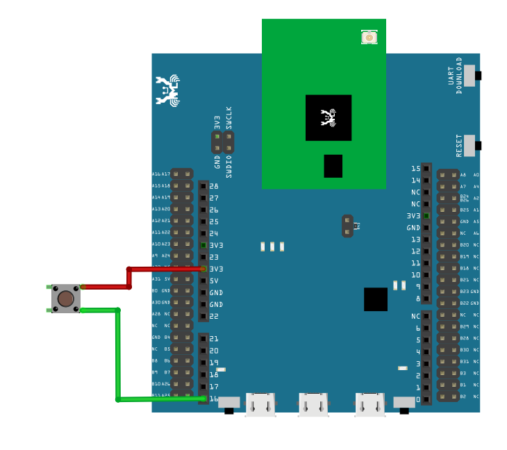
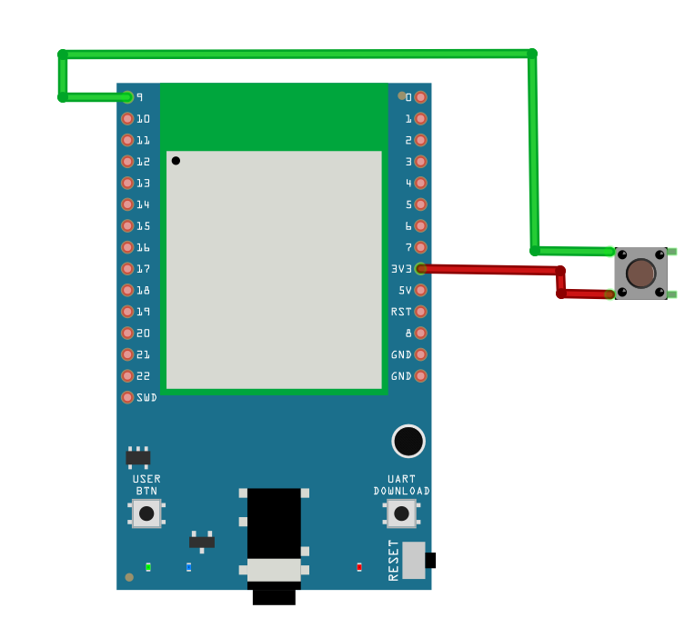
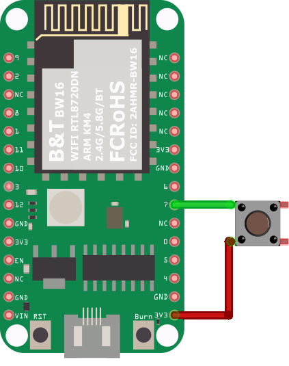
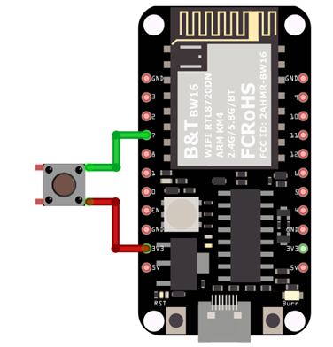
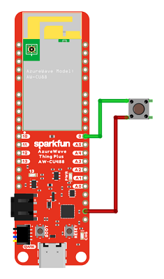
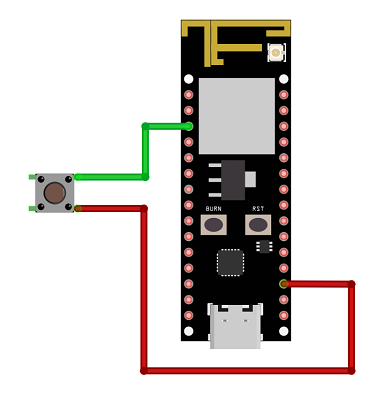
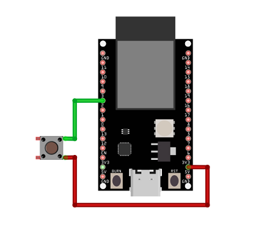
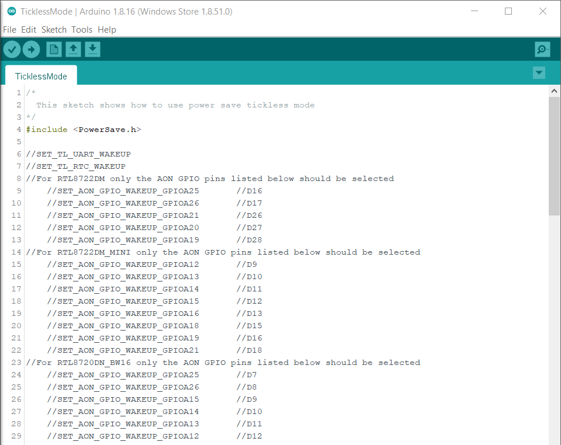
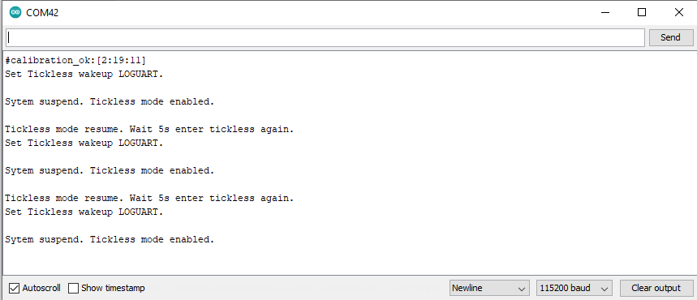
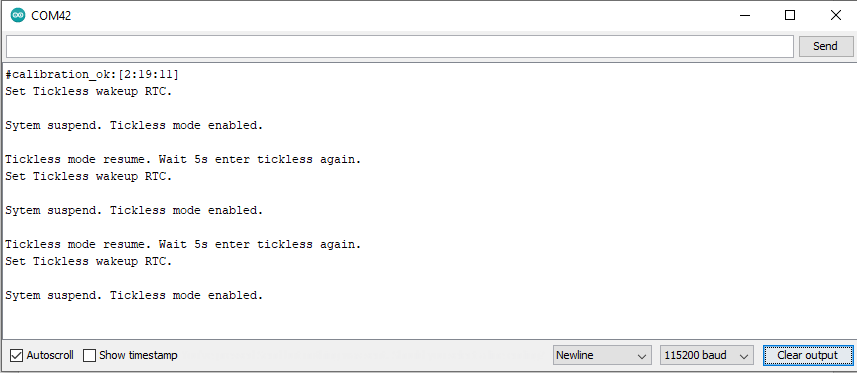
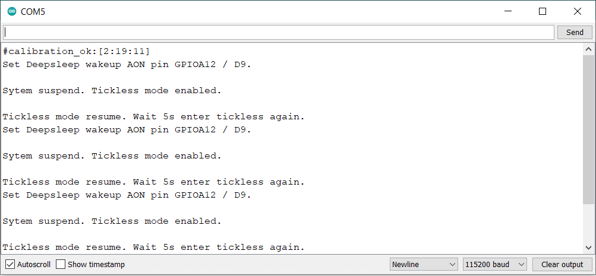
