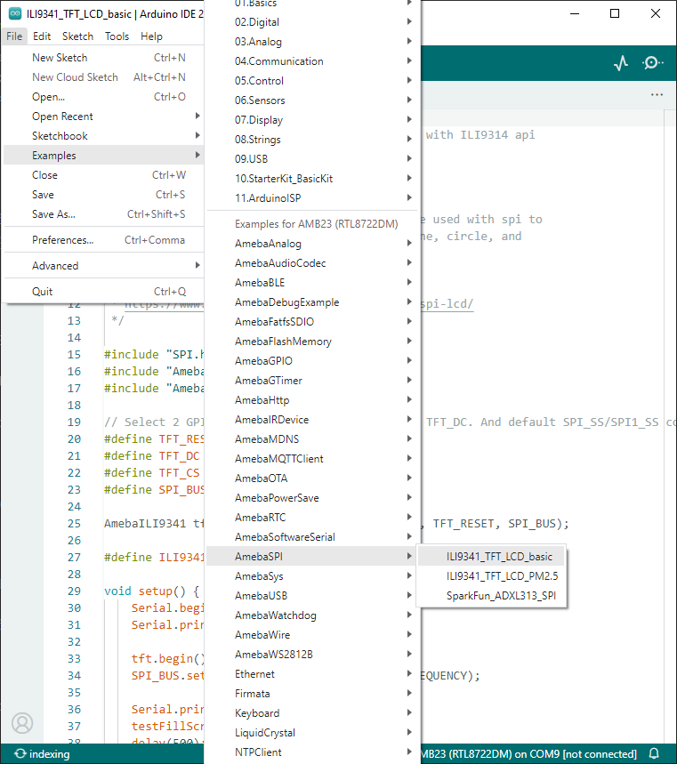

SPI - Print Image and Text On LCD Screen
=========================================

.. contents::
  :local:
  :depth: 2

If you are not familiar with SPI, please read `Introduction to
SPI <https://www.amebaiot.com/spi-intro/>`_ first.

Materials
---------

- AmebaD [AMB21 / AMB22 / AMB23 / AMB25 / AMB26 / BW16 / AW-CU488 Thing Plus] x 1

- ILI9341 TFT LCD with SPI interface x 1

Example
-------

We have tested the following two models of ILI9341 TFT LCD with SPI interface:

**Adafruit 2.8″ TFT LCD (with touch screen)**

- https://www.adafruit.com/products/1651

- https://learn.adafruit.com/adafruit-2-8-tft-touch-shield-v2?view=all

**QVGA 2.2″ TFT LCD**

- http://www.lcdwiki.com/2.2inch_SPI_Module_ILI9341_SKU:MSP2202

Common pins in ILI9341 TFT LCD with SPI interface:

- MOSI: Standard SPI Pin

- MISO: Standard SPI Pin

- SLK: Standard SPI Pin

- CS: Standard SPI Pin

- RESET: Used to reboot LCD.

- D/C: Data/Command. When it is at LOW, the signal transmitted are commands, otherwise the data transmitted are data.

- LED (or BL): Adapt the screen backlight. Can be controlled by PWM or connected to VCC for 100% backlight.

- VCC: Connected to 3V or 5V, depends on its spec.

- GND: Connected to GND.

**QVGA 2.2″ TFT LCD Wiring Diagrams**

.. only:: amb21

|image01|

.. only:: end amb21

.. only:: amb23

|image02|

.. only:: end amb23

.. only:: amb25

|image06|

.. only:: end amb25

.. only:: amb26
    
|image07|

.. only:: end amb26

.. only:: bw16-typeb

|image03|

.. only:: end bw16-typeb

.. only:: bw16-typec

|image04|

.. only:: end bw16-typec

.. only:: aw-cu488

|image05|

.. only:: end aw-cu488

**Adafruit 2.8″ TFT LCD touch shield Wiring Diagrams**

.. only:: amb21

|image08|

.. only:: end amb21

.. only:: amb23

|image09|

.. only:: end amb23

.. only:: amb25

|image13|

.. only:: end amb25

.. only:: amb26

|image14|

.. only:: end amb26 

.. only:: bw16-typeb
    
|image10|

.. only:: end bw16-typeb

.. only:: bw16-typec
    
|image11|

.. only:: end bw16-typec

.. only:: aw-cu488

|image12|

.. only:: end aw-cu488

Open the example, “File”→ “Examples”→ “AmebaSPI” → “ILI9341_TFT_LCD_basic”

|image15|

Compile and upload to Ameba, then press the reset button.
Then you can see some display tests appear on the LCD screen, such as displaying different colors, drawing vertical and horizontal lines, drawing circles, etc.…

|image16|

Besides, it can also display any user images based on the screen size. Using the online Image converting tool here that supports input images in png, .jpg and .gif ad output as .c file. Upon converting is done, place the .c file in our template Amebalogo.h file and upload the code again.

|image18|

|image19|

Code Reference
--------------

-  | **RGB 16-bit**
   | ILI9341 uses RGB 16-bit to display colors. Different from RGB
     24-bit, it uses 5 bits for red, 6 bits for green, 5 bits for blue.
     For example, the RGB 24-bit representation of sky blue is 0x87CEFF,
     that is in binary:

      -  Red: 0x87 = B10000111

      -  Green: 0xCE = B11001110

      -  Blue: 0xFF = B11111111

..

   and converted to RGB 16-bit:

      -  Red: B10000

      -  Green: B110011

      -  Blue: B11111

..

   Then concatenate them, which forms B1000011001111111 = 0x867F

-  **Drawing of ILI9341**

   -  First you must specify the range of the rectangle to draw, then
      pass the 2-byte RGB 16-bit color to ILI9341 corresponding to each
      pixel one by one, in this way ILI9341 fills each color to each
      pixel.

   -  You still must specify the drawing range even though the range
      covers only one pixel.

   -  From the rules we mentioned above, we can conclude that drawing
      vertical or horizontal lines are faster than diagonal lines.

-  **Printing text on ILI9341**

   -  In our API, each character is 5x7 but each character is printed to
      size 6x8 (its right side and below are left blank), so as to
      separate from next character. For example, the character “A”:

      |image17|

   -  The font size represents the dot size. For example, if the font
      size is 2, each dot in the character is a 2x2 rectangle

-  **Screen rotation**

   -  ILI9341 provides 0, 90, 180, 270 degrees screen rotation.

   -  If the original width is 240 and original height is 320, when the
      screen rotates 90 degrees, the width becomes 320 and the height
      becomes 240.

.. |image03| image:: ../../../../_static/amebad/Example_Guides/SPI/SPI_Print_Image_And_Text_On_LCD_Screen/image03.png
   :width:  875 px
   :height:  560 px

.. |image10| image:: ../../../../_static/amebad/Example_Guides/SPI/SPI_Print_Image_And_Text_On_LCD_Screen/image10.png
   :width:  776 px
   :height:  510 px

   
.. |image17| image:: ../../../../_static/amebad/Example_Guides/SPI/SPI_Print_Image_And_Text_On_LCD_Screen/image17.png
   :width:  193 px
   :height:  258 px

