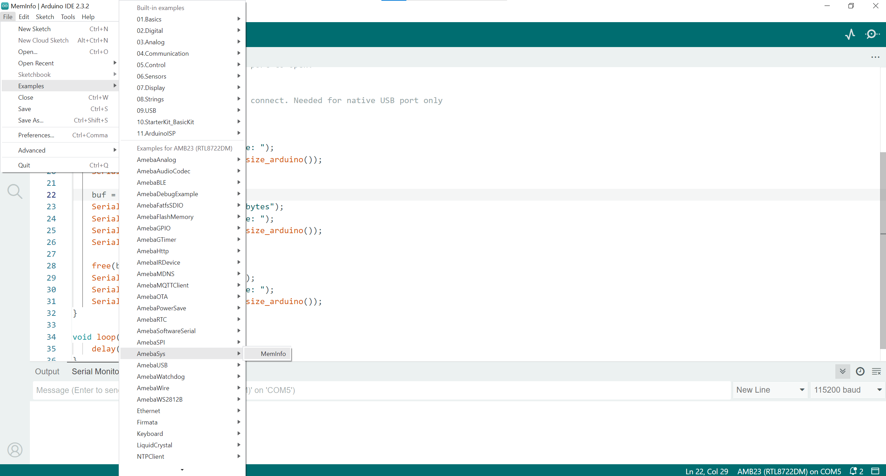
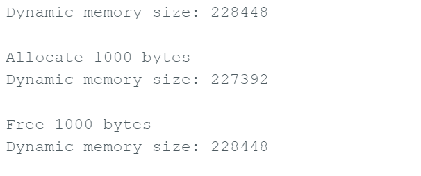
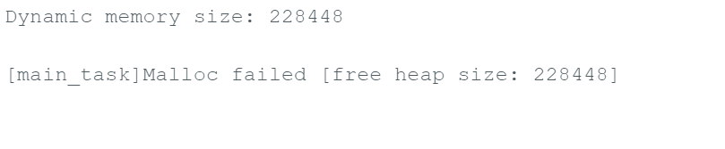

SYS - MemInfo
=============

Materials
---------

- AmebaD [AMB21 / AMB22 / AMB23 / AMB25 / AMB26 / BW16 / AW-CU488 Thing Plus] x 1

**Introduction**
~~~~~~~~~~~~~~~~

This example demonstrates how to monitor the current OS free heap size on the Ameba board using FreeRTOS.

FreeRTOS uses a memory heap for dynamic memory allocation and creating threads. Monitoring the heap size is important because a low heap size can lead to allocation failures and abnormal behavior.

**Procedure**
~~~~~~~~~~~~~

Step 1. Open Example

Open the example: :guilabel:`Files -> Examples -> AmebaSys -> MemInfo`

|image01|

Step 2. Upload Code

Upload the code and open the Serial Monitor.

The output will show the available heap size before and after memory allocation and freeing:

- Initial free heap size
- Free heap size after allocating 1000 bytes
- Free heap size after freeing the memory

This helps you understand how dynamic memory usage affects available heap space at runtime.

|image02|

.. note :: If the available heap size becomes too low, and memory is allocated beyond what is available, the allocation will fail.

|image03|

