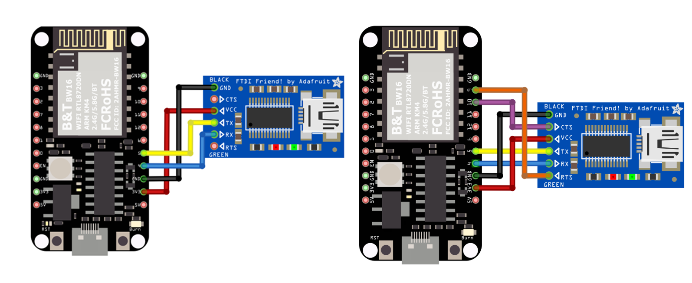
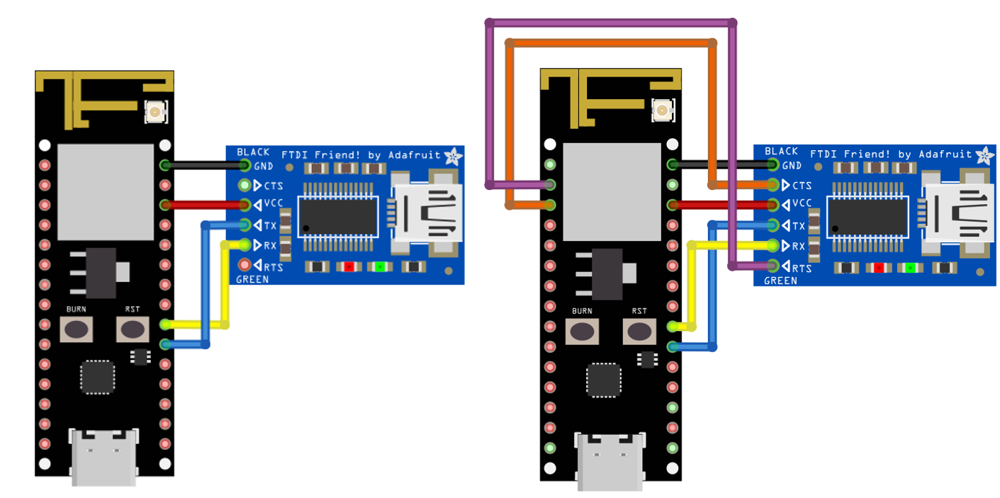
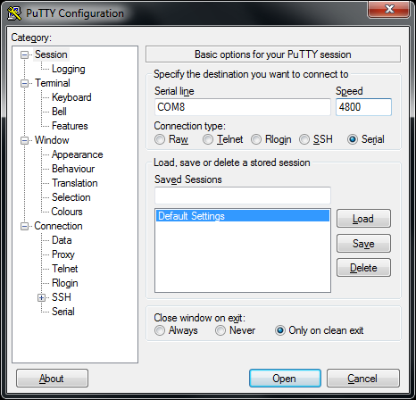

UART - Communicate with PC over USB to Serial Module	
====================================================

.. contents::
  :local:
  :depth: 2

Materials
---------

- AmebaD [AMB21 / AMB22 / AMB23 / AMB25 / AMB26 / BW16 / AW-CU488 Thing Plus] x 1
- USB to TTL Adapter x 1

Example
-------

**Introduction**
~~~~~~~~~~~~~~~~

UART uses two wires, one for transmitting and the other one for receiving, so the data transmission is bidirectional. The communication uses a predefined frequency (baud rate) to transmit data. In Arduino, UART is called “Serial”. There is only one hardware UART on Arduino UNO and it is primarily used to read the log and messages printed by Arduino (it is also known as “Log UART”). If we use hardware UART for other purposes, the Log UART does not have resources to function. To provide more UART connections, it is possible to use a GPIO pin to simulate the behavior of UART with a software approach, this is called Software Serial. Ameba is equipped with several hardware UART ports, but it is also compatible with the Software Serial Library.

**Procedure**
~~~~~~~~~~~~~

In this example, we use UART to connect USB to TTL adapter to Ameba.
USB to TTL adapter sends data to Ameba, the data would be returned by Ameba, and showed on the screen.

**Install USB to TTL Adapter**

USB to TTL adapter converts USB to serial interface. Normally, there are at least 4 pins on the adapter, that is 3V3 (or 5V), GND, TX and RX. Generally, installing the driver for the USB to TTL adapter would be required before using it. If the adapter uses the chip of FTDI, Windows will search and install the driver automatically, otherwise, you may need to install the corresponding driver yourself.
Afterwards, open your Device Manager. You can find the corresponding serial port number of the USB to TTL adapter:
  
|image01|

**Executing the Example**

Open the “SoftwareSerialExample” example in ``“File” → “Examples” → “AmebaSoftwareSerial” → “SoftwareSerial_Basic”``:
  
|image02|

SoftwareSerial_DetailSetting

Open the “SoftwareSerialExample” example in “File” → “Examples” → “AmebaSoftwareSerial” → “SoftwareSerial_DetailSetting”: 

|image03|

.. only:: amb21

**AMB21 / AMB22** Wiring Diagram:
  
|image04|

.. only:: end amb21

.. only:: amb23

**AMB23** Wiring Diagram:

|image05|

.. only:: end amb23

.. only:: bw16-typeb

**BW16** Wiring Diagram:

|image06|

.. only:: end bw16-typeb

.. only:: bw16-typec

**BW16-TypeC** Wiring Diagram:

|image07|

.. only:: end bw16-typec

.. only:: aw-cu488

**AW-CU488 Thing Plus** Wiring Diagram:

|image08|

.. only:: end aw-cu488

.. only:: amb25

**AMB25** Wiring Diagram:

|image09|

.. only:: end amb25

.. only:: amb26

**AMB26** Wiring Diagram:

|image10|

.. only:: end amb26

Next, open a serial port terminal, such as Putty or Tera Term. (Putty is used in this example). Open the Putty window, choose “Serial” in connection type, and specify the port number of the USB to TTL adapter (e.g. COM8). In the speed field, fill in the baud rate of this connection. 

**SoftwareSerial_Basic**
Note that both sides of the connection should use the same baud rate. In this example we set baud rate to 4800.

|image11|

Next, select “Serial” on the left side. Set data bits to 8, stop bits to 1, parity to none, and flow control to none. Then click Open and press the reset button on Ameba.
  
|image12|

**SoftwareSerial_DetailSetting** 

|image13|

You can see the “Hello, world?” message appears in Putty. 

**SoftwareSerial_Basics**
If characters are typed into Putty, the input characters would be sent to Serial RX of Ameba by TX of USB to TTL Adapter, and returned by Serial TX of Ameba. Finally, RX of USB to TTL Adapter receives the returned characters and prints them in Putty as shown in the picture below.

**SoftwareSerial_DetailSetting**
If characters are typed into the serial monitor, the input character will print out in the Putty as shown in the picture below. 

|image14|

Code Reference
--------------

First, use ``SoftwareSerial:begin(speed)`` to set the baud rate for the serial communication:
https://www.arduino.cc/en/Reference/SoftwareSerialBegin

Use ``write()`` to send data, and use ``SoftwareSerial:available()`` to get the number of bytes available for reading from a software serial port:
https://www.arduino.cc/en/Reference/SoftwareSerialAvailable

If there are data available to read, use read() to read from serial port.

.. |image02| image:: ../../../../_static/amebad/Example_Guides/UART/UART_Communicate_with_PC_over_USB_to_Serial_Module/image02.png
   :width: 683
   :height: 1006

.. |image10| image:: ../../../../_static/amebad/Example_Guides/UART/UART_Communicate_with_PC_over_USB_to_Serial_Module/image10.png
   :width: 1577
   :height: 627
   :scale: 50%

.. |image12| image:: ../../../../_static/amebad/Example_Guides/UART/UART_Communicate_with_PC_over_USB_to_Serial_Module/image12.png
   :width: 466
   :height: 448

.. |image14| image:: ../../../../_static/amebad/Example_Guides/UART/UART_Communicate_with_PC_over_USB_to_Serial_Module/image14.png
   :width: 395
   :height: 248
