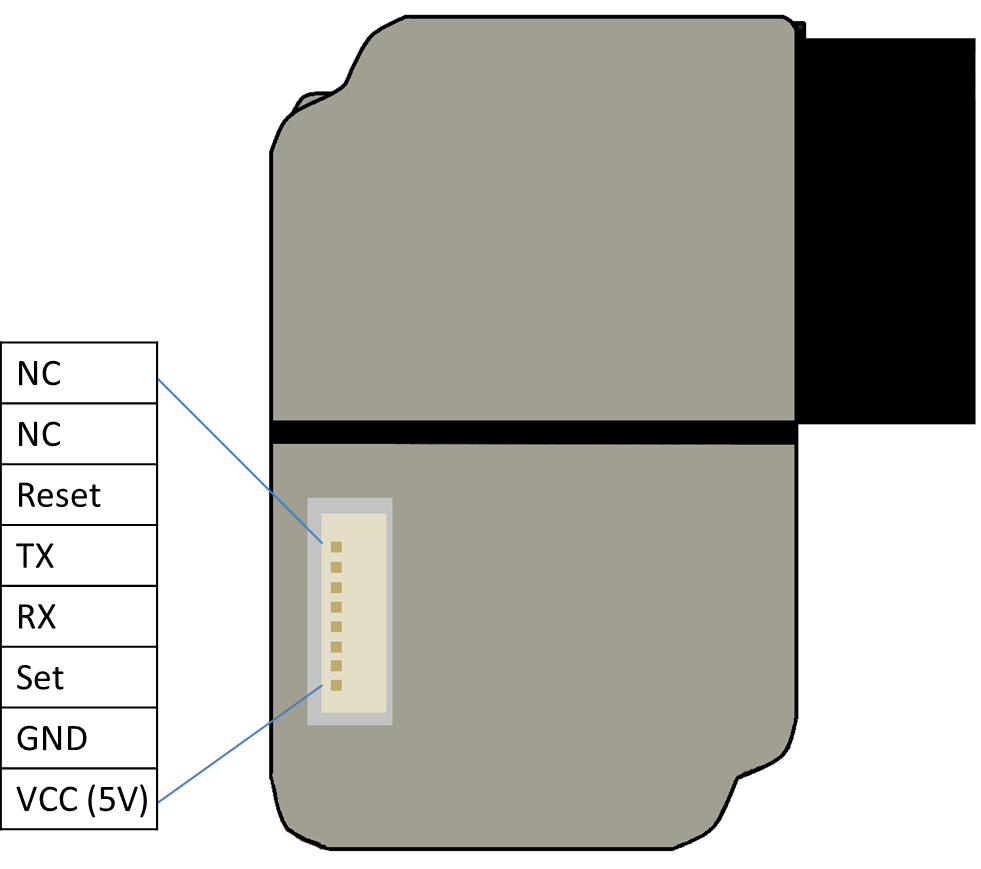
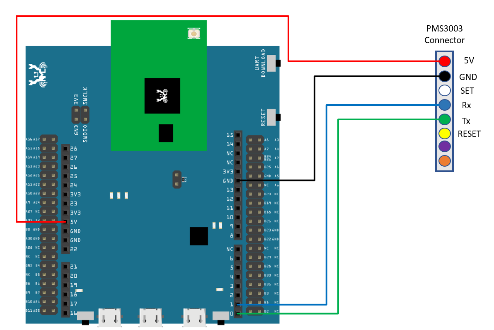
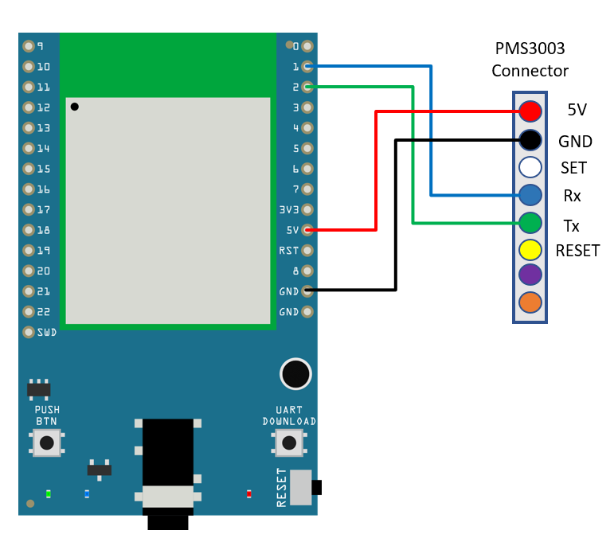
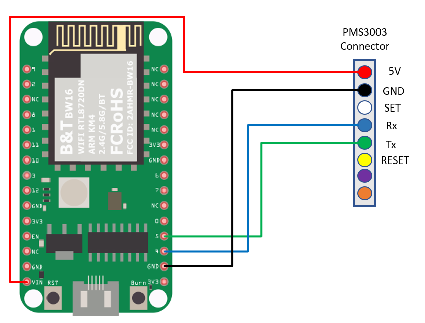
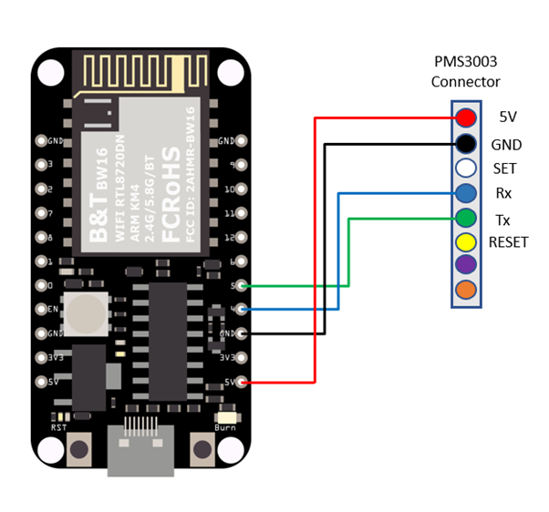
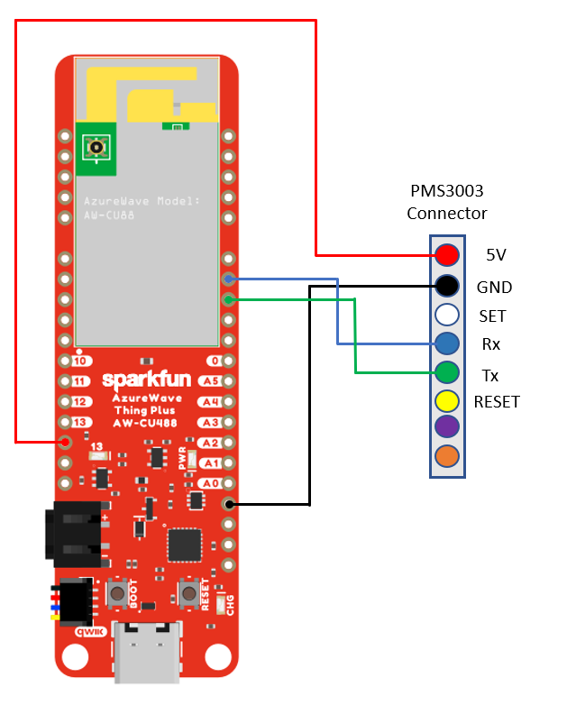
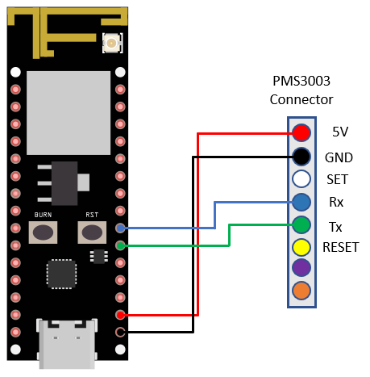
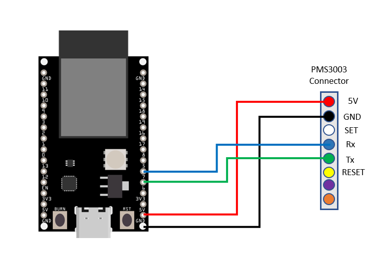
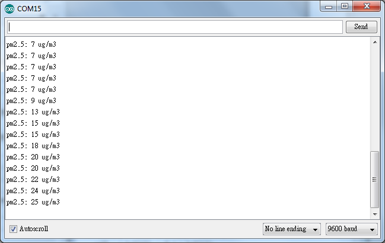

UART - PM2.5 Concentration in The Air
=====================================

Materials
---------

- AmebaD [AMB21 / AMB22 / AMB23 / AMB25 / AMB26 / BW16 / AW-CU488 Thing Plus] x 1
- PlanTower PMS3003 or PMS5003 x 1

Example
-------

**Introduction**
~~~~~~~~~~~~~~~~

PMS3003 or PMS5003 is a sensor of air quality, it can detect the concentration of 0.3 to 10 micrometer particulate matters in the air. The sensor output its data via UART.

The PMS3003 or PMS5003 sensor detects the concentration value of PM 1.0, PM 2.5, PM 10 particles. For example, PM 2.5 stands for fine particles with a diameter of 2.5 micrometers or less.

Open the example in ``"File" → "Examples" → "AmebaSoftwareSerial" → "PMS3003_AirQuality"``

|image01|

There are 8 pins in PMS3003:

|image02|

PMS3003 requires 5V power, but the working voltage of its IC is 3.3C. Therefore, the working voltage of Reset, TX, RX, Set is 3.3V as well. If the "Set" pin is pulled to high, the PMS3003 is put to operating mode. If the "Set" pin is pulled low, the PMS3003 is put to standby mode.

TX/RX pins are for UART connection. Under operating mode, PMS3003 outputs the data it reads continuously (Each data is 32 bytes). Please refer to the following article for detailed data format information:

https://www.dfrobot.com/wiki/index.php?title=PM2.5_laser_dust_sensor_SKU:SEN0177

.. only:: amb21

**AMB21 / AMB22** Wiring Diagram:

|image03|

.. only:: end amb21

.. only:: amb23

**AMB23** Wiring Diagram:

|image04|

.. only:: end amb23

.. only:: bw16-typeb

**BW16** Wiring Diagram:

|image05|

.. only:: end bw16-typeb

.. only:: bw16-typec

**BW16-TypeC** Wiring Diagram:

|image06|

.. only:: end bw16-typec

.. only:: aw-cu488

**AW-CU488 Thing Plus** Wiring Diagram:

|image07|

.. only:: end aw-cu488

.. only:: amb25

**AMB25** Wiring Diagram:

|image08|

.. only:: end amb25

.. only:: amb26

**AMB26** Wiring Diagram:

|image09|

.. only:: end amb26

In this example, we do not use the "Set" and "Reset" pins.

Compile the code and upload it to Ameba. After pressing the Reset button, Ameba starts to output the PM 2.5 data to serial monitor.

|image10|

.. |image01| image:: ../../../../_static/amebad/Example_Guides/UART/UART_PM2.5_Concentration_in_the_Air/image01.png
   :width: 777
   :height: 1006

