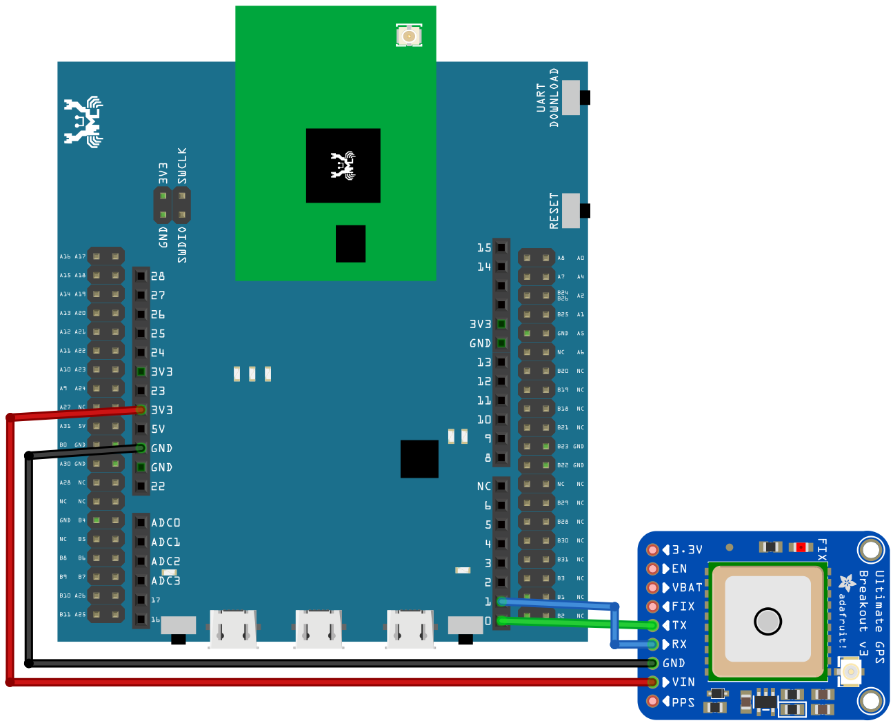
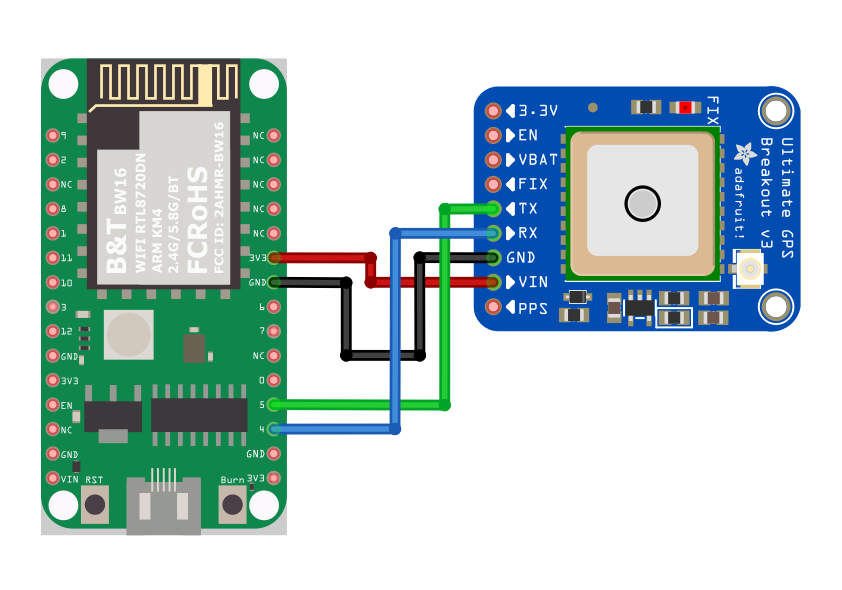

UART - Retrieve GPS Position
============================

Materials
---------

- AmebaD [AMB21 / AMB22 / AMB23 / AMB25 / AMB26 / BW16 / AW-CU488 Thing Plus] x 1
- `Adafruit Ultimate GPS Breakout <https://www.adafruit.com/product/746>`__ x 1 (Refer to `official document <https://learn.adafruit.com/adafruit-ultimate-gps?view=all>`_)

Example
-------

**Introduction**
~~~~~~~~~~~~~~~~

In this example, we use Adafruit Ultimate GPS Breakout. Its data format is pure text, so we can connect it to USB to TTL Adapter and observe the output.

**Procedure**
~~~~~~~~~~~~~

|image01|

|image02|

It follows the NMEA sentence format (refer to http://aprs.gids.nl/nmea/)The GPS signal is weak in indoor environment. The status that the GPS signal is not received is called "not fix". Bring the GPS module outdoors, when the GPS signal is "fix", you would get a message similar to the figure below.

|image03|

In this example we are only interested in the "$GPRMC (Global Positioning Recommended Minimum Coordinates)":

**$GPRMC,032122.000,A,2446.8181,N,12059.7251,E,0.39,78.89,270116,,,A*53**
Each field is separated by a comma.

- First field is the GMT time (Greenwich Mean Time), that is 032122.000 in this example. The time format is HH:MM:SS.SSS, i.e., 03:21:22.000. Note that the time zone and the daylight-saving time adjustment should be handled on your own.

- Second field represents the status code

   -  V: Void (Invalid)

   -  A: Active, meaning the GPS signal is fix.

- The third to sixth fields represent the geolocation

In this example, 2446.8181,N represents 24 degrees 46.8181 minutes north latitude, and 12059.7251,E represents 120 degrees 59.7251 minutes east longitude.

We can search **+24 46.8181', +120 59.7251'** in Google maps to check whether the position is correct.

|image04|

- The seventh field is relative speed(knot). 1 knot = 1.852km/hr, in this example the relative speed is 0.39 knot.

- The eighth field is the moving angle, which is calculated by its moving orbit.

- The ninth field is the date with format ddMMyy. In this example, "270116" stands for day 27, January, year 2016.

- The last field is checksum. In the example we have \*53 as checksum.

.. only:: amb21

**AMB21 / AMB22** Wiring Diagram:

|image05|

.. only:: end amb21

.. only:: amb23

**AMB23** Wiring Diagram:

|image06|

.. only:: end amb23

.. only:: bw16-typeb

**BW16** Wiring Diagram:

|image07|

.. only:: end bw16-typeb

.. only:: bw16-typec

**BW16-TypeC** Wiring Diagram:

|image08|

.. only:: end bw16-typec

.. only:: aw-cu488

**AW-CU488 Thing Plus** Wiring Diagram:

|image09|

.. only:: end aw-cu488

.. only:: amb25

**AMB25** Wiring Diagram:

|image10|

.. only:: end amb25

.. only:: amb26

**AMB26** Wiring Diagram:

|image11|

.. only:: end amb26

Open the example in :guilabel:`Files -> Examples -> AmebaSoftwareSerial -> Adafruit_GPS_parsing`

Compile and upload to Ameba, then press the reset button.
The result will be output to Serial Monitor:

|image12|

|image13|

.. |image01| image:: ../../../../_static/amebad/Example_Guides/UART/UART_Retrieve_GPS_Position/image01.png
   :width: 1252
   :height: 294
   :scale: 70%
.. |image02| image:: ../../../../_static/amebad/Example_Guides/UART/UART_Retrieve_GPS_Position/image02.png
   :width: 649
   :height: 372
.. |image03| image:: ../../../../_static/amebad/Example_Guides/UART/UART_Retrieve_GPS_Position/image03.png
   :width: 777
   :height: 425
.. |image04| image:: ../../../../_static/amebad/Example_Guides/UART/UART_Retrieve_GPS_Position/image04.png
   :width: 1028
   :height: 651
   :scale: 80%

.. |image06| image:: ../../../../_static/amebad/Example_Guides/UART/UART_Retrieve_GPS_Position/image06.png
   :width: 1100
   :height: 809
   :scale: 80%

.. |image09| image:: ../../../../_static/amebad/Example_Guides/UART/UART_Retrieve_GPS_Position/image09.png
   :width: 731
   :height: 780

.. |image11| image:: ../../../../_static/amebad/Example_Guides/UART/UART_Retrieve_GPS_Position/image11.png
   :width: 795
   :height: 582
.. |image12| image:: ../../../../_static/amebad/Example_Guides/UART/UART_Retrieve_GPS_Position/image12.png
   :width: 649
   :height: 410

