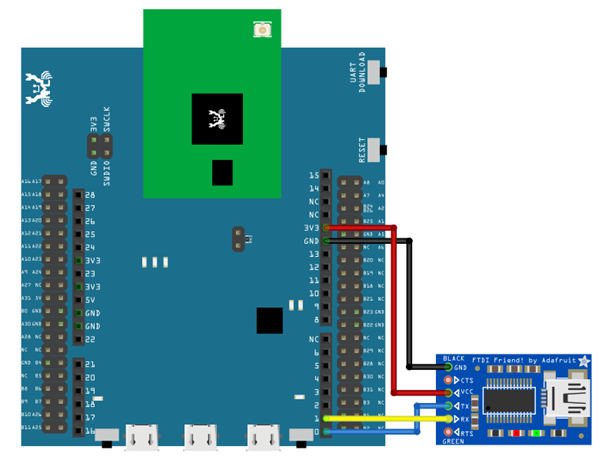
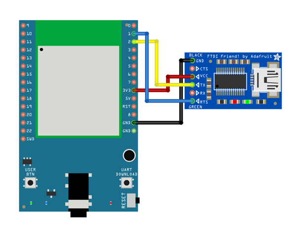
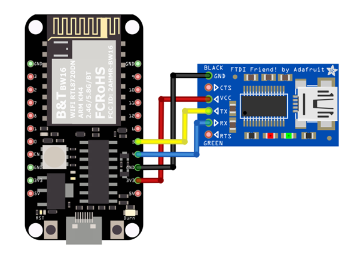
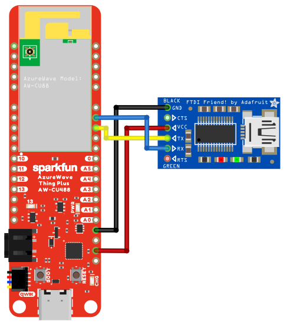
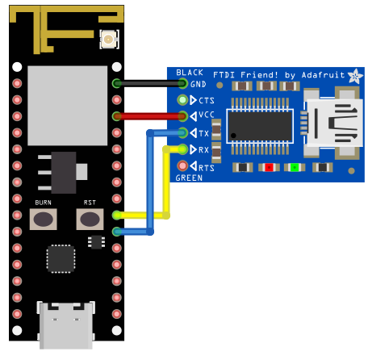
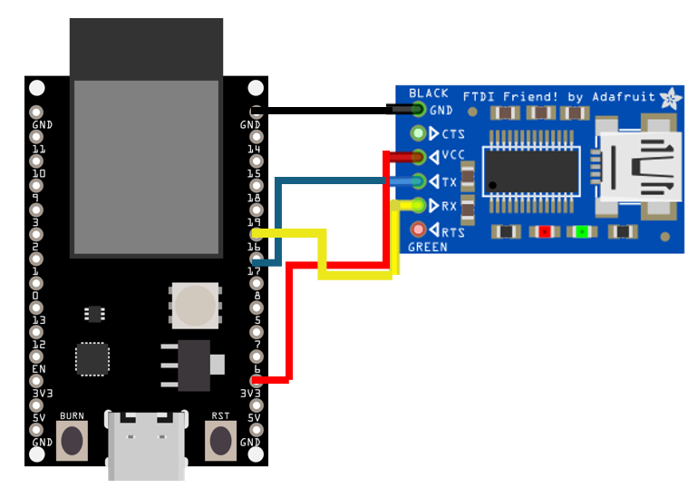
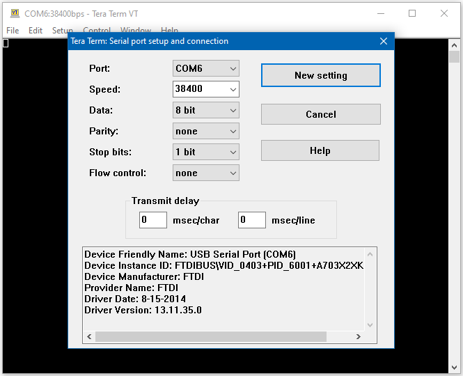

UART - Set Callback Function For UART Communications
====================================================

Materials
---------

- AmebaD [AMB21 / AMB22 / AMB23 / AMB25 / AMB26 / BW16 / AW-CU488 Thing Plus] x 1
- USB to TTL Adapter x 1

Example
-------

**Introduction**
~~~~~~~~~~~~~~~~

This example shows how to set a callback function for UART communication to process the UART data.

A USB to TTL adapter is required for this example. Ensure that you have the driver installed and connect it to the Ameba board as shown.

.. only:: amb21

**AMB21 / AMB22** Wiring Diagram:

|image01|

.. only:: end amb21

.. only:: amb23

**AMB23** Wiring Diagram:

|image02|

.. only:: end amb23

.. only:: bw16-typeb

**BW16** Wiring Diagram:

|image03|

.. only:: end bw16-typeb

.. only:: bw16-typec

**BW16-TypeC** Wiring Diagram:

|image04|

.. only:: end bw16-typec

.. only:: aw-cu488

**AW-CU488 Thing Plus** Wiring Diagram:

|image05|

.. only:: end aw-cu488

.. only:: amb25

**AMB25** Wiring Diagram:

|image06|

.. only:: end amb25

.. only:: amb26

**AMB26** Wiring Diagram:

|image07|

.. only:: end amb26

Open the example in :guilabel:`File -> Examples -> AmebaSoftwareSerial -> SoftwareSerial_Irq_Callback`

|image08|

Upload the code and press the reset button on Ameba once the upload is finished.
Next, using a terminal program, such as TeraTerm or PuTTY, open a serial port and configure it according to the settings. Make sure the serial port number corresponds to the USB to TTL adapter.

- Speed: 38400

- Data: 8 bit

- Parity: none

- Stop bits: 1 bit

- Flow control: none

|image09|

Once the serial port is open, type in the terminal and press the enter key, and you will see the corresponding output.

|image10|

Code Reference
--------------

``mySerial.setAvailableCallback(mySerialCallback);`` is used to set the function mySerialCallback as a callback function for software serial. When a new character is received, the callback function checks if the character corresponds to the enter key, and releases the semaphore if it is true, which in turn allows the main loop to print out all the previously received characters.

.. |image03| image:: ../../../../_static/amebad/Example_Guides/UART/UART_Set_Callback_Function_For_UART_Communications/image03.png
   :width: 1020
   :height: 705
   :scale: 80%

.. |image09| image:: ../../../../_static/amebad/Example_Guides/UART/UART_Set_Callback_Function_For_UART_Communications/image09.png
   :width: 665
   :height: 540
.. |image10| image:: ../../../../_static/amebad/Example_Guides/UART/UART_Set_Callback_Function_For_UART_Communications/image10.png
   :width: 665
   :height: 540
