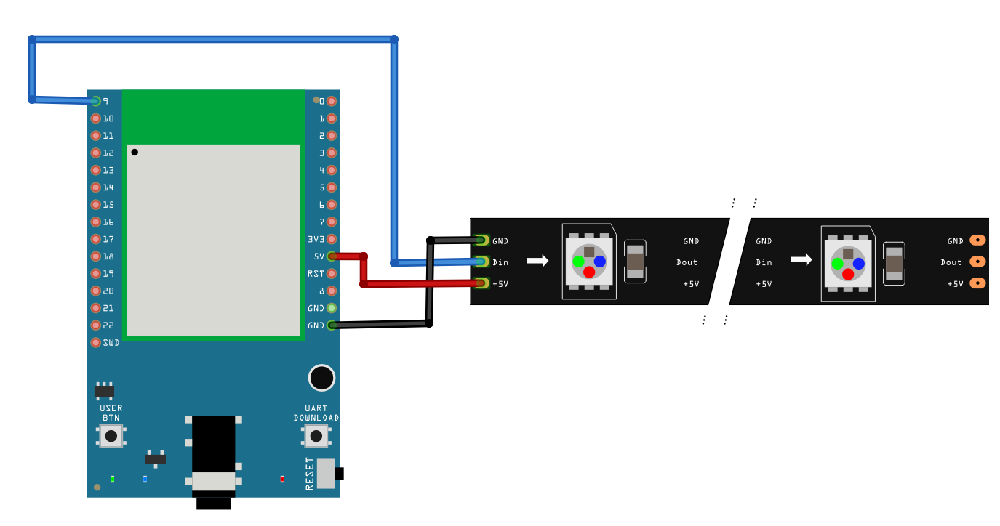
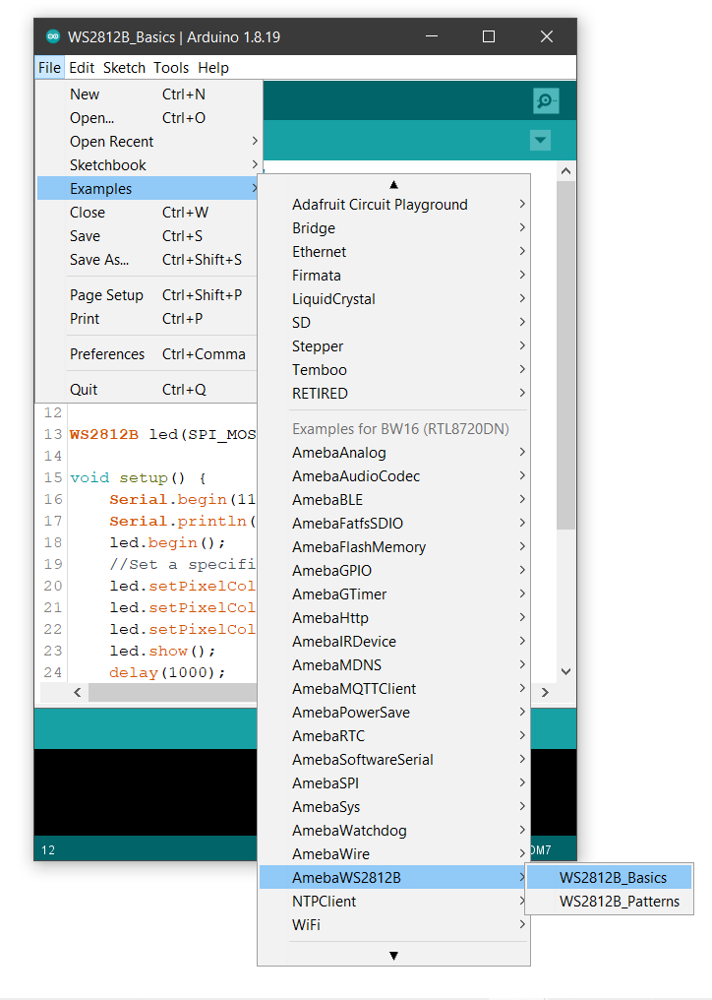

WS2812B - Basics
================

Materials
---------

- AmebaD [AMB21 / AMB22 / AMB23 / AMB25 / AMB26 / BW16 / AW-CU488 Thing Plus] x 1
- WS2812B LED Strip / Ring / Stick / Board x1

Example
-------

**Introduction**
~~~~~~~~~~~~~~~~

In this example, we will be using the AmebaD board to control the WS2812B RGB LED, using the SPI peripheral to create the waveform necessary for the LEDs.

WS2812B basics allows you to control a single LED with a color or fill all the LED with the same color.

Procedure
----------

Firstly, connect the WS2812B to the Ameba board as shown in the following diagrams.

.. only:: amb21

**AMB21 / AMB22** Wiring Diagram:

|image01|

.. only:: end amb21

.. only:: amb23

**AMB23** Wiring Diagram:

|image02|

.. only:: end amb23

.. only:: bw16-typeb

**BW16** Wiring Diagram:

|image03|

.. only:: end bw16-typeb

.. only:: bw16-typec

**BW16-TypeC** Wiring Diagram:

|image04|

.. only:: end bw16-typec

.. only:: aw-cu488

**AW-CU488 Thing Plus** Wiring Diagram:

|image05|

.. only:: end aw-cu488

.. only:: amb25

**AMB25** Wiring Diagram:

|image06|

.. only:: end amb25

.. only:: amb26

**AMB26** Wiring Diagram:

|image07|

.. only:: end amb26

To light up one individual LED or multiple LEDs with the same color, use **WS2812B_Basics**.

Open the example in :guilabel:`File -> Example -> AmebaWS2812B -> WS2812B_Basics`

|image08|

In the sample code, modify **TOTAL_NUM_OF_LEDS** to be the total number of LEDs on the WS2812B module, and modify **NUM_OF_LEDS** to be the number of LEDs that you have connected.

|image09|

Next, compile and upload to Ameba, then press the reset button. You will see the first 3 LED light up with red, green, and blue light color individually and after a while all the LED will be filled with a color.

|image10|

|image11|

Code Reference
--------------

[1] WS2812B Datasheet:

https://cdn-shop.adafruit.com/datasheets/WS2812B.pdf

.. |image01| image:: ../../../../_static/amebad/Example_Guides/WS2812B/WS2812B_Basics/image01.png
   :width: 1234
   :height: 747
   :scale: 70%

.. |image03| image:: ../../../../_static/amebad/Example_Guides/WS2812B/WS2812B_Basics/image03.png
   :width: 1320
   :height: 685
   :scale: 60%

.. |image05| image:: ../../../../_static/amebad/Example_Guides/WS2812B/WS2812B_Basics/image05.png
   :width: 957
   :height: 710
   :scale: 80%
.. |image06| image:: ../../../../_static/amebad/Example_Guides/WS2812B/WS2812B_Basics/image06.png
   :width: 1287
   :height: 702
   :scale: 60%

.. |image10| image:: ../../../../_static/amebad/Example_Guides/WS2812B/WS2812B_Basics/image10.png
   :width: 2912
   :height: 512
   :scale: 30%
.. |image11| image:: ../../../../_static/amebad/Example_Guides/WS2812B/WS2812B_Basics/image11.png
   :width: 2908
   :height: 516
   :scale: 30%
