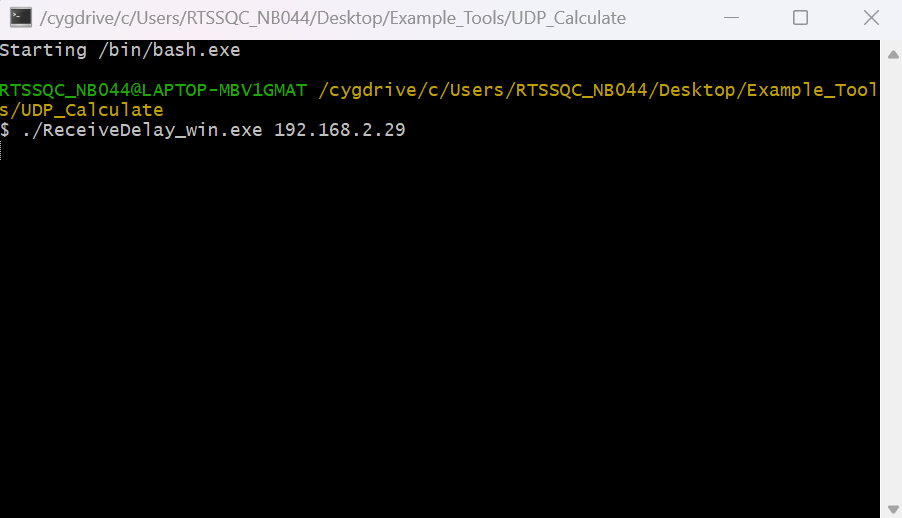
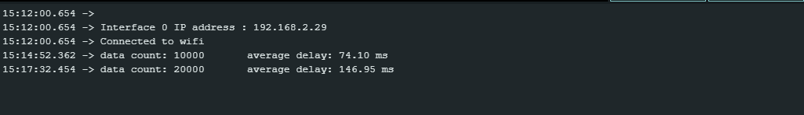

WiFi - Approximate UDP Receive Delay
======================================

.. contents::
  :local:
  :depth: 2
  
Materials
---------

- AmebaD [AMB21 / AMB22 / AMB23 / AMB25 / AMB26 / BW16 / AW-CU488 Thing Plus] x 1

- Computer that connected to same network

Example
--------

This example uses Ameba to receive UDP packets from a computer and calculates the UDP receive delay.

**Ameba Side**

- Open the example in “File” -> “Examples” -> “WiFi” -> “UDP_Calculation” -> “UDP_CalculateReceiveDelay”.

- Modify the ssid, password and key index (optional). Compile and upload the code from the Arduino IDE to Ameba and press the reset button when the upload is complete. Ameba should connect to the same network as the computer.

- Open the serial monitor in Arduino IDE and record the IP address assigned to Ameba as the client IP address.

**Computer Side**

- Cygwin (https://www.cygwin.com/) will be required for the example. Please download and install.

- Connect the computer to the network.

- Download the “ReceiveDelay_win.exe” from https://github.com/Ameba-AIoT/ameba-arduino-d “Ameba_misc/Example_Tools/UDP_Calculate”.

- Open Cygwin terminal.

- Run command “./ReceiveDelay_win.exe <the client IP address>”.

|image01|

- The computer begins to send packets to Ameba. Once 10000 packets have been received, Ameba will calculate the average delay and print out the result to the serial monitor. It may take up to a few minutes for 10000 packets to be sent.

|image02|

   