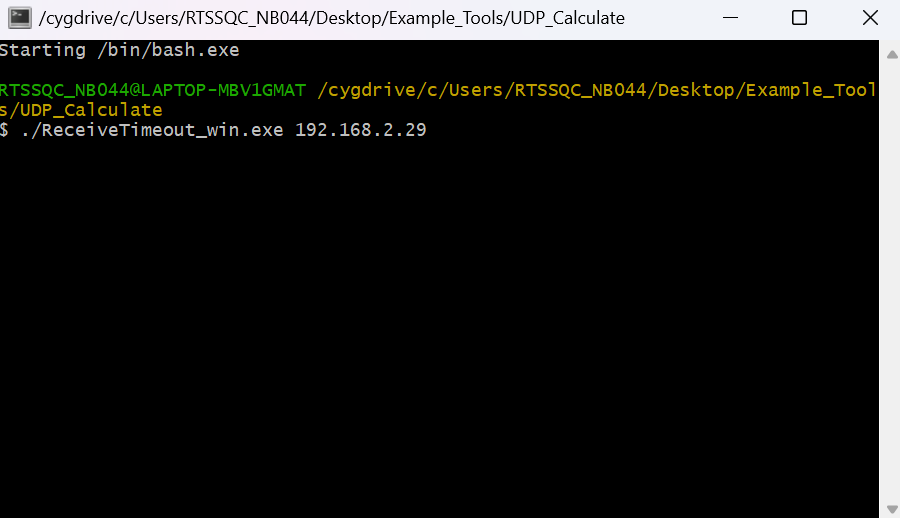
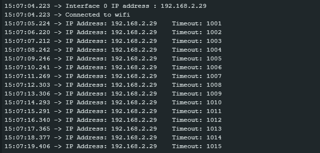
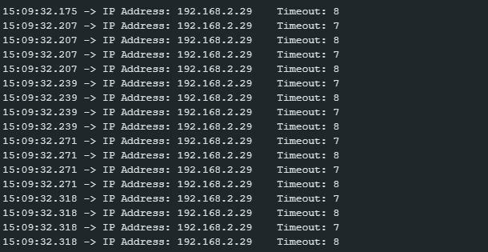

WiFi - Approximate UDP Receive Timeout
=======================================

Materials
---------

- AmebaD [AMB21 / AMB22 / AMB23 / AMB25 / AMB26 / BW16 / AW-CU488 Thing Plus] x 1

- Windows computer connected to same network

Example
--------

This example uses Ameba to receive UDP packets from a computer and calculates the allowed UDP receive timeout setting.

**Ameba Side**

- Open the example in :guilabel:`File -> Examples -> WiFi -> UDP_Calculation -> UDP_CalculateReceiveTimeout`

- Modify the ssid, password and key index (optional). Compile and upload the code from the Arduino IDE to Ameba and press the reset button when the upload is complete. Ameba should connect to the same network as the computer.

- Open the serial monitor in Arduino IDE and record the IP address assigned to Ameba as the client IP address.

**Computer Side**

- Cygwin (https://www.cygwin.com/) will be required for the example. Please download and install.

- Connect the computer to the network.

- Download the "ReceiveTimeout_win.exe" from https://github.com/Ameba-AIoT/ameba-arduino-d "Ameba_misc/Example_Tools/UDP_Calculate".

- Open Cygwin terminal.

- Run command "./ReceiveTimeout_win.exe <the client IP address>".

|image01|

- The computer will begin to send packets continuously to Ameba. The timeout value is set to 1000ms initially. For each packet received successfully, Ameba decreases the timeout value. The next packet must be received within the timeout period, otherwise Ameba registers a failed packet and increases the timeout value. Open the serial monitor and observe the timeout value converge to a minimum value.

|image02|

|image03|

