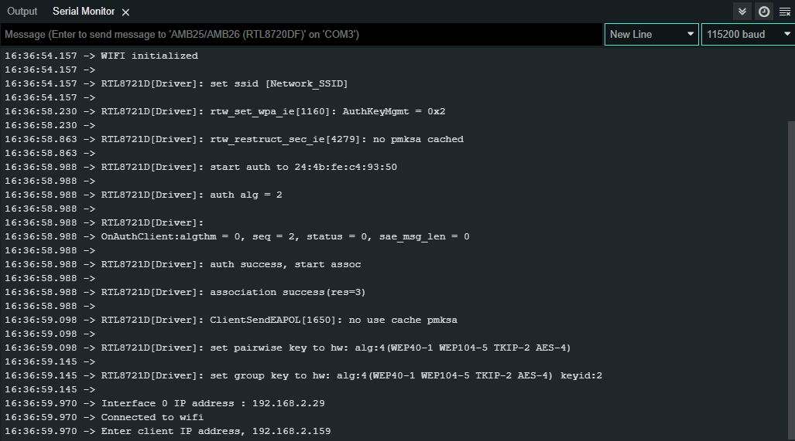
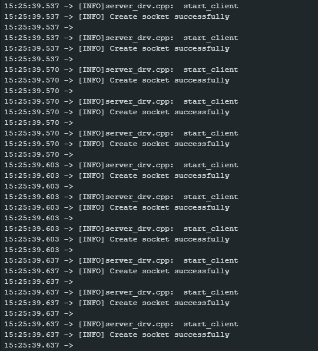
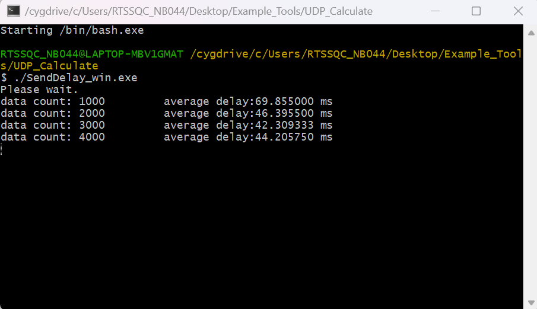

WiFi - Approximate UDP Sending Delay
=======================================

Materials
---------

- AmebaD [AMB21 / AMB22 / AMB23 / AMB25 / AMB26 / BW16 / AW-CU488 Thing Plus] x 1

- Windows computer connected to same network

Example
--------

This example uses Ameba to send UDP packets to a computer and calculates the UDP sending delay.

**Computer Side**
- Cygwin (https://www.cygwin.com/) will be required for the example. Please download and install.

- Connect the computer to the network.

- Download the "SendDelay_win.exe" from https://github.com/Ameba-AIoT/ameba-arduino-d "Ameba_misc/Example_Tools/UDP_Calculate".

- Open Cygwin terminal.

- Run command "ipconfig". Record the IPv4 address as the client IP address.

- Run command "./SendDelay_win.exe". The computer begins to listen for packets from Ameba.

|image01|

**Ameba Side**

- Open the example in :guilabel:`File -> Examples -> WiFi -> UDP_Calculation -> UDP_CalculateSendDelay`

- Modify the ssid, password and key index (optional). Compile and upload the code from the Arduino IDE to Ameba and press the reset button when the upload is complete. Ameba should connect to the same network as the computer.

- Open the serial monitor in Arduino IDE and record the IP address assigned to Ameba as the client IP address.

|image02|

|image03|

- The Ameba will begin to send UDP packets to the computer. Once 1000 packets have been received, the computer will calculate the average delay and print out the result.

|image04|

.. |image01| image:: ../../../../_static/amebad/Example_Guides/WiFi/WiFi_Approximate_UDP_Sending_Delay/image01.png
   :width:  890 px
   :height:  539 px

