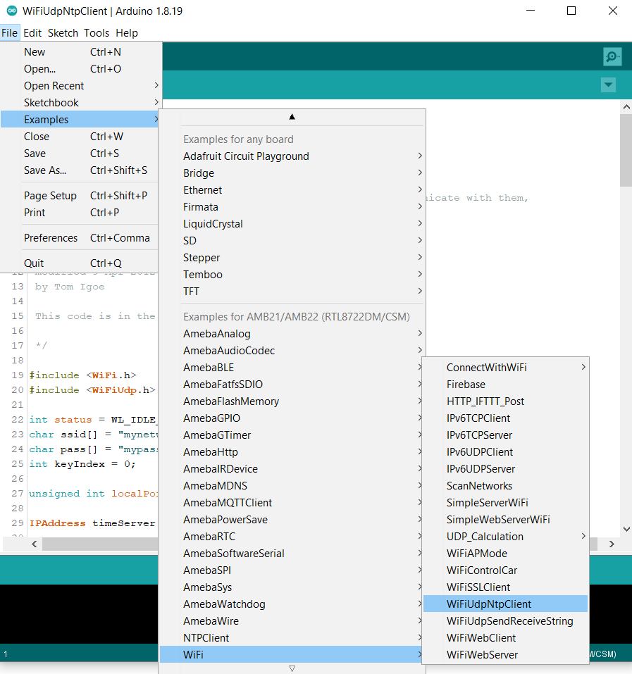
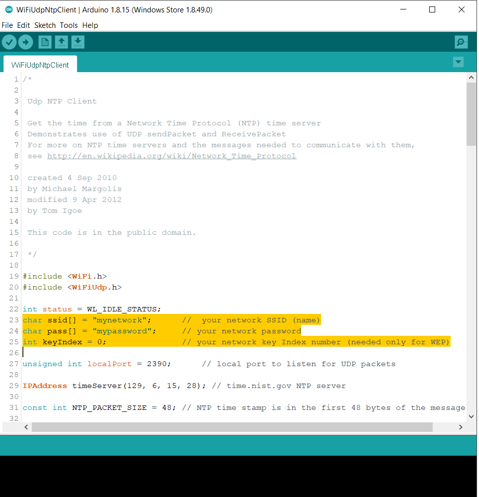

WiFi - Retrieve Universal Time (UTC) by UDP
=============================================================

Materials
---------

- AmebaD [AMB21 / AMB22 / AMB23 / AMB25 / AMB26 / BW16 / AW-CU488 Thing Plus] x 1

Example
--------

In this example, we connect Ameba to WiFi. Then send NTP (Network Time Protocol, RFC 1305) request to NTP server using UDP. After receiving the NTP request, the NTP server replies current UTC (Coordinated Universal Time) packet. We will parse the UTC packet to show current UTC time in the serial monitor.

Open the example. "File" -> "Examples" -> "WiFi" -> "WiFiUdpNtpClient"

|image01|

Modify the highlighted code section (ssid, password, keyindex) to connect to your WiFi network.

|image02|

Compile the code and upload it to Ameba. After pressing the Reset button, Ameba connects to WiFi and sends NTP request packet to NTP server "129.6.15.28". We parse the replied packet and show UTC time in serial monitor:

|image03|

.. |image03| image:: ../../../../_static/amebad/Example_Guides/WiFi/WiFi_Retrieve_Universal_Time_(UTC)_by_UDP/image03.png
   :width:  704 px
   :height:  423 px

