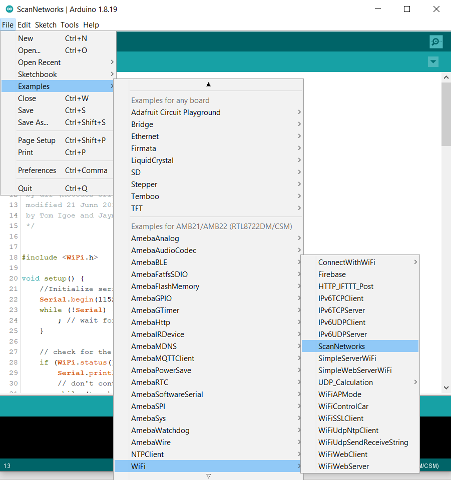
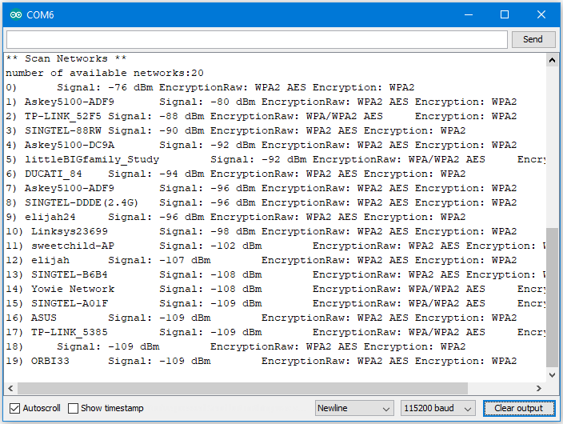

WiFi - Scan the surrounding WiFi networks
==========================================

Materials
---------

- AmebaD [AMB21 / AMB22 / AMB23 / AMB25 / AMB26 / BW16 / AW-CU488 Thing Plus] x 1

- Antenna x 1

Example
-------

In this example, we use Ameba to scan available WiFi hotspots in the surroundings, and prints the SSID, encryption type, signal strength information of each detected hotspot.

First, make sure the correct Ameba development board is selected in Arduino IDE: "Tools" -> "Board" ->

Open the "ScanNetworks" example in "File" -> "Examples" -> "AmebaWiFi" -> "ScanNetworks":

|image01|

Then upload the sample code and press the reset button on Ameba. Afterwards, you can see "**Scan Networks**" message appears, with the detected WiFi hotspots and the information of each hotspot.

|image02|

Code Reference
---------------

First we use WiFi.macAddress(mac) to get the MAC address of Ameba: https://www.arduino.cc/en/Reference/WiFiMACAddress

Then we use WiFi.scanNetworks() to detect WiFi hotspots: https://www.arduino.cc/en/Reference/WiFiScanNetworks

| To get information of detected WiFi hotspot:
| We use WiFi.SSID(thisNet) to retrieve SSID of a network:
| https://www.arduino.cc/en/Reference/WiFiSSID

We use WiFi.RSSI(thisNet) to get the signal strength of the connection to the router: https://www.arduino.cc/en/Reference/WiFiRSSI

We use WiFi.encryptionType(thisNet) to get the encryption type of the network: https://www.arduino.cc/en/Reference/WiFiEncryptionType

Comparison with Arduino
-------------------------

In the Arduino platform, we need to add an extra WiFi shield to be the WiFi module to realize the WiFi connection. And we must #include to use SPI to communicate with WiFi module.
However, Ameba is already equipped with WiFi module.

Therefore, #include is not needed.

