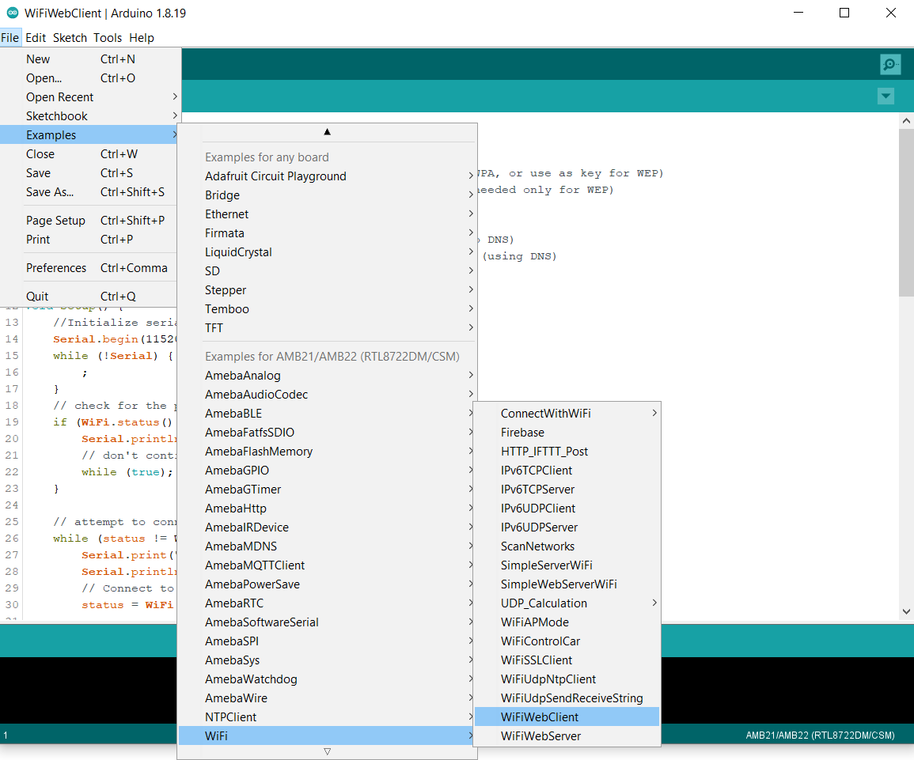
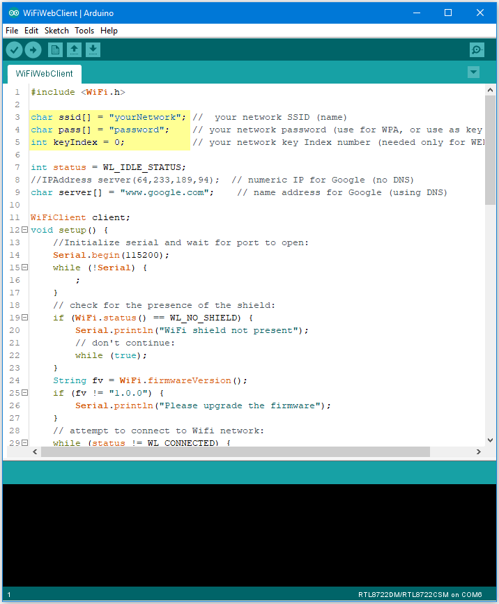
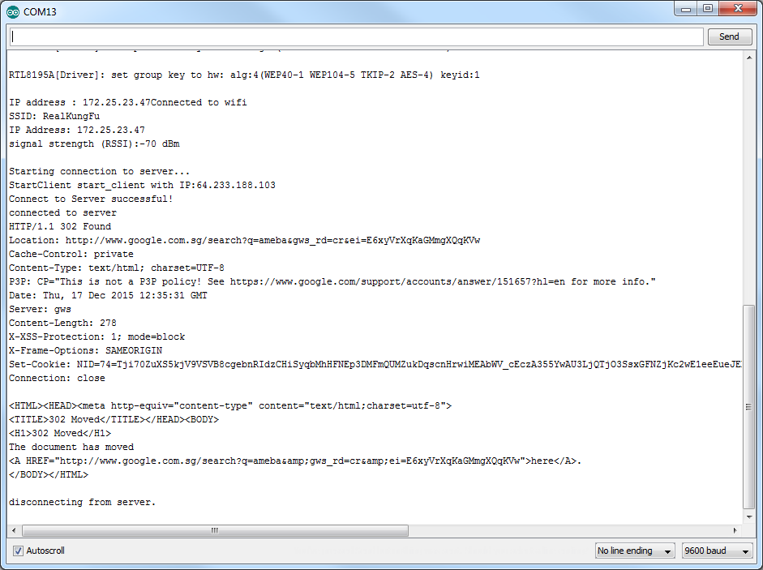

WiFi - Set up Client to Retrieve Google Search Information
=============================================================

.. contents::
  :local:
  :depth: 2
  
Materials
---------

- AmebaD [AMB21 / AMB22 / AMB23 / AMB25 / AMB26 / BW16 / AW-CU488 Thing Plus] x 1

- Laptop (Make sure it is connected to the same network domain as Ameba, and tcp tools are installed.)

Example
--------

In this example, we use Ameba to be a web client to retrieve information from the Internet.
First, make sure the correct Ameba development board is selected in “Tools” -> “Board”

Then open “File” -> “Examples” -> “WiFi” -> “WiFiWebClient”

|image01|

In the sample code, modify the highlighted snippet and enter the required information (ssid, password, key index) required to connect to your WiFi network.

|image02|

Upload the code and press the reset button on Ameba. Then you can see the information retrieved from Google is shown in the Arduino serial monitor.

|image03|

Code Reference
---------------

| https://www.arduino.cc/en/Reference/WiFiBegin
| To get the information of a WiFi connection: Use WiFi.SSID() to get SSID of the current connected network.
| https://www.arduino.cc/en/Reference/WiFiSSID
| Use WiFi.RSSI() to get the signal strength of the connection.
| https://www.arduino.cc/en/Reference/WiFiRSSI
| Use WiFi.localIP() to get the IP address of Ameba.
| https://www.arduino.cc/en/Reference/WiFiLocalIP
| Use WiFiClient() to create a client.
| https://www.arduino.cc/en/Reference/WiFiClient
| Use client.connect() to connect to the IP address and port specified.
| https://www.arduino.cc/en/Reference/WiFiClientConnect
| Use client.println() to print data followed by a carriage return and newline.
| https://www.arduino.cc/en/Reference/WiFiClientPrintln
| Use client.available() to return the number of bytes available for reading.
| https://www.arduino.cc/en/Reference/WiFiClientAvailable
| Use client.read() to read the next byte received from the server the client is connected to.
| https://www.arduino.cc/en/Reference/WiFiClientRead
| Use client.stop() to disconnect from the server the client is connected to.
| https://www.arduino.cc/en/Reference/WiFIClientStop

   