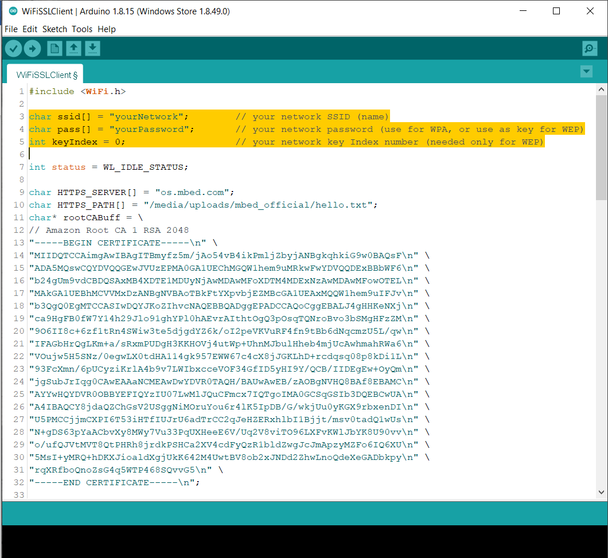

WiFi - Set up SSL Client for HTTPS Communication
===================================================

Materials
---------

- AmebaD [AMB21 / AMB22 / AMB23 / AMB25 / AMB26 / BW16 / AW-CU488 Thing Plus] x 1

Example
---------

This example uses Ameba to securely retrieve information from the internet using SSL. SSL is an acronym for Secure Sockets Layer. It is a cryptographic protocol designed to provide communications security over a computer network, by encrypting the messages passed between server and client.

Open the "WiFiSSLClient" example in :guilabel:`File -> Examples -> WiFi -> WiFiSSLClient`

|image01|

In the sample code, modify the highlighted snippet to reflect your WiFi network settings.

|image02|

Upload the code and press the reset button on Ameba once the upload is finished.

Open the serial monitor in the Arduino IDE and observe as Ameba retrieves a text file from os.mbed.com.

|image03|

Code Reference
----------------
Use "WiFiSSLClient client;" to create a client that uses SSL. After creation, the client can be used in the same way as a regular client.

.. |image03| image:: ../../../../_static/amebad/Example_Guides/WiFi/WiFi_Set_up_SSL_Client_for_HTTPS_Communication/image03.png
   :width:  931 px
   :height:  404 px

