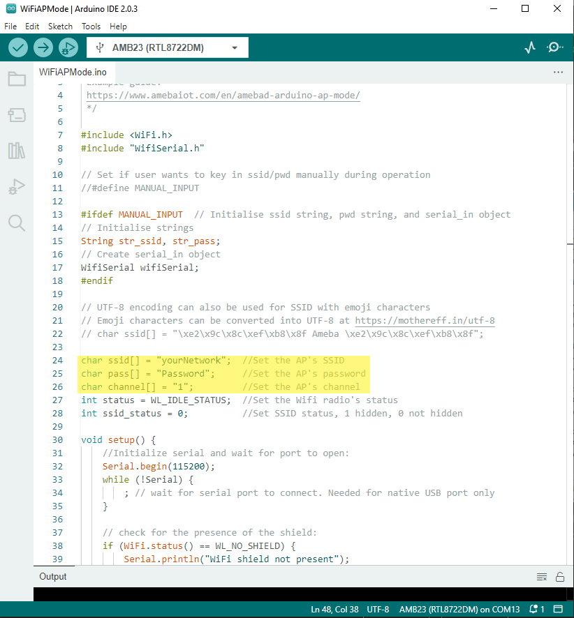
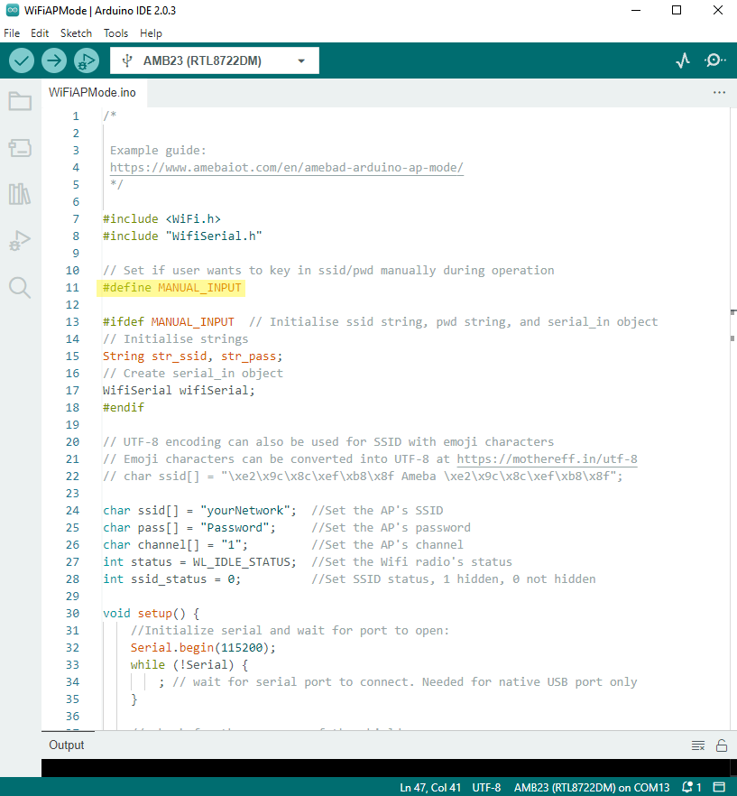
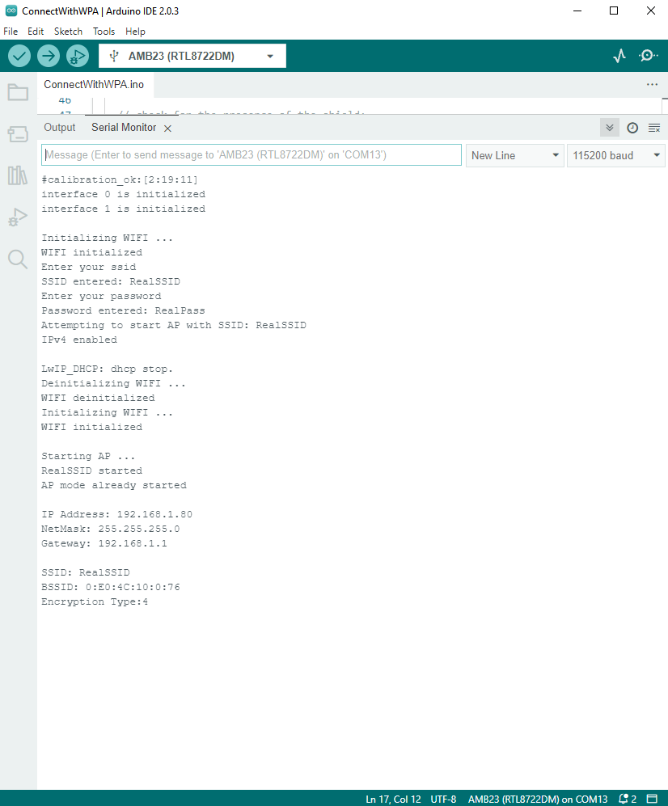
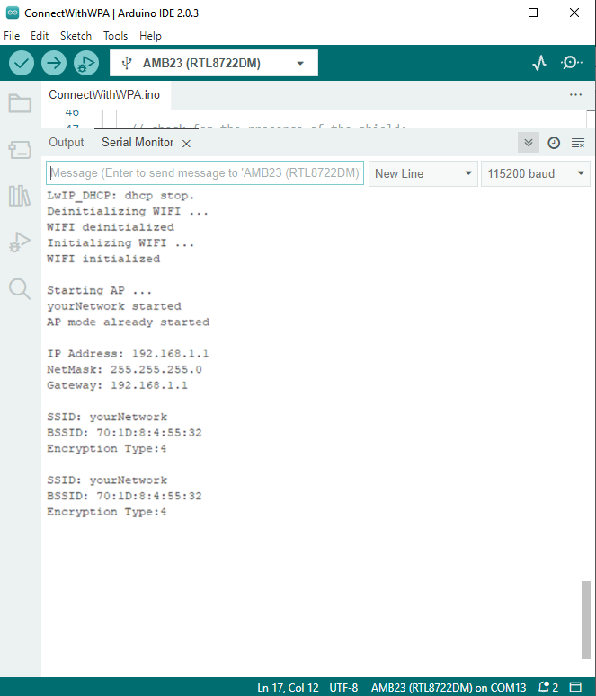
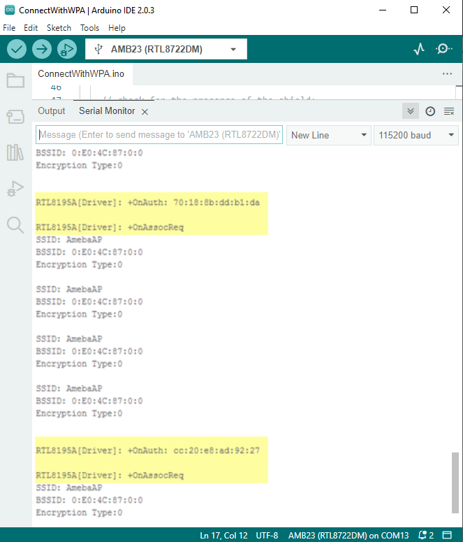
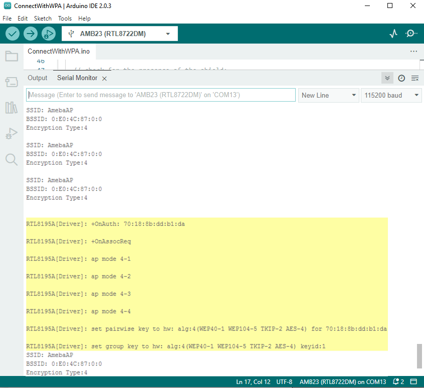

WiFi - Set up WiFi AP Mode
=============================

In AP mode, Ameba can accept at most 3 station connections, and can be set to open mode or WPA2 mode.

Materials
---------

- AmebaD [AMB21 / AMB22 / AMB23 / AMB25 / AMB26 / BW16 / AW-CU488 Thing Plus] x 1

Example
---------

In this example, we turn on the AP mode of Ameba and connect station to Ameba.

Open the WiFi AP example, :guilabel:`File -> Examples -> WiFi -> WiFiAPMode`

|image01|

In the highlighted code snippet, fill in your SSID, PASSWORD and CHANNEL.

If you prefer to enter your SSID & password in the Serial monitor while the program is running, uncomment #define MANUAL_INPUT at the top of the file.

|image02|

Note: If you enabled MANUAL_INPUT, after uploading the sample code and pressing the reset button on Ameba, input your SSID in the Serial monitor and press enter.

Next, input your password and press enter. AP mode should start after that.

|image03|

The code highlighted is the API we used to turn on the AP mode in security mode.

If you want to turn on the AP mode in open mode, please modify the code to status = WiFi.apbegin(ssid, channel);

Then upload the sample code and press reset, and you can see related information shown in serial monitor.

|image04|

In the figure below, we show the messages shown in serial monitor when two stations connect to Ameba AP in open mode:

|image05|

In the figure below, we show the messages shown in serial monitor when a station connects to Ameba AP in security mode:

|image06|

