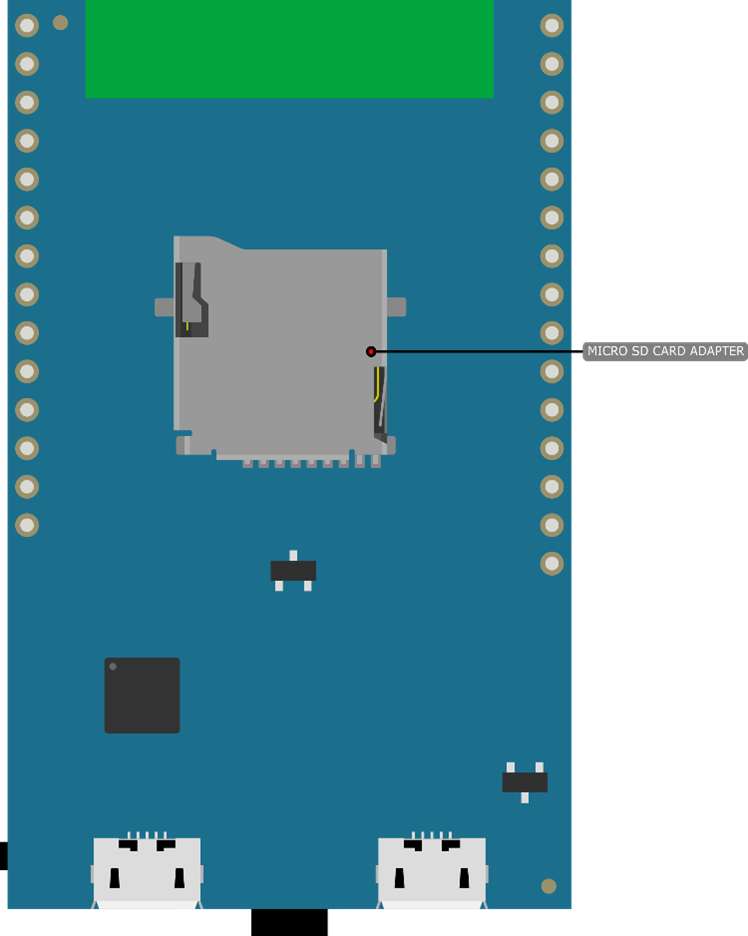
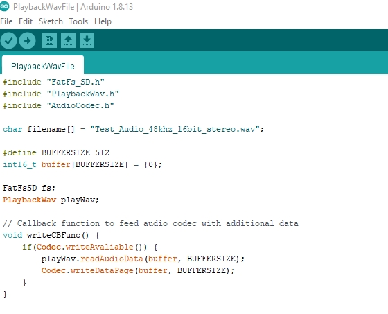
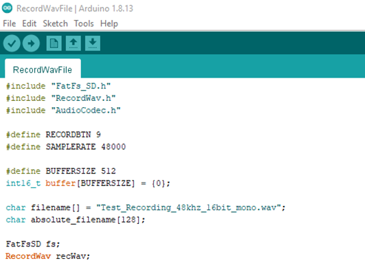
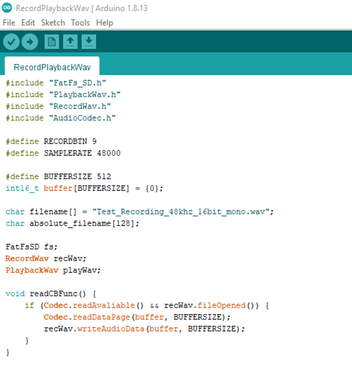
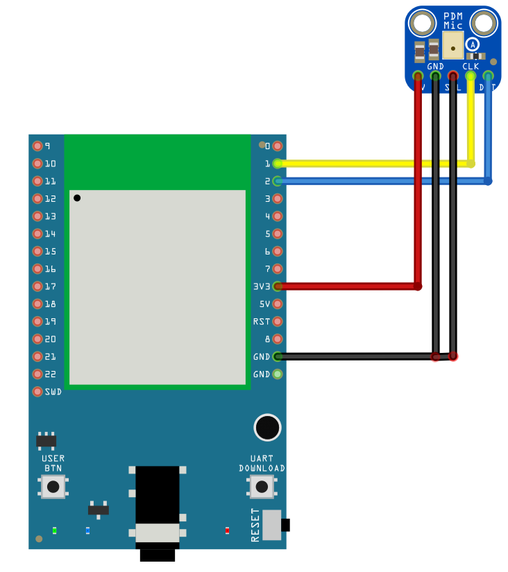

Play and Record Wav Files
=========================

.. contents::
  :local:
  :depth: 2

Materials
---------

   - AmebaD [AMB23] x 1
   - MicroSD card
   - Adafruit PDM Microphone Breakout x 1 [Optional]

Example
-------

Procedure
~~~~~~~~~

As AMB23 have a built in microphone on the board, there is no need for any external microphone. Copy a sample wav file into the MicroSD card for demo. (In this example, the sample name is `Test_Audio_48khz_16bit_stereo.wav <https://github.com/Ameba-AIoT/ameba-arduino-d/blob/master/Ameba_misc/Example_Samples/Test_Audio_48khz_16bit_stereo.wav>`_) Then insert the MicroSD card into the adapter at the back of the board.

  |image01|

If you wish to connect a digital microphone (PDM), you may refer to the following wiring diagram.

  |image05|

**Example 01 - PlaybackWavFile**

| Open the example, ``“Files” -> “Examples” -> “AmebaAudioCodec” -> “PlaybackWavFile”``.

  |image02|

Upload the code and press the reset button on Ameba once the upload is finished.
Insert earphone/speaker into the onboard jack for playing the sample sound.

**Example 02 - RecordWavFile**

| Open the example, ``“Files” -> “Examples” -> “AmebaAudioCodec” -> “RecordWavFile”``.

  |image03|

| Define a GPIO/button(Input high to active) for ``RECORDBTN``. Define the ``filename[]`` for name of the storage wav file. In this example the name is “Test_Recording_48khz_16bit_mono.wav”.
| Upload the code and press the reset button on Ameba once the upload is finished.
| Input high to ``RECORDBTN``, then record voice by on board mic. When input is low the record stops. The recorded voice will be stored in “Test_Recording_48khz_16bit_mono.wav” that located at MicroSD card.

**Example 03 - RecordPlaybackWav**

| Open the example, ``“Files” -> “Examples” -> “AmebaAudioCodec” -> “RecordPlaybackWav”``.

  |image04|

| This example is a combination of **Example01** and **Example02**. You can record by **Example02** then play it by jack as the method of **Example01**.

| Define a GPIO/button(Input high to active) for ``RECORDBTN``. Define the ``filename[]`` for name of the storage wav file. In this example the name is 
| “Test_Recording_48khz_16bit_mono.wav”.

| Upload the code and press the reset button on Ameba once the upload is finished.

| Input high to ``RECORDBTN``, then record voice by on board mic. When input is low the record stops. The recorded voice will be stored in 
  “Test_Recording_48khz_16bit_mono.wav” that located at MicroSD card.

| Insert earphone/speaker into the onboard jack for playing the sample sound.

