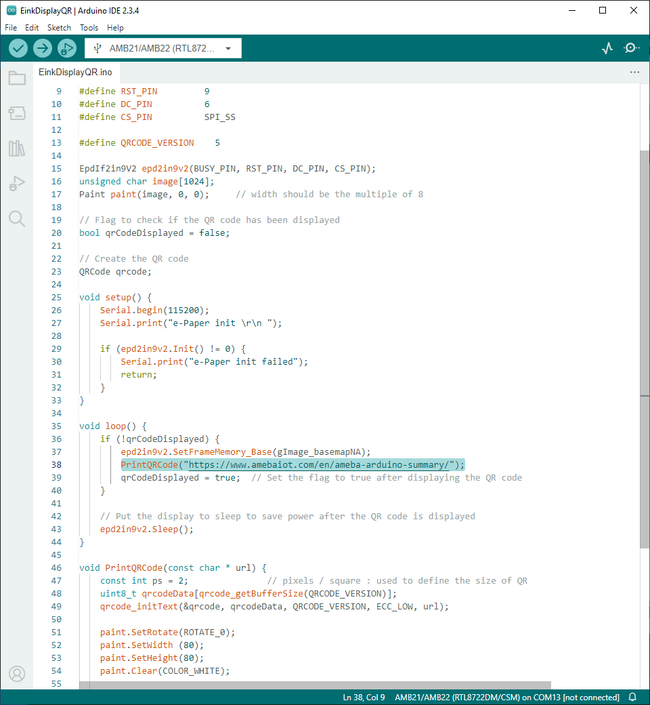

E-Paper - Display User-generated QR Code
=========================================

.. contents::
  :local:
  :depth: 2

Materials
---------
- AmebaD [AMB21 / AMB22 / AMB23 / AMB25 / AMB26 / BW16 / AW-CU488 Thing Plus] x 1

- Waveshare E-Paper [2.9inch E-Paper HAT (D)/ 2.9inch E-Paper V2/ 2.9inch e-Paper Module (B)/ 4.2inch e-Paper Module/ 4.2inch v2 e-Paper Module/ 7.5-inch E-Ink display HAT] x1

In this example, AmebaD boards will be used to connect to a Waveshare e-Paper module (2.9inch/ 4.2inch/ 7.5inch) to display texts. The display uses the flexible substrate as base plate, with an interface and a reference system design. You may refer to the official datasheet to know more information about these modules.

**AMB23 wiring diagrams:**

2.9inch HAT (D) e-Paper Module

|image02|

2.9inch E-Paper v2 e-Paper Module/ 2.9inch e-Paper Module (B)

|image02v2| 

4.2inch e-Paper Module/ 4.2inch v2 e-Paper Module

|image09|

7.5-inch e-Paper Module
Do note that Display Config should be set to B and Interface Config should be set to 0.

|image16|

Download the Eink zip library, AmebaEink.zip, at https://github.com/Ameba-AIoT/ameba-arduino-d/blob/dev/Arduino_zip_libraries. Then install the AmebaEink.zip by navigating to “Sketch” -> “Include Library” -> “Add .ZIP Library…”.

Eink examples are categorised based on the size and modules of the e-Paper display.

|image22|

Open one of the “EinkDisplayQR” examples. For example, “File” → “Examples” → “AmebaEink” → “EPD_2in9v2” → “EinkDisplayQR”:

|image23|

You may choose any GPIO pins for Busy, Reset and DC pin.

|image24|

Modify the URL in the loop() section highlighted for your QR code, then upload the code to the Ameba board. Upload the code to the board and press the reset button after uploading is done.

A QR code generated based on the input URL will be shown on the E-paper module. In the example, the QR code links to Ameba IoT official website.

|image25|

|image26|

Code Reference
---------------

[1] We use Good Display GDEH029A1 2.9 Inch / 296x128 Resolution / Partial Refresh Arduino Sample Code to get the e-Paper successfully Display:
http://www.good-display.com/product/201.html

[2] EPD libraries can be obtained from:
https://github.com/waveshare/e-Paper

[3] Generate a QR code on the E-paper module:
https://eugeniopace.org/qrcode/arduino/eink/2019/07/01/qrcode-on-arduino.html

.. |image02| image:: ../../../_static/amebad/Example_Guides/E-Paper/Epaper_Display_user_generated_QR_code/image02.png
   :width:  816 px
   :height:  349 px

.. |image22| image:: ../../../_static/amebad/Example_Guides/E-Paper/Epaper_Display_user_generated_QR_code/image22.png
   :width:  768 px
   :height:  832 px

.. |image23| image:: ../../../_static/amebad/Example_Guides/E-Paper/Epaper_Display_user_generated_QR_code/image23.png
   :width:  768 px
   :height:  832 px

.. |image24| image:: ../../../_static/amebad/Example_Guides/E-Paper/Epaper_Display_user_generated_QR_code/image24.png
   :width:  768 px
   :height:  832 px

.. |image26| image:: ../../../_static/amebad/Example_Guides/E-Paper/Epaper_Display_user_generated_QR_code/image26.png
   :width:  590 px
   :height:  788 px
