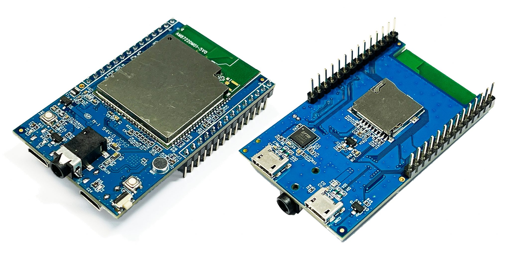

AMB23 Arduino
=============

.. table::
   :class: table-transparent
   :align: center

   +------------------------------------------------------------------------+----------------------------------------------------------+
   | |image01|                                                              | - MCU                                                    |
   |                                                                        |    - Part Number: RTL8722DM                              |
   | **AMB23**                                                              |    - 32-bit KM4 (Arm Cortex-M33 compatible)              |
   |                                                                        |    - 32-bit KM0 (Arm Cortex-M23 compatible)              |
   | (Ameba RTL8722DM)                                                      | - Memory                                                 |
   |                                                                        |    - 512KB SRAM                                          |
   +------------------------------------------------------------------------+    - 4MB PSRAM                                           |
   | |image02|                                                              |    - 2MB Flash                                           |
   |                                                                        | - Key Features                                           |
   | - Worldwide                                                            |    - Integrated 802.11 a/n Wi-Fi SoC                     |
   |    - `Seeed Studio <link01_>`_                                         |    - Trustzone-M Security                                |
   |    - `Adafruit <link02_>`_                                             |    - Hardware SSL Engine                                 |
   | - Regional                                                             |    - Root Trust Secure Boot                              |
   |    - `Taiwan ICShop <link03_>`_                                        |    - USB Host/Device                                     |
   |                                                                        |    - SD Host                                             |
   |                                                                        |    - BLE5.0                                              |
   |                                                                        |    - Codec                                               |
   |                                                                        |    - LCDC                                                |
   |                                                                        |    - Key Matrix                                          |
   |                                                                        | - Other Features                                         |
   |                                                                        |    - 1 PCM interface                                     |
   |                                                                        |    - 3 UART interfaces                                   |
   |                                                                        |    - 1 I2C Interface                                     |
   |                                                                        |    - 7 ADC interfaces                                    |
   |                                                                        |    - 1 SPI interfaces                                    |
   |                                                                        |    - 9 PWM interfaces                                    |
   |                                                                        |    - Max 23 GPIO                                         |
   |                                                                        |    - 1 Switch button                                     |
   |                                                                        |    - 2 LED                                               |
   +------------------------------------------------------------------------+----------------------------------------------------------+

.. toctree::
   :caption: Category list
   :maxdepth: 2

   Getting_Started/index
   Example_Guides/index
   API_Documents/index

SDK Source Code
---------------

* |image03| `ameba-arduino-d <https://github.com/Ameba-AIoT/ameba-arduino-d>`_

.. _link01: https://www.seeedstudio.com/Ameba-RTL8722DM-mini-EVB-Arduino-WiFi-Shield-p-5055.html

.. _link02: https://www.adafruit.com/product/5285

.. _link03: https://www.icshop.com.tw/products/368030501635?locale=en

.. |image03| image:: ../_static/GitHub_Logo_2025.png
   :target: https://github.com/Ameba-AIoT
   :width:  50px
