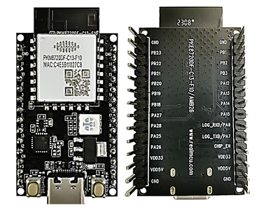

AMB26 Arduino
=============

.. table::
   :align: center

   +-----------+
   | |image01| |
   +-----------+

.. toctree::
   :caption: Category list
   :maxdepth: 2

   Getting_Started/index
   Example_Guides/index
   API_Documents/index

SDK Source Code
---------------

* |image02| `ameba-arduino-d <https://github.com/Ameba-AIoT/ameba-arduino-d>`_

.. |image02| image:: ../_static/GitHub_Logo_2025.png
   :target: https://github.com/Ameba-AIoT
   :width:  50px
