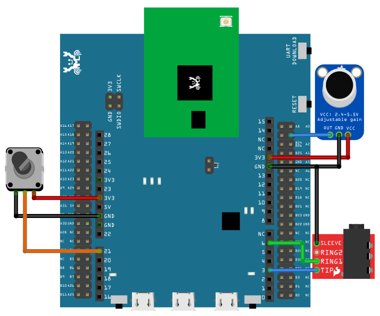

AudioCodec - Basic Input Output
================================

Materials
---------

- AmebaD [ AMB21 / AMB22 / AMB23 / AW-CU488 Thing Plus ] x 1

- Potentiometer x 1

- Analog microphone x 1 (e.g., Adafruit 1063 / 1064)

- 3.5mm TRS/TRRS breakout x 1 (e.g., Adafruit 2791 / Sparkfun 11570)

Example
-------

Connect the potentiometer, microphone and 3.5mm connector to the RTL8722 board following the diagram.

|image01|

Open the example, "Files" -> "Examples" -> "AmebaAudioCodec" -> "BasicInputOutput".

|image04|

Upload the code and press the reset button on Ameba once the upload is finished.

Connect a pair of wired headphones to the 3.5mm audio jack, blow at the microphone, and you should hear the sounds picked-up by the microphone replayed in the headphones. Adjust the potentiometer and the output volume will change as well. Note: if you are using a microphone with an amplifier included, such as Adafruit 1063, the amplifier can lead to the microphone picking up more noise.

.. |image04| image:: ../../../../_static/amebad/Example_Guides/AudioCodec/Audio_Codec_Basic_Input_Output/image04.png
   :width: 608 px
   :height: 830 px
