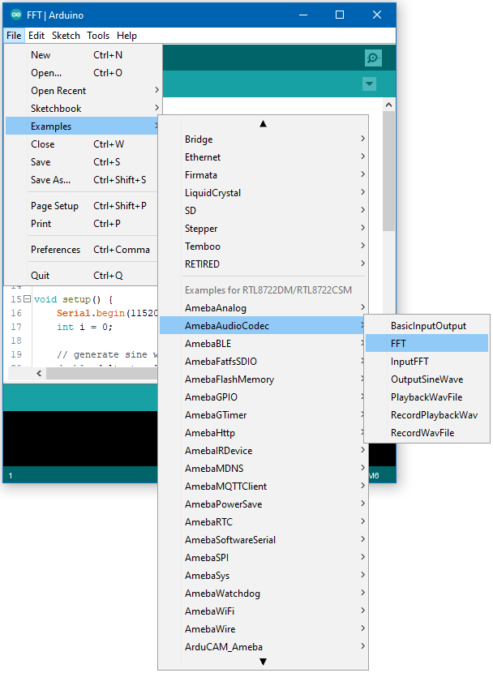
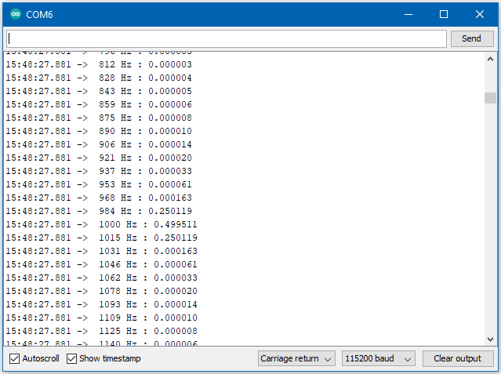

AudioCodec - FFT
=================

Materials
---------

- AmebaD [ AMB21 / AMB22 / AMB23 / AW-CU488 Thing Plus ] x 1

Example
-------

This example shows how to use the FFT class to calculate the fast Fourier transform of a signal to extract the frequencies present in the signal.

Open the example, :guilabel:`Files -> Examples -> AmebaAudioCodec -> FFT`

|image01|

Upload the code and press the reset button on Ameba once the upload is finished.

Open the serial monitor, and the output results of the FFT calculation will be displayed.

|image02|

