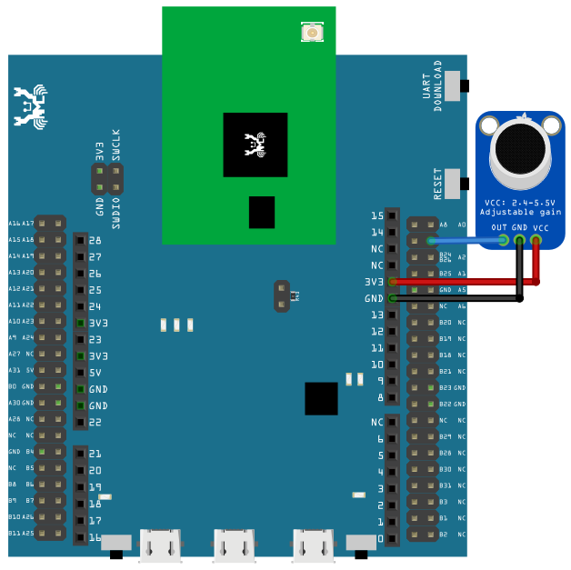
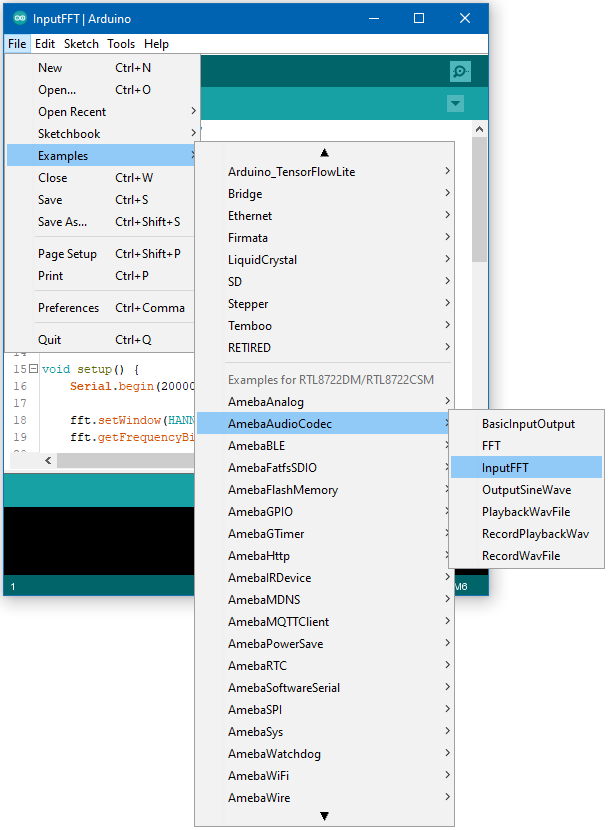
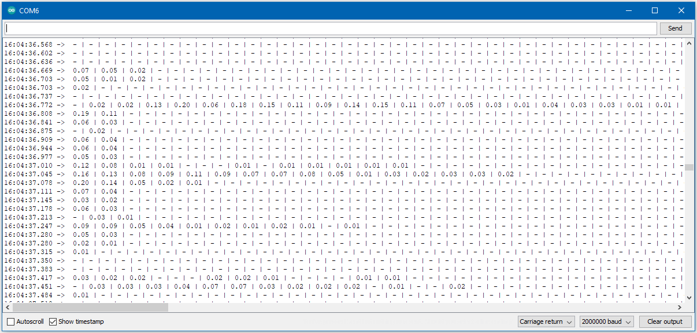

AudioCodec - Input FFT
=======================

Materials
---------

- AmebaD [ AMB21 / AMB22 / AMB23 / AW-CU488 Thing Plus ] x 1

- Analog microphone x 1 (e.g., Adafruit 1063 / 1064) x 1

Example
-------

This example shows how to use the FFT class to calculate the fast Fourier transform of the audio signal recorded by the microphone.

Connect the microphone to the RTL8722 board following the diagram.

|image01|

Next, Open the example, :guilabel:`Files -> Examples -> AmebaAudioCodec -> InputFFT`

|image03|

Upload the code and press the reset button on Ameba once the upload is finished.

Open the serial monitor and change the baud rate to 2000000. A stream of FFT results of audio samples will be displayed. Try playing music or use a smartphone app to generate a sine wave into the microphone, and you should be able to see the FFT output change.

|image04|

