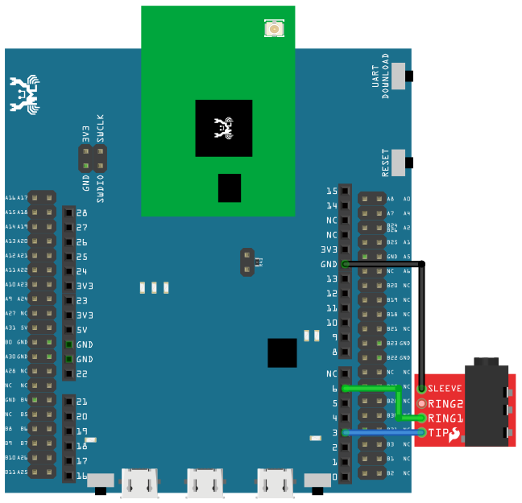
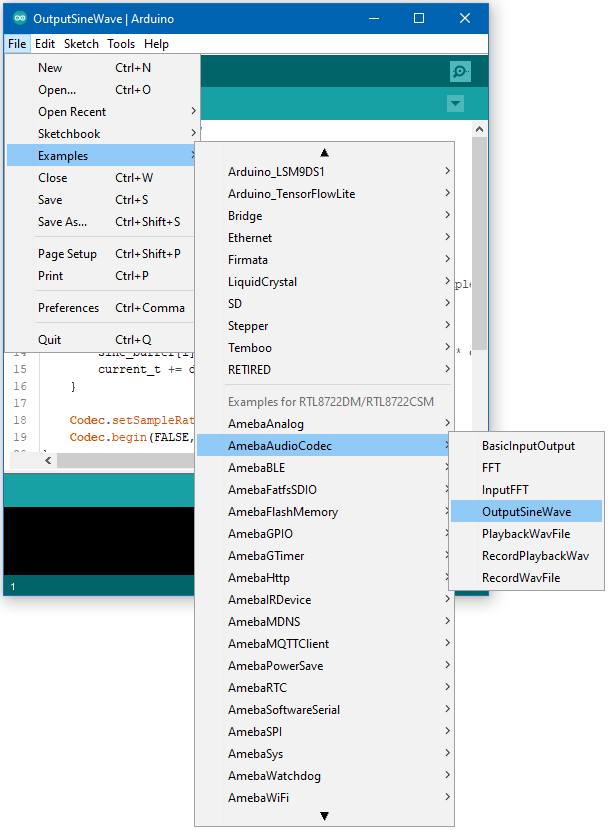

AudioCodec - Output Sine Wave
==============================

Materials
---------

- AmebaD [ AMB21 / AMB22 / AMB23 / AW-CU488 Thing Plus ] x 1

- 3.5mm TRS/TRRS breakout x 1 (e.g., Adafruit 2791 / Sparkfun 11570) x 1

Example
-------

Connect the 3.5mm connector to the RTL8722 board following the diagram.

|image01|

Open the example, :guilabel:`Files -> Examples -> AmebaAudioCodec -> OutputSineWave`

|image03|

Upload the code and press the reset button on Ameba once the upload is finished.

Connect a pair of wired headphones to the 3.5mm audio jack and you should hear the generate single sinusoidal tone.

