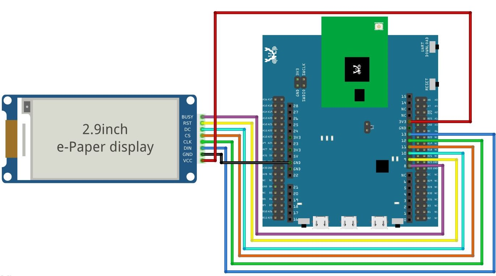
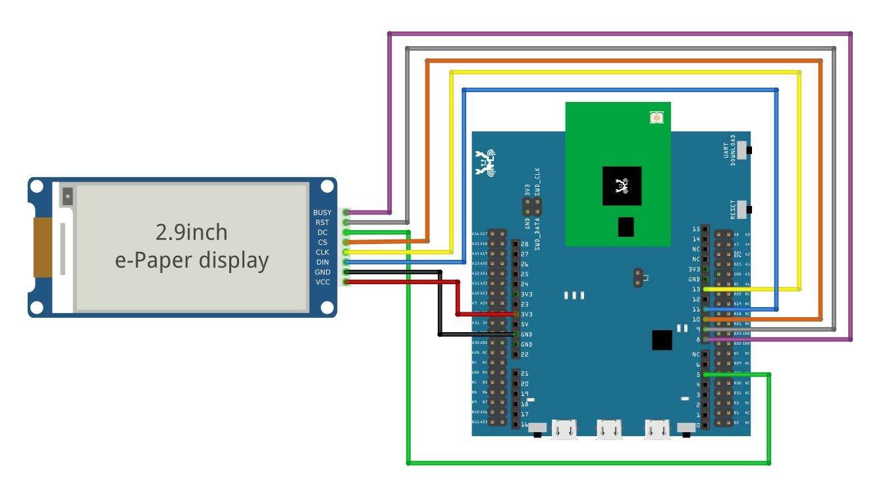
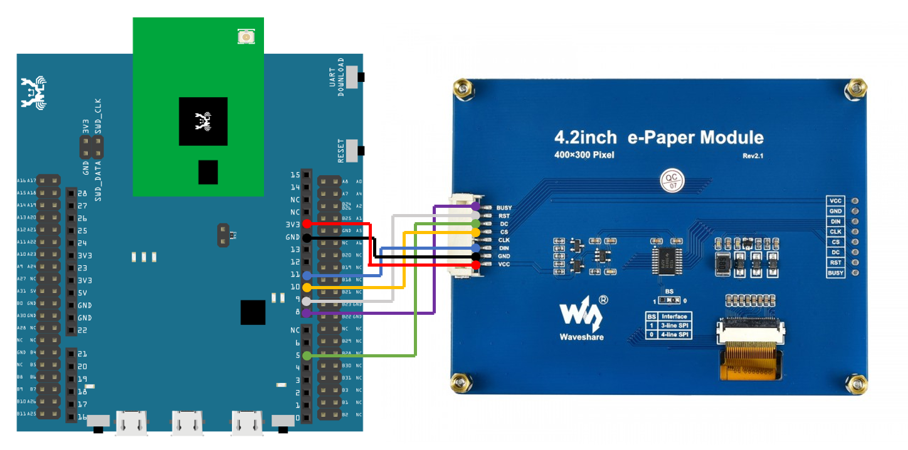
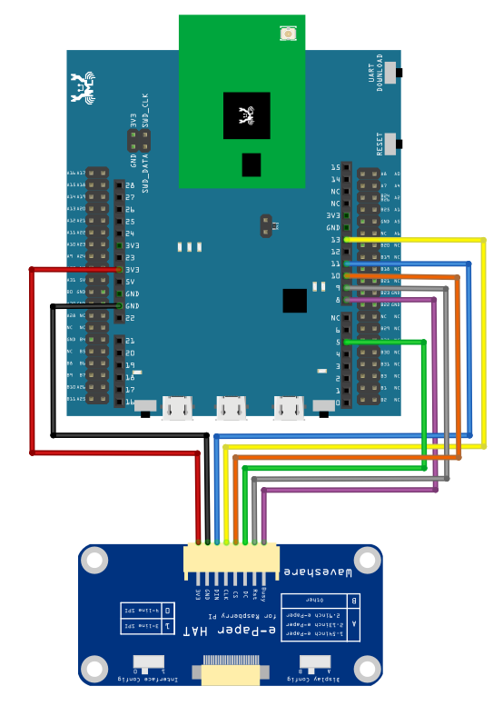
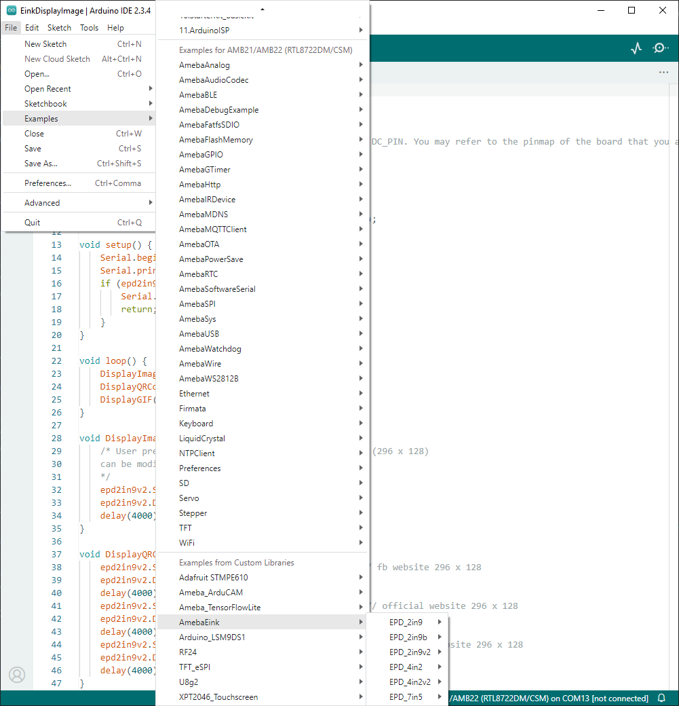
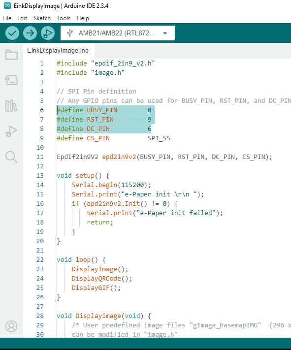

E-Paper - Display Images
=========================

.. contents::
  :local:
  :depth: 2

Materials
---------
- AmebaD [AMB21 / AMB22 / AMB23 / AMB25 / AMB26 / BW16 / AW-CU488 Thing Plus] x 1

- Waveshare E-Paper [2.9inch E-Paper HAT (D)/ 2.9inch E-Paper V2/ 2.9inch e-Paper Module (B)/ 4.2inch e-Paper Module/ 4.2inch v2 e-Paper Module/ 7.5-inch E-Ink display HAT] x1

Example
-------

In this example, AmebaD boards will be used to connect to a Waveshare e-Paper module (2.9inch/ 4.2inch/ 7.5inch) to display images. The display uses the flexible substrate as base plate, with an interface and a reference system design. You may refer to the official datasheet to know more information about these modules.

**AMB21/22 wiring diagrams:**

2.9inch HAT (D) e-Paper Module

|image01|

2.9inch E-Paper V2 e-Paper Module/ 2.9inch e-Paper Module (B)

|image01v2| 

4.2inch e-Paper Module/ 4.2inch v2 e-Paper Module

|image08|

7.5-inch e-Paper Module
Do note that Display Config should be set to B and Interface Config should be set to 0.

|image15|

Firstly, prepare a picture/photo and resize the image based on the e-Paper display that you are using. You can look for a photo resizing tool online, for example, the `Online Image Resizer <https://resizeimage.net/>`_ . Simply follow the instructions on the website to resize the picture and download the resized image in JPEG format.

2.9” e-Paper module: 296x128 pixels

4.2” e-Paper module: 400x300 pixels

7.5” e-Paper module: 800x480 pixels

Secondly, use `Image2LCD <http://www.waveshare.net/w/upload/3/36/Image2Lcd.7z>`_ tool to convert the resized JPEG image into hexadecimal codes. You can visit this `YouTube <https://www.youtube.com/watch?v=kAmnU5Y96MA&t=363s>`_ link to learn more about how to use the Image2LCD tool.

Next, download the Eink zip library, AmebaEink.zip, at https://github.com/Ameba-AIoT/ameba-arduino-d/tree/master/Arduino_zip_libraries. Then install the AmebaEink.zip by navigating to “Sketch” -> “Include Library” -> “Add .ZIP Library…”.

Eink examples are categorised based on the size and modules of the e-Paper display.

|image22|

Open one of the “EinkDisplayImages” examples. For example, “File” → “Examples” → “AmebaEink” → “EPD_2in9v2” → “EinkDisplayImages”:

|image23|

You may choose any GPIO pins for Busy, Reset and DC pin.

|image24|

Upload the code to the board and press the reset button after uploading is done. Wait for around 1-2 seconds for the e-Paper module to refresh its screen. Images will start to loop on the e-Paper display, each image will be displaying for 4 seconds.

|image25|

|image26|

The 2.9-inch e-Paper Module (B) supports three colours—red, black, and white. You may refer to the example for 2.9-inch e-Paper Module (B) to learn how to display red images by navigating to “File” → “Examples” → “AmebaEink” → “EPD_2in9b”-> “EinkDisplayImages”.

Red image displaying on 2.9-inch Module (B) e-Paper display is shown below.

|image27|

Code Reference
---------------

[1] We use Good Display GDEH029A1 2.9 Inch / 296x128 Resolution / Partial Refresh Arduino Sample Code to get the e-Paper successfully Display:
http://www.good-display.com/product/201.html

[2] EPD libraries can be obtained from:
https://github.com/waveshare/e-Paper

[3] Generate a QR code on the E-paper module:
https://eugeniopace.org/qrcode/arduino/eink/2019/07/01/qrcode-on-arduino.html

.. |image25| image:: ../../../../_static/amebad/Example_Guides/E-Paper/Epaper_Display_Images/image25.png
   :width:  514 px
   :height:  867 px

.. |image26| image:: ../../../../_static/amebad/Example_Guides/E-Paper/Epaper_Display_Images/image26.png
   :width:  524 px
   :height:  797 px

.. |image27| image:: ../../../../_static/amebad/Example_Guides/E-Paper/Epaper_Display_Images/image27.png
   :width:  816 px
   :height:  405 px