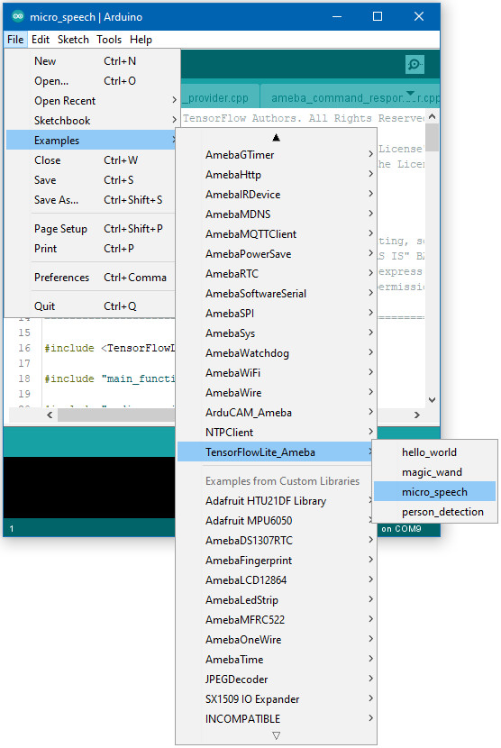
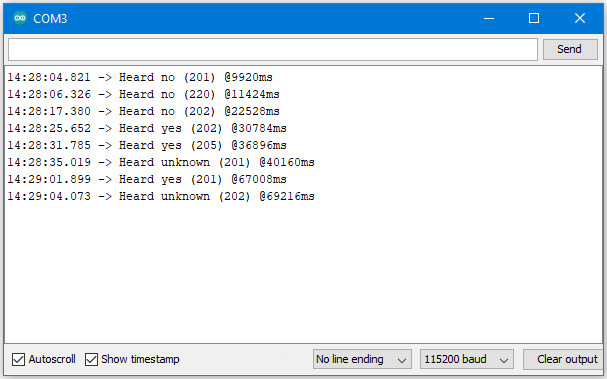

TensorFlow Lite - Micro Speech
==============================

Materials
---------

- AmebaD [AMB21 / AMB22 / AMB23 / AW-CU488 Thing Plus] x 1

- Adafruit PDM MEMS microphone

- LED x 4

Example
-------

Connect the microphone and LEDs to the Ameba board according to the diagram below.

|image01|

Open the example, "Files -> Examples -> AmebaTensorFlowLite -> micro_speech`

|image04|

Enable TensorFlow Lite option. It is set to disable by default.

|image06|

| Upload the code and press the reset button on Ameba once the upload is finished.
| Once it is running, you should see one of the LEDs flashing, indicating that it is processing audio. Saying the word "yes" will cause the green
  LED to light up. Saying the word "no" will cause the red LED to light up. If the word is not recognized, the blue LED will to light up.
| The inference results are also output to the Arduino serial monitor, which appear as follows:

|image05|

If you are having trouble in getting the words recognized, here are some tips:

- Ensure that your surroundings are quiet with minimal noise.

- Experiment with varying the distance of the microphone, starting with it at an arm's length.

- Experiment with different tones and volume when saying the words.

- Depending on how you pronounce the words, the characteristics of the microphone used, getting one keyword recognized may be easier than the other.

Code Reference
--------------

More information on TensorFlow Lite for Microcontrollers can be found at: https://www.tensorflow.org/lite/microcontrollers

.. |image06| image:: ../../../../_static/amebad/Example_Guides/TensorFlowLite/TensorFlow_Lite_Micro_Speech/image06.png
   :width: 758
   :height: 562
   :scale: 100 %
