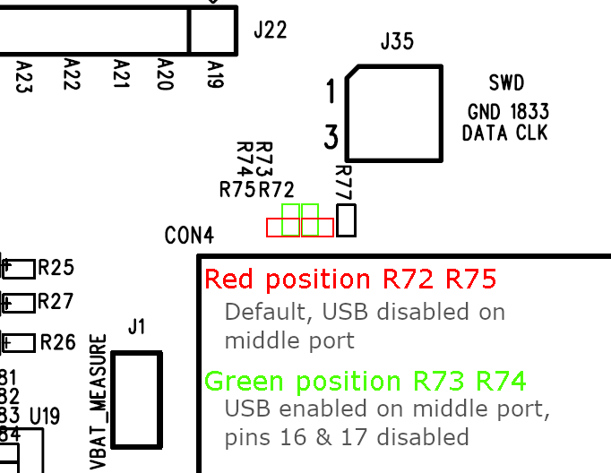

USB - CDC Serial Port
=======================

Materials
---------

- AmebaD [AMB21 / AMB22 / AMB23] x 1

- USB host device [Windows / Linux / MacOS]

- USB cable x 2

Example
--------

In this example, the RTL8722 board emulates a CDC ACM virtual COM-port connected using USB.

**USB connection**

Two USB ports will be used simultaneously, thus two USB cables are required for this example. In addition to the regular USB port used for uploading code, the second USB cable should be connected to the USB OTG port as shown below.

For AMB21 / AMB22, a modification needs to be made to enable the USB OTG port. The two zero-ohm resistors in the red box should be resoldered and moved into the green position. This will disable pins 16 and 17 (GPIOA_25 and GPIOA_26) on the pin headers and enable the middle USB port.

|image02|

|image03|

Alternatively, if you do not wish to risk damaging the board in the process of soldering, an external USB breakout board may be used. Connect the USB pins as shown.

|image04|

Open the example, :guilabel:`Files -> Examples -> AmebaUSB -> USBCDCSerial`

|image05|

Upload the code and press the reset button once the upload is finished. Open the Arduino serial monitor.

Immediately after reset, a second COM port should become available. On your host device, open a terminal application (e.g., Teraterm) and connect to this new COM port.

Any message sent on the Arduino serial monitor should appear on the terminal application. Similarly, any message sent on the terminal application should appear in Arduino serial monitor.

|image06|

|image07|

Code Reference
----------------

The SerialUSB class can be used in the same way as the familiar Serial class, and supports all the same print features.

.. |image02| image:: ../../../../_static/amebad/Example_Guides/USB/USB_CDC_Serial_Port/image02.png
   :width: 3468
   :height: 2872
   :scale: 20%

.. |image05| image:: ../../../../_static/amebad/Example_Guides/USB/USB_CDC_Serial_Port/image05.png
   :width: 640
   :height: 950
   :scale: 100 %

.. |image06| image:: ../../../../_static/amebad/Example_Guides/USB/USB_CDC_Serial_Port/image06.png
   :width: 671
   :height: 357
   :scale: 100 %

.. |image07| image:: ../../../../_static/amebad/Example_Guides/USB/USB_CDC_Serial_Port/image07.png
   :width: 671
   :height: 357
   :scale: 100 %
