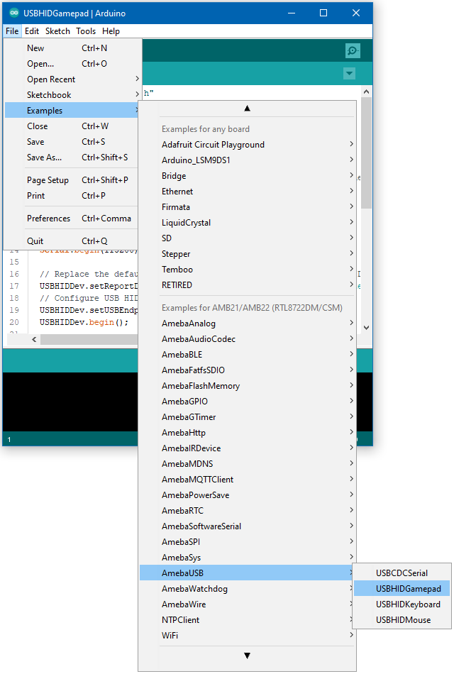
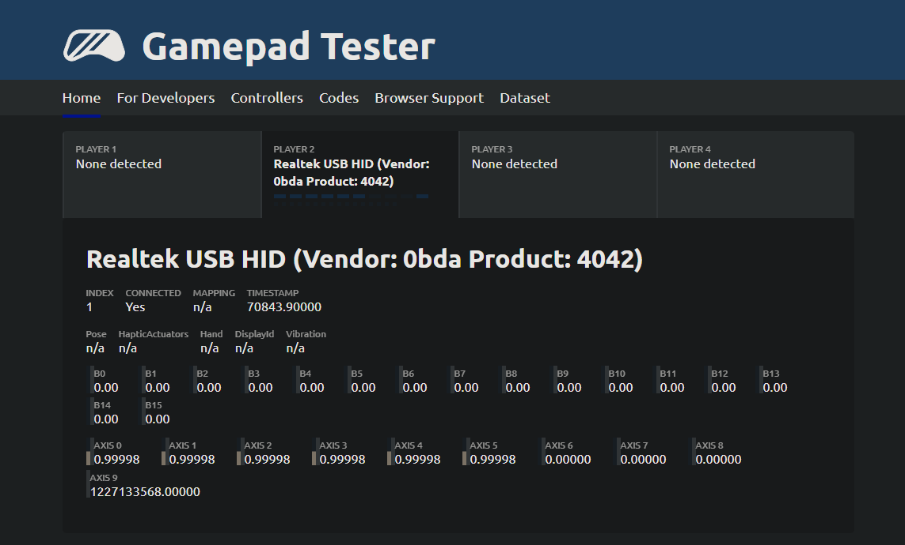
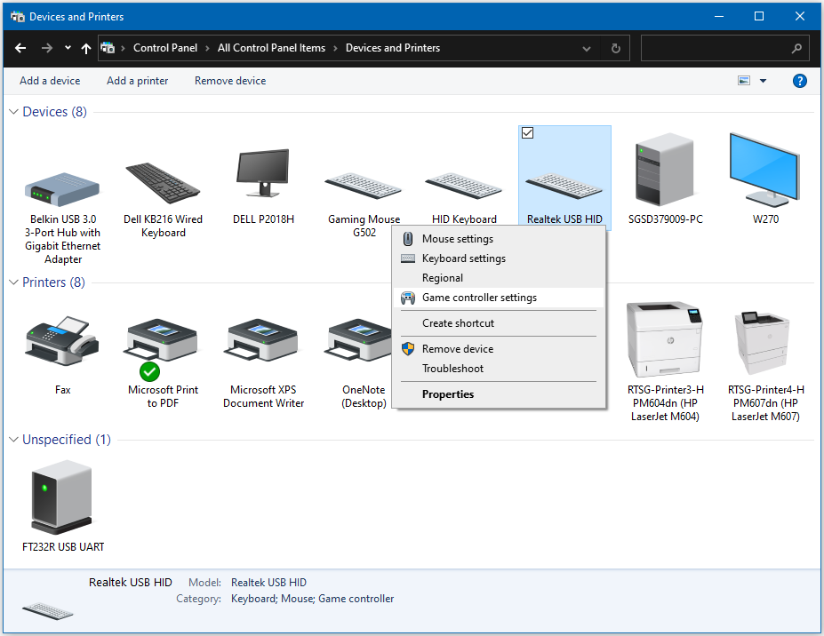
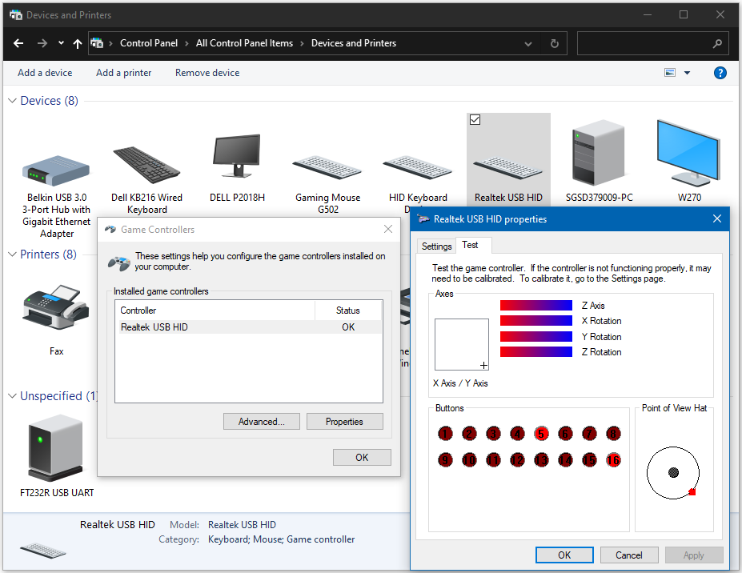

USB - HID Gamepad
==================

Materials
---------

- AmebaD [AMB21 / AMB22 / AMB23] x 1

- USB host device [Windows / Linux / MacOS]

Example
--------

In this example, the RTL8722 board emulates a HID gamepad connected using USB.

Open the example, "Files" -> "Examples" -> "AmebaUSB" -> "USBHIDGamepad".

|image01|

Upload the code and press the reset button once the upload is finished.

Connect the USB OTG port on the board to the host device. Refer to the example guide for USB CDC Serial for connection instructions.

Connect digital pin 8 to 3.3V to start sending input, connect to GND to stop.

To view the input, open a browser window and go to https://gamepad-tester.com/. The connected gamepad device should show up here, and some of the buttons and axes should show changing values.

|image02|

On Windows, gamepad input can also be viewed by going to "Control Panel" -> "Devices and Printers" -> "Realtek USB HID" -> "Game Controller Settings" -> "Properties". The buttons and axes should also show changing values here.

|image03|

|image04|

Code Reference
---------------

By default, the board emulates a gamepad with an 8-direction hat switch (d-pad), 6 analog axes and 16 buttons. How the inputs are interpreted is dependent on the host device, and the button ordering may differ between devices. Also, some axes or buttons may be disabled or missing on certain host devices.

