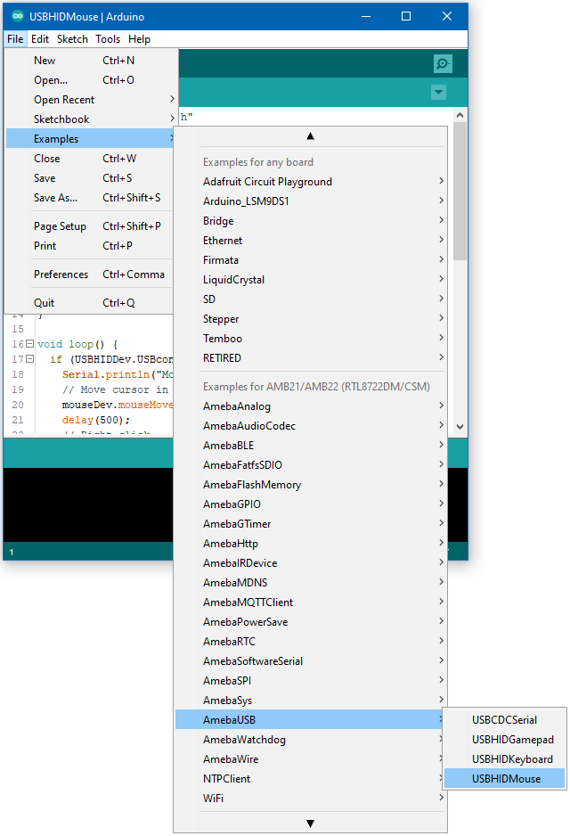

USB - HID Mouse
================

Materials
---------

- AmebaD [ AMB23 / AMB21 / AMB22 ] x 1

- USB host device [ Windows / Linux / MacOS ]

Example
--------

In this example, the RTL8722 board emulates a HID mouse connected using USB.

Open the example, :guilabel:`Files -> Examples -> AmebaUSB -> USBHIDMouse`

|image01|

Upload the code and press the reset button once the upload is finished.

Connect the USB OTG port on the board to the host device. Refer to the example guide for USB CDC Serial for connection instructions.

The board is ready to send mouse input to the host device. Connect digital pin 8 to 3.3V to start sending input, connect to GND to stop.
You should see the mouse cursor move around four points in a square, performing right and left clicks, and scrolling up and down

Code Reference
---------------

How the mouse input is interpreted is dependent on the host system. Some systems, such as mobile operating systems, may not support all mouse button input functions.

