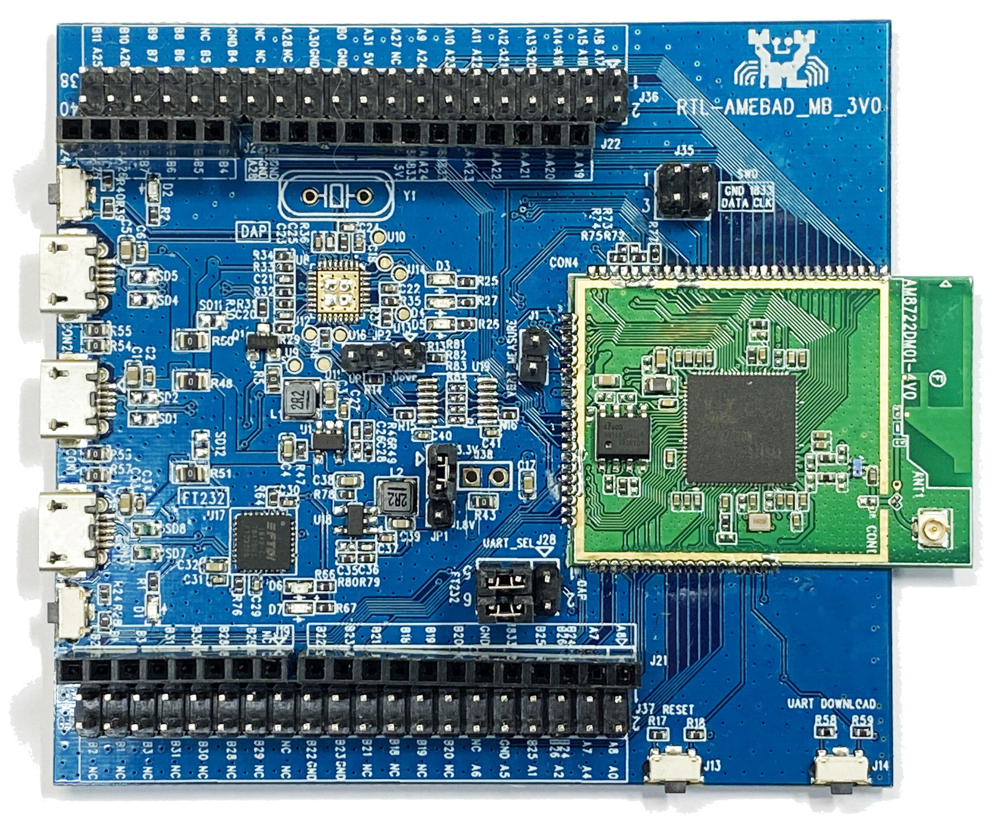
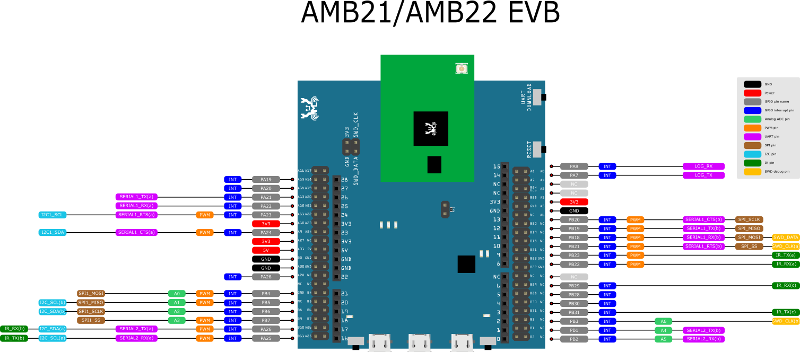
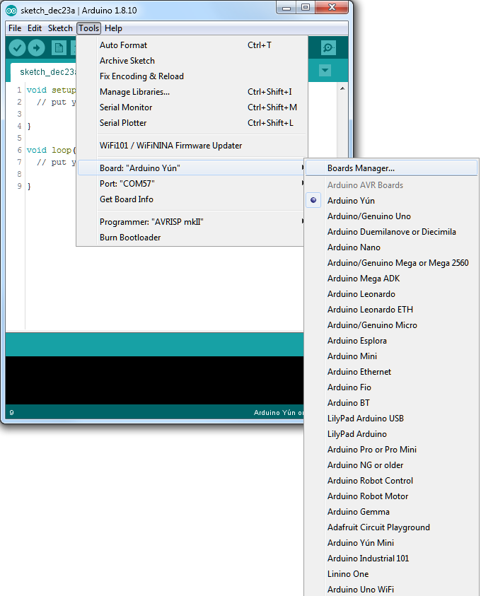
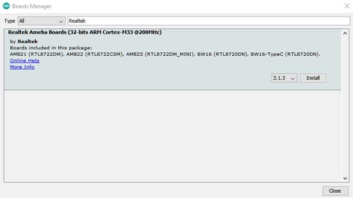
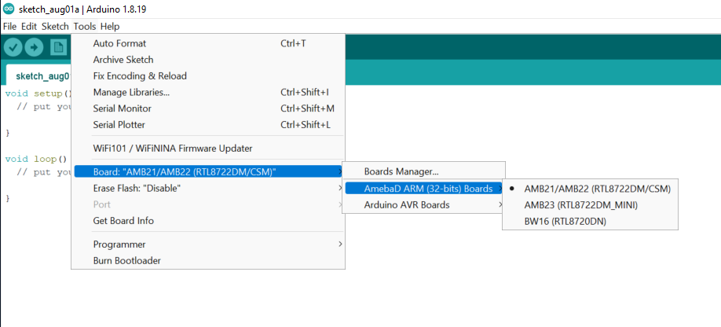
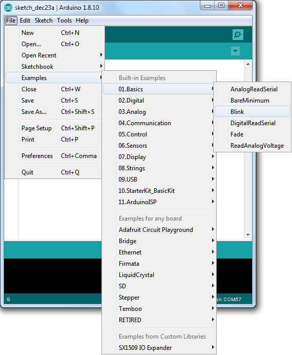
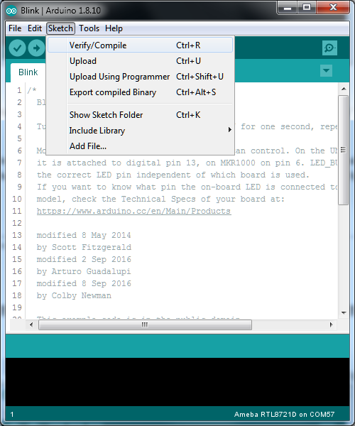
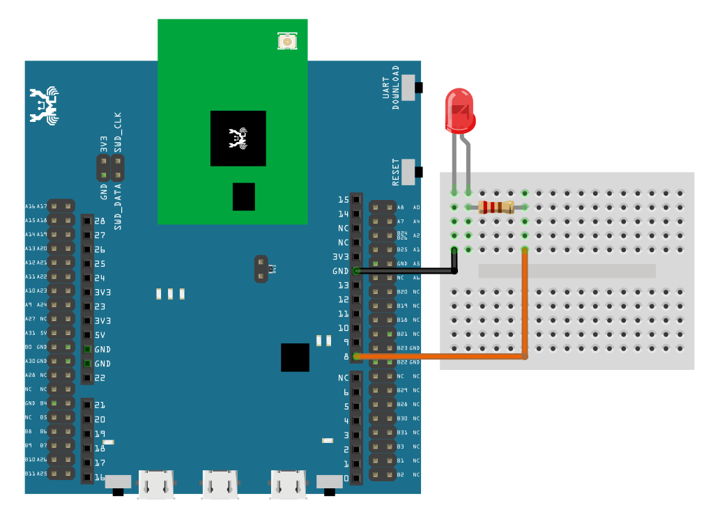

Ameba ARDUINO with AMB21 (RTL8722DM)
========================================

Introduction
------------

Ameba is an easy-to-program platform for developing all kind of IoT applications.
AMB21/AMB22 is equipped with various peripheral interfaces, including WiFi, GPIO INT, I2C, UART, SPI, PWM, ADC.
Through these interfaces, AMB21/AMB22 can connect with electronic components such as LED, switches, manometer, hygrometer, PM2.5 dust sensors, …etc.

The collected data can be uploaded via WiFi and be utilized by applications on smart devices
to realize IoT implementation.

|image01|

AMB21/AMB22 and Arduino Uno have similar size, as shown in the above
figure, and the pins on AMB21/AMB22 are compatible with Arduino Uno.
AMB21/AMB22 uses Micro USB to supply power, which is common in many smart devices.
Please refer to the following figure and table for the pin diagram and functions.

|image02|

+---+------------+------------+-------+-------+-----------------+--------------+------------+----------+----------------+
|   | *GPIO Pin* | *GPIO INT* | *ADC* | *PWM* |     *UART*      |    *SPI*     |   *I2C*    |   *IR*   |      *SWD*     |
+===+============+============+=======+=======+=================+==============+============+==========+================+
| 0 |   PB2      | ✓          | A5    |       | SERIAL2_RX (b)  |              |            |          |                |
+---+------------+------------+-------+-------+-----------------+--------------+------------+----------+----------------+
| 1 |   PB1      | ✓          | A4    |       | SERIAL2_TX (b)  |              |            |          |                |
+---+------------+------------+-------+-------+-----------------+--------------+------------+----------+----------------+
| 2 |   PB3      | ✓          | A6    |       |                 |              |            |          |  SWD_CLK (b)   |
+---+------------+------------+-------+-------+-----------------+--------------+------------+----------+----------------+
| 3 |   PB31     | ✓          |       |       |                 |              |            | IR_TX (c)|                |
+---+------------+------------+-------+-------+-----------------+--------------+------------+----------+----------------+
| 4 |   PB30     | ✓          |       |       |                 |              |            |          |                |
+---+------------+------------+-------+-------+-----------------+--------------+------------+----------+----------------+
| 5 |   PB28     | ✓          |       |       |                 |              |            |          |                |
+---+------------+------------+-------+-------+-----------------+--------------+------------+----------+----------------+
| 6 |   PB29     | ✓          |       |       |                 |              |            | IR_RX (c)|                |
+---+------------+------------+-------+-------+-----------------+--------------+------------+----------+----------------+
| 7 |   NC       | ✓          |       |       |                 |              |            |          |                |
+---+------------+------------+-------+-------+-----------------+--------------+------------+----------+----------------+
| 8 |   PB22     | ✓          |       | ✓     |                 |              |            | IR_RX (a)|                |
+---+------------+------------+-------+-------+-----------------+--------------+------------+----------+----------------+
| 9 |   PB23     | ✓          |       | ✓     |                 |              |            | IR_TX (a)|                |
+---+------------+------------+-------+-------+-----------------+--------------+------------+----------+----------------+
| 10|   PB21     | ✓          |       | ✓     | SERIAL1_RTS (b) | SPI_SS       |            |          |                |
+---+------------+------------+-------+-------+-----------------+--------------+------------+----------+----------------+
| 11|   PB18     | ✓          |       | ✓     | SERIAL1_RX (b)  | SPI_MOSI     |            |          |  SWD_CLK (a)   |
+---+------------+------------+-------+-------+-----------------+--------------+------------+----------+----------------+
| 12|   PB19     | ✓          |       | ✓     | SERIAL1_TX (b)  | SPI_MISO     |            |          |  SWD_DATA      |
+---+------------+------------+-------+-------+-----------------+--------------+------------+----------+----------------+
| 13|   PB20     | ✓          |       | ✓     | SERIAL1_CTS (b) | SPI_SCLK     |            |          |                |
+---+------------+------------+-------+-------+-----------------+--------------+------------+----------+----------------+
| 14|   PA7      | ✓          |       |       | LOG_TX          |              |            |          |                |
+---+------------+------------+-------+-------+-----------------+--------------+------------+----------+----------------+
| 15|   PA8      | ✓          |       |       | LOG_RX          |              |            |          |                |
+---+------------+------------+-------+-------+-----------------+--------------+------------+----------+----------------+
| 16|   PA25     | ✓          |       | ✓     | SERIAL2_RX (a)  |              |I2C_SCL (a) | IR_TX (b)|                |
+---+------------+------------+-------+-------+-----------------+--------------+------------+----------+----------------+
| 17|   PA26     | ✓          |       | ✓     | SERIAL2_TX (a)  |              |I2C_SDA (a) | IR_RX (b)|                |
+---+------------+------------+-------+-------+-----------------+--------------+------------+----------+----------------+
| 18|   PB7      | ✓          | A3    | ✓     |                 | SPI1_SS      |            |          |                |
+---+------------+------------+-------+-------+-----------------+--------------+------------+----------+----------------+
| 19|   PB6      | ✓          | A2    |       |                 | SPI1_SCLK    | I2C_SDA (b)|          |                |
+---+------------+------------+-------+-------+-----------------+--------------+------------+----------+----------------+
| 20|   PB5      | ✓          | A1    | ✓     |                 | SPI1_MISO    | I2C_SCL (b)|          |                |
+---+------------+------------+-------+-------+-----------------+--------------+------------+----------+----------------+
| 21|   PB4      | ✓          | A0    | ✓     |                 | SPI1_MOSI    |            |          |                |
+---+------------+------------+-------+-------+-----------------+--------------+------------+----------+----------------+
| 22|   PA28     | ✓          |       |       |                 |              |            |          |                |
+---+------------+------------+-------+-------+-----------------+--------------+------------+----------+----------------+
| 23|   PA24     | ✓          |       | ✓     | SERIAL1_CTS (a) |              | I2C1_SDA   |          |                |
+---+------------+------------+-------+-------+-----------------+--------------+------------+----------+----------------+
| 24|   PA23     | ✓          |       | ✓     | SERIAL1_RTS (a) |              | I2C1_SCL   |          |                |
+---+------------+------------+-------+-------+-----------------+--------------+------------+----------+----------------+
| 25|   PA22     | ✓          |       |       | SERIAL1_RX (a)  |              |            |          |                |
+---+------------+------------+-------+-------+-----------------+--------------+------------+----------+----------------+
| 26|   PA21     | ✓          |       |       | SERIAL1_TX (a)  |              |            |          |                |
+---+------------+------------+-------+-------+-----------------+--------------+------------+----------+----------------+
| 27|   PA20     | ✓          |       |       |                 |              |            |          |                |
+---+------------+------------+-------+-------+-----------------+--------------+------------+----------+----------------+
| 28|   PA19     | ✓          |       |       |                 |              |            |          |                |
+---+------------+------------+-------+-------+-----------------+--------------+------------+----------+----------------+

Set up Developing environment
-----------------------------

Step 1. OS environment
~~~~~~~~~~~~~~~~~~~~~~

AMB21/AMB22 (RTL8722CSM/RTL8722DM) board currently supports Windows OS 32-bits or 64-bits,
Linux OS (Ubuntu) and macOS. To have the best experiences, please use the latest version of OS.

Step 2. Installing the driver
~~~~~~~~~~~~~~~~~~~~~~~~~~~~~

First, connect AMB21/AMB22 to the computer via Micro USB:

|image03|

If this is the first time connects AMB21/AMB22 to computer, the USB driver for AMB21/AMB22 will be automatic installed.
If you have driver issue of connect board to computer please go to https://ftdichip.com/drivers/ for USB driver.
Check the COM port number in Device Manager of computer:

|image04|

Step 3. Set up Arduino IDE
~~~~~~~~~~~~~~~~~~~~~~~~~~

From version 1.6.5, Arduino IDE supports third-party hardware. Therefore, we can use Arduino IDE to develop applications,
and the Arduino basic examples can run on AMB21/AMB22 too.

Arduino IDE can be downloaded in the Arduino website: https://www.arduino.cc/en/Main/Software

When the installation is finished, open Arduino IDE. To set up AMB21/AMB22 correctly in Arduino IDE, go to guilabel:`File -> Preferences`

|image05|

And paste the following URL into :guilabel:`Additional Boards Manager URLs` field::

   https://github.com/ambiot/ambd_arduino/raw/master/Arduino_package/package_realtek.com_amebad_index.json

Next, go to :guilabel:`Tools -> Board -> Boards Manager`

|image06|

The :guilabel:`Boards Manager` requires about 10~20 seconds to refresh all
hardware files (if the network is in bad condition, it may take longer).
Every time the new hardware is connected, we need to reopen the Board
Manager. So, we close the Boards Manager, and then open it again. Find
**Realtek Ameba Boards** in the list, click :guilabel:`Install`, then the Arduino IDE
starts to download required files.

|image07|

If there is GitHub downloading issue, please refer to the following link at "Download/Software Development Kit". There are 3 sections.

#. "AMB21/AMB22_Arduino_patch1_SDK", please select at least 1 of the SDKs. There are 5 latest released SDK options.
#. "AMB21/AMB22_Arduino_patch2_Tools", please select according to your operation system. There are Windows, Linux and MacOS.
#. "AMB21/AMB22_Arduino_Source_Code", this section is optional download only wants to refer the latest source code.

https://www.amebaiot.com.cn/en/ameba-arduino-summary/

Download the files selected, then unzip (patch1 and patch2 are compulsory).
There are "Install.doc"/"Install.pdf" for you to refer installation steps. According to your system,
please run the installation tool in the "Offline_SDK_installation_tool" folder.

After the installation tool running successfully, you may open Arduino
IDE and proceed to :guilabel:`Tools -> Board -> Boards Manager…` Try to find
**Realtek Ameba Boards** in the list,
click :guilabel:`Install` then the Arduino IDE starts to download required files
for AMB21/AMB22.

Finally, we select board in :guilabel:`tools -> Board -> Ameba ARM (32-bits) Boards -> AMB21/AMB22 (RTL8722DM/CSM)`

|image08|

Try the First Example
---------------------

Step 1. Compile & Upload
~~~~~~~~~~~~~~~~~~~~~~~~

Arduino IDE provides many built-in examples, which can be compiled,
uploaded and run directly on the boards. Here, we take the "Blink" example as the first try.
Open :guilabel:`File -> Examples -> 01.Basics -> Blink`

|image09|

Arduino IDE opens a new window with the complete sample code.

Next, we compile the sample code directly, click :guilabel:`Sketch -> Verify/Compile`

|image10|

Arduino IDE prints the compiling messages in the bottom area of the IDE window. When the compilation is finished, you will get the message as following.

|image11|

Afterwards, we will upload the compiled code to board.

Please make sure board is connected to computer, then click :guilabel:`Sketch -> Upload`

The Arduino IDE will compile first then upload. Users are required to enter the upload mode of the board.
To enter upload mode, first press and hold the UART_DOWNLOAD button, then press and release the RESET button,
lastly release the UART_DOWNLOAD button. There is a 5-seconds count down set as a reminder to enter the upload mode.

|image12|

|image13|

It is optional for users to check if the board entered the upload mode.
Open serial monitor/terminal and look for **Flash Download Start**.

.. note :: it is normal that some serial terminals may show unknown characters as following picture.

|image14|

Again, during the uploading procedure the IDE prints messages. Uploading
procedure takes considerably longer time (about 30 seconds to 1 minute).
When upload completed, the "Done uploading" message is printed.

Step 2. Run the Blink example
~~~~~~~~~~~~~~~~~~~~~~~~~~~~~

In each example, Arduino not only provides sample code, but also
detailed documentation, including wiring diagram, sample code
explanation, technical details, …etc. These examples can be directly
used on AMB21/AMB22.
So, we find the detailed information of the
`Blink example <https://www.arduino.cc/en/Tutorial/Blink>`__.

In short, this example makes LED blinks, and it uses GPIO pin 08
(refer to the pin diagram ``D08``). Then we connect the LED and resistance
as the following figure. In addition, please use a resister with suitable resistance
in series between LED and GND.

|image15|

Finally, press the RESET button, and you can see the LED blinking.

.. |image03| image:: ../../../_static/amebad/Getting_Started/AMB21_getting_started/image03.png
   :width:  820 px
   :height:  584 px
.. |image04| image:: ../../../_static/amebad/Getting_Started/AMB21_getting_started/image04.png
   :width:  795 px
   :height:  579 px
.. |image05| image:: ../../../_static/amebad/Getting_Started/AMB21_getting_started/image05.png
   :width:  500 px
   :height:  600 px

.. |image11| image:: ../../../_static/amebad/Getting_Started/AMB21_getting_started/image11.png
   :width:  500 px
   :height:  600 px
.. |image12| image:: ../../../_static/amebad/Getting_Started/AMB21_getting_started/image12.png
   :width:  628 px
   :height:  175 px
.. |image13| image:: ../../../_static/amebad/Getting_Started/AMB21_getting_started/image13.png
   :width:  732 px
   :height:  752 px
.. |image14| image:: ../../../_static/amebad/Getting_Started/AMB21_getting_started/image14.png
   :width:  930 px
   :height:  603 px

