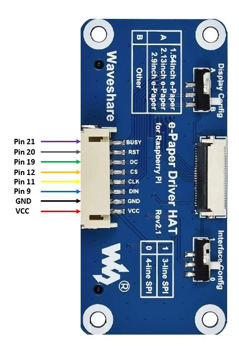
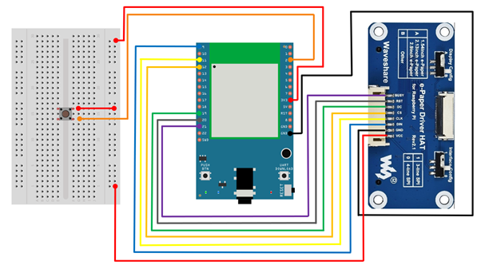
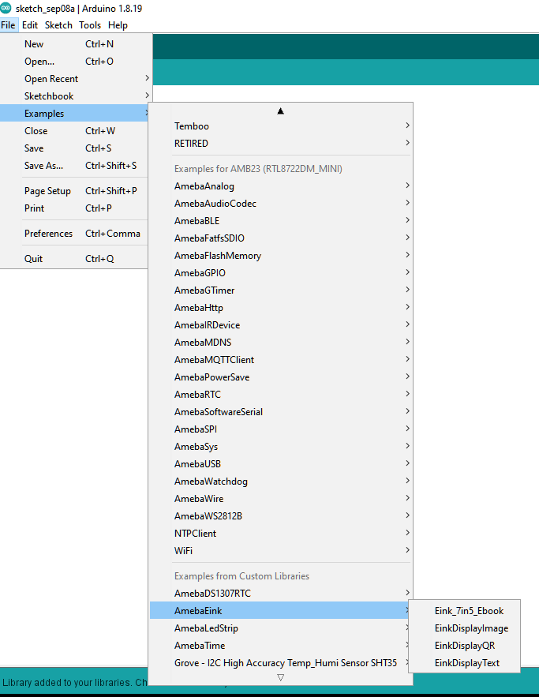
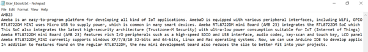
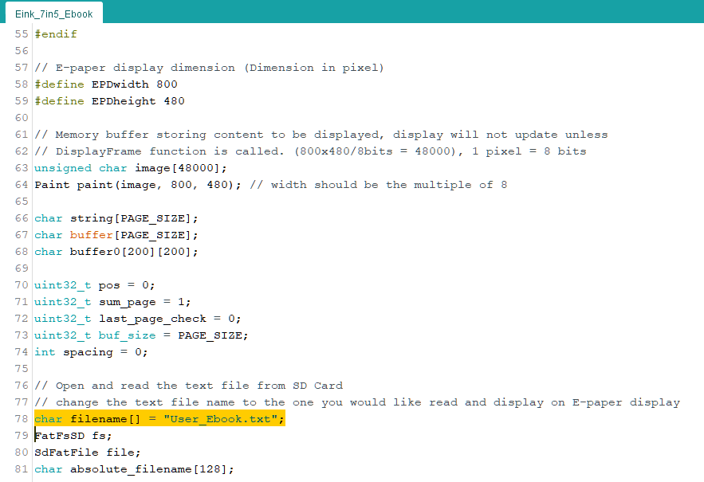
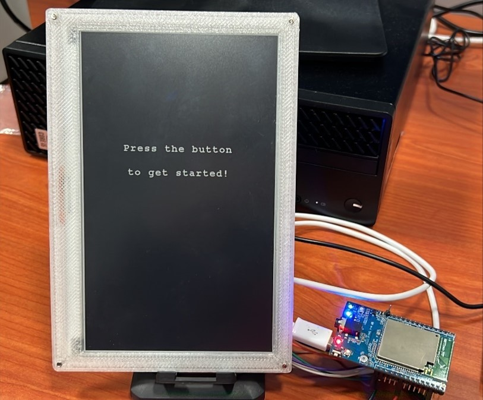
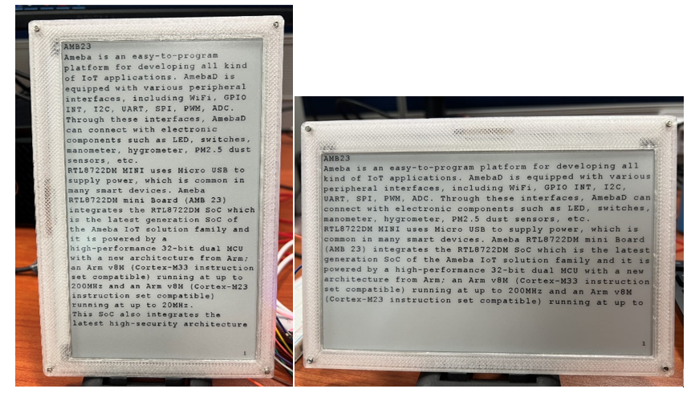
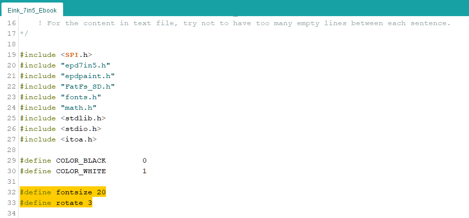

E-Paper - 7.5-inch e-Book with MicroSD card
===========================================

Materials
---------

- AmebaD [AMB23] x 1
- Button x 1
- MicroSD card x 1
- Waveshare 7.5-inch E-Ink display HAT x 1

Example
-------

In this example, we will be connecting AMB23 to Waveshare 7.5-inch e-Paper module to be used as an e-Book. The 7.5" active area contains 800 x 480 pixels and has 1-bit white/black full display capabilities. An integrated circuit contains gate buffer, source buffer, interface, timing control logic, oscillator, etc. are supplied with each panel. You may refer to [7.5inch-e-paper-specification] (https://www.waveshare.com/w/upload/6/60/7.5inch_e-Paper_V2_Specification.pdf) for more information about this e-Paper module.

**AMB23 wiring diagram:**

Do note that Display Config should be set to B and Interface Config should be set to 0.

|image01|

|image02|

Download the Eink zip library, AmebaEink.zip, at https://github.com/Ameba-AIoT/ameba-arduino-d/tree/master/Arduino_zip_libraries.
and install AmebaEink.zip on Arduino IDE. You may follow the instruction at https://docs.arduino.cc/software/ide-v1/tutorials/installing-libraries to install it.

After AmebaEink.zip is installed, Open the "Eink_7in5_Ebook" example by selecting "File" -> "Examples" -> "AmebaEink" -> "Eink_7in5_Ebook".

|image03|

Next, insert the MicroSD card into your computer and create a new text file named "User_Ebook.txt". Then, save the content that you would like to display in the text file (Note: do only include words). The content of "User_Ebook.txt" shown below is for illustration purposes only.

|image04|

Alternatively, if you prefer another filename for your text file, you can modify the highlighted code snippet in the sketch with the new filename.

|image05|

Once the file is created, insert the MicroSD card into the onboard SD card reader on AMB23. Upload the code and press the reset button once the uploading is done. When reset button is pressed, the e-Paper display will refresh and display a cover page.

|image06|

By pressing the button, the content in the selected text file saved in MicroSD card will be read and displayed onto the e-Paper display. The content will be split into pages.

To proceed to the next page, press the button once more. The page number will be shown at the bottom right-hand corner as the page changes. You will see the following in either portrait or landscape mode based on your orientation choice after button is pressed:

|image07|

|image08|

You can modify the highlighted code snippet to change the font size or orientation of the displayed text.

Supported font size: 16, 20, 24
Supported orientation: 0 degree - 0 (landscape), 90 degree - 1 (portrait), 180 degree- 2 (landscape), 270 degree - 3 (portrait)

|image09|

Code Reference
---------------
[1] We use waveshare 7.5-inch e-Paper display module/ 800x480 Resolution driver code to get e-Paper successfully display:
https://github.com/waveshare/e-Paper/tree/master/Arduino/epd7in5_V2

[2] Text Wrap function was written reference to:
https://www.cprogramming.com/snippets/source-code/word-wrap-in-c

