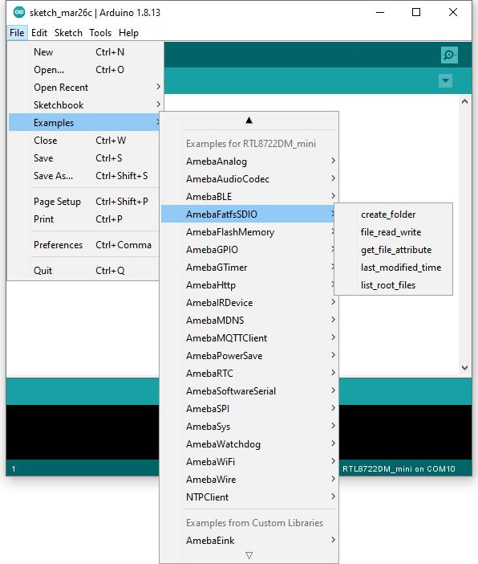
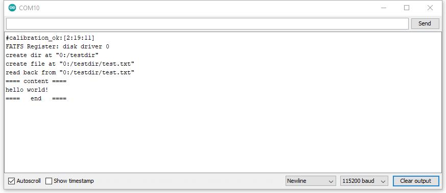
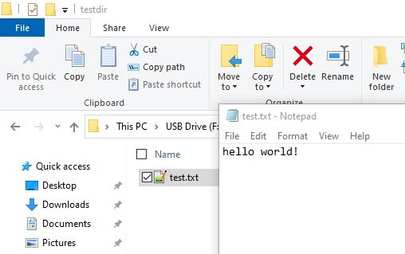
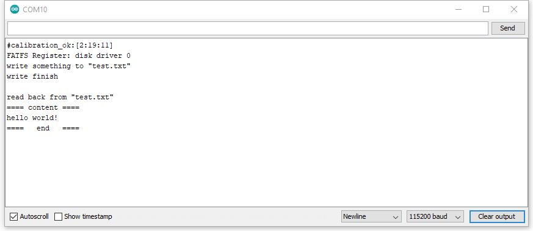
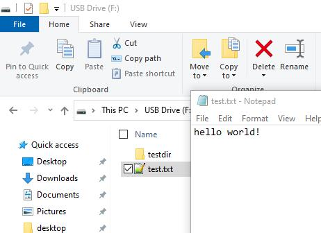
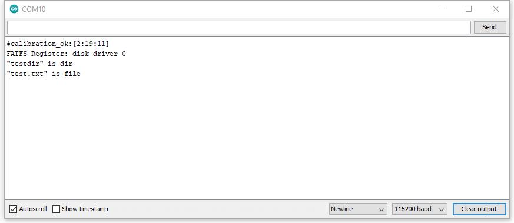
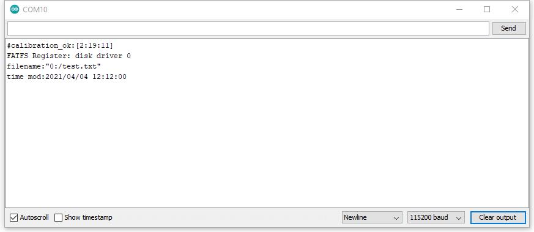
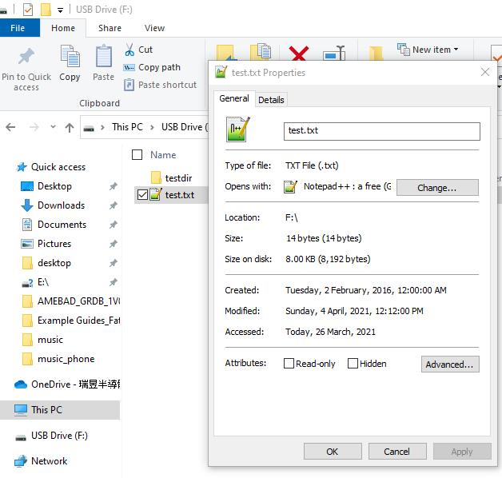
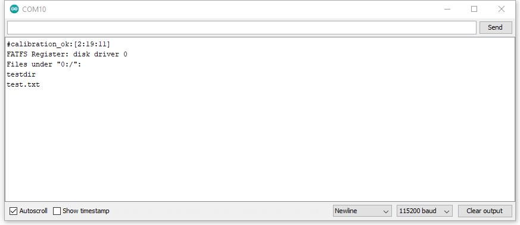

File system in SD card
======================

.. contents::
  :local:
  :depth: 2

Materials
---------

- AmebaD [AMB23] x 1
- MicroSD card

Example
-------

Insert a MicroSD card into the onboard SD card reader of RTL8722DM MINI board.

Example 01 create_folder
~~~~~~~~~~~~~~~~~~~~~~~~

Open the example, "Files" -> "Examples" -> "AmebaFatfsSDIO" -> "create_folder".

|image01|

Upload the code and press the reset button on Ameba once the upload is finished. In the sample code, we first create a folder "testdir", then text file "test.txt" with content "hello world!". Read the file and print content to serial monitor.

|image02|

Next, insert SD card into card reader, and check whether the operations succeeded.

|image03|

Example 02 file_read_write
~~~~~~~~~~~~~~~~~~~~~~~~~~

Open the example, "Files" -> "Examples" -> "AmebaFatfsSDIO" -> "file_read_write".

Upload the code and press the reset button on Ameba once the upload is finished. In the sample code, we create text file "test.txt" with content "hello world!". Read the file and print content to serial monitor.

|image04|

Next, insert SD card into card reader, and check whether the operations succeeded.

|image05|

Example 03 get_file_attribute
~~~~~~~~~~~~~~~~~~~~~~~~~~~~~

Open the example, "Files" -> "Examples" -> "AmebaFatfsSDIO" -> "get_file_attribute". 

Upload the code and press the reset button on Ameba once the upload is finished. In the sample code, system will print put all file attribute to serial monitor.

|image06|

Next, insert SD card into card reader, and check whether the operations succeeded. In this case, we already know the attribute should be folder "testdir" and text file "test.txt"by refer the above pictures.

Example 04 last_modified_time
~~~~~~~~~~~~~~~~~~~~~~~~~~~~~

Open the example, "Files" -> "Examples" -> "AmebaFatfsSDIO" -> "last_modified_time". 

Upload the code and press the reset button on Ameba once the upload is finished. In the sample code, system will print put the target file last modified time to serial monitor.

|image07|

Next, insert SD card into card reader, and check whether the operations succeeded.

|image08|

Example 05 list_root_files
~~~~~~~~~~~~~~~~~~~~~~~~~~

Open the example, "Files" -> "Examples" -> "AmebaFatfsSDIO" -> "list_root_files". 

Upload the code and press the reset button on Ameba once the upload is finished. In the sample code, system will print put all root file to serial monitor.

|image09|

Next, insert SD card into card reader, and check whether the operations succeeded. In this case, we already know the root files folder "testdir" and text file "test.txt"by refer the above pictures.

