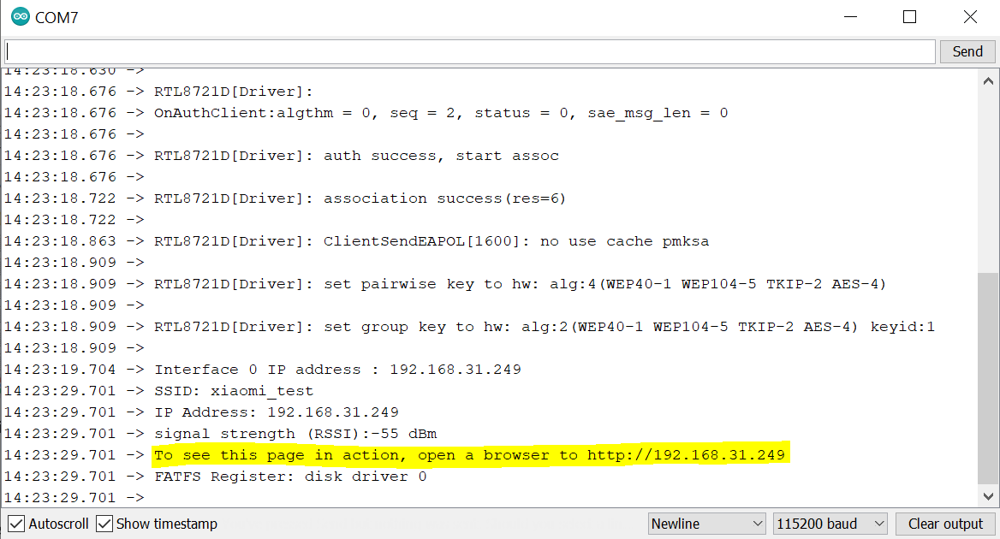

Read and open HTML file from SD card
====================================

Materials
---------

- AmebaD [AMB23] x 1
- MicroSD card

Example
-------

Insert the MicroSD card into your computer and copy the HTML file to your SD card (Note: put the file at outside and do not put it inside of any folder in the SD card). Here is a HTML sample for testing, `Web_test.html <https://github.com/Ameba-AIoT/ameba-arduino-d/blob/dev/Ameba_misc/Example_Samples/Web_test.html>`_.

|image01|

| Then insert the MicroSD card into the onboard SD card reader of RTL8722DM MINI board.
| Open the example, "Files" -> "Examples" -> "AmebaFatfsSDIO" -> "read_html_from_SD_card"
| Upload the code and press the reset button on Ameba once the upload is finished. When the connection is established, you should be able to see the message "To see this page in action, open a browser to http://xxx.xxx.xxx.xxx" in the serial monitor as shown in the figure:

|image02|

Next, open the address stated in serial monitor in the browser of your laptop or cell phone under the same WiFi domain. You will see the following display in your browser:

|image03|

Now you have successfully read and opened the html file saved in your SD card.

.. |image01| image:: ../../../../_static/amebad/Example_Guides/FatfsSDIO/FatfsSDIO_Read_and_open_HTML_file_from_SD_card/image01.png
   :width: 1041 px
   :height: 360 px
   :scale: 70 %

.. |image03| image:: ../../../../_static/amebad/Example_Guides/FatfsSDIO/FatfsSDIO_Read_and_open_HTML_file_from_SD_card/image03.png
   :width: 3895 px
   :height: 1235 px
   :scale: 20 %
