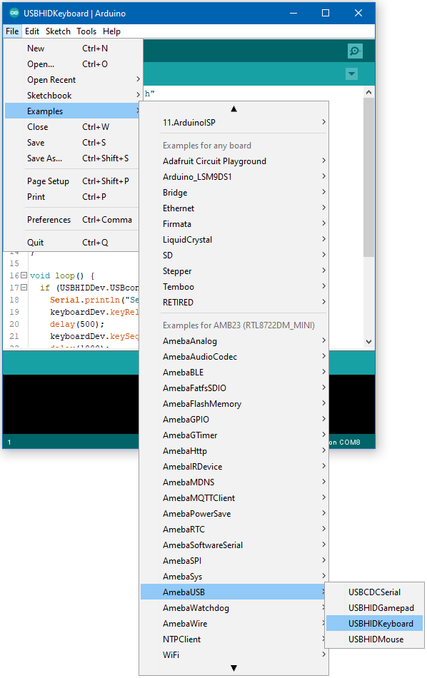
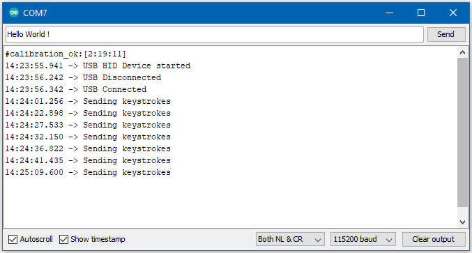

USB - HID Keyboard
===================

.. contents::
  :local:
  :depth: 2

Materials
---------

- AmebaD [ AMB23 / AMB21 / AMB22 ] x 1

- USB host device [ Windows / Linux / MacOS ]

Example
--------

In this example, the RTL8722 board emulates a HID keyboard connected using USB.

Open the example, “Files” -> “Examples” -> “AmebaUSB” -> “USBHIDKeyboard”.

|image01|

Upload the code and press the reset button once the upload is finished.

Connect the USB OTG port on the board to the host device. Refer to the example guide for USB CDC Serial for connection instructions.

The board is ready to send keyboard input to the host device. Select a text input field, such as in the Serial Monitor or a text document. Connect digital pin 8 to 3.3V to start sending keystrokes, connect to GND to stop.

You should see the text “Hello World!” typed out and deleted repeatedly.

|image02|

