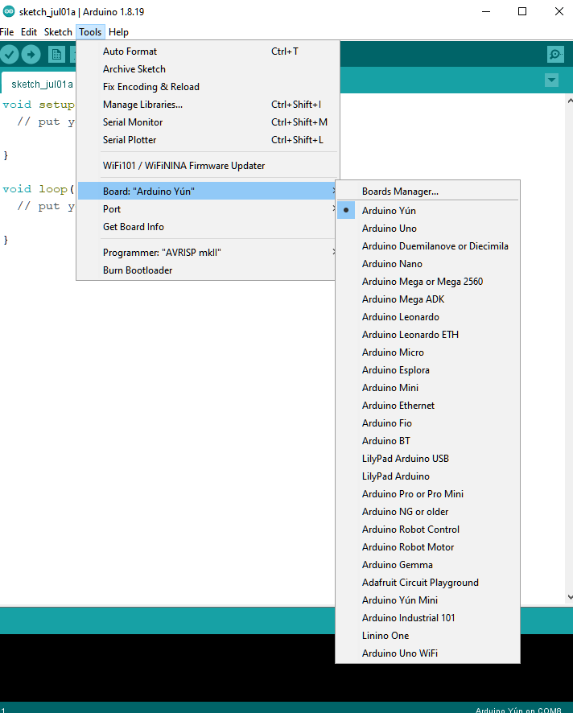
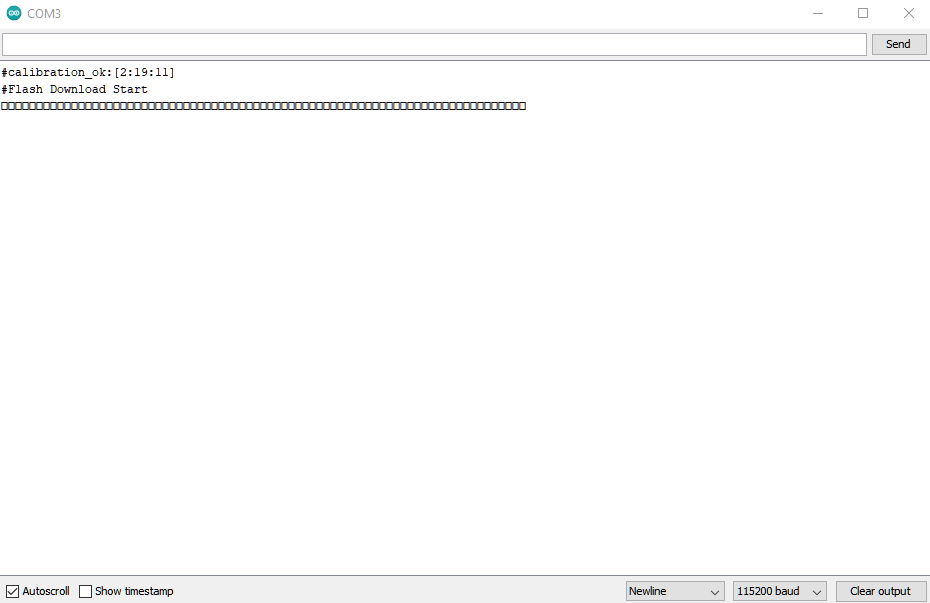

Ameba ARDUINO with AMB23 (RTL8722DM MINI)
==========================================

Introduction
------------

Ameba is an easy-to-program platform for developing all kind of IoT applications. AmebaD
is equipped with various peripheral interfaces, including WiFi, GPIO INT, I2C, UART, SPI,
PWM, ADC. Through these interfaces, AmebaD can connect with electronic components such as
LED, switches, manometer, hygrometer, PM2.5 dust sensors, …etc.

The collected data can be uploaded via WiFi and be utilized by applications on smart
devices to realize IoT implementation.

|image01|

AMB23 uses Micro USB to supply power, which is common in many smart devices.
Please refer to the following figure and table for the pin diagram and function.

|image02|

+---+-------------+--------------+---------+----------+---------------------+------------------+----------------+--------------+------------+----------------+
|   | **GPIO Pin**| **GPIO INT** | **ADC** | **PWM**  |     **UART**        |     **SPI**      |    **I2C**     |   **LED**    | **Button** |    **SWD**     |
+===+=============+==============+=========+==========+=====================+==================+================+==============+============+================+
| 0 | PB0         |  ✓           |         |          |                     |                  |I2C_SDA (a)     |              |            |                |
+---+-------------+--------------+---------+----------+---------------------+------------------+----------------+--------------+------------+----------------+
| 1 | PB1         |  ✓           | A4      |          | SERIAL2_TX (a)      |                  |                |              |            |                |
+---+-------------+--------------+---------+----------+---------------------+------------------+----------------+--------------+------------+----------------+
| 2 | PB2         |  ✓           | A5      |          | SERIAL2_RX (a)      |                  |                |              |            |                |
+---+-------------+--------------+---------+----------+---------------------+------------------+----------------+--------------+------------+----------------+
| 3 | PB3         |  ✓           | A6      |          |                     |                  |                |              |            |  SWD_CLK       |
+---+-------------+--------------+---------+----------+---------------------+------------------+----------------+--------------+------------+----------------+
| 4 | PB4         |  ✓           | A0      |  ✓       |                     | SPI_MOSI (b)     |                |              |            |                |
+---+-------------+--------------+---------+----------+---------------------+------------------+----------------+--------------+------------+----------------+
| 5 | PB5         |  ✓           | A1      |  ✓       |                     | SPI_MISO (b)     |I2C_SCL (b)     |              |            |                |
+---+-------------+--------------+---------+----------+---------------------+------------------+----------------+--------------+------------+----------------+
| 6 | PB6         |  ✓           | A2      |          |                     | SPI_SCLK (b)     |I2C_SDA (b)     |              |            |                |
+---+-------------+--------------+---------+----------+---------------------+------------------+----------------+--------------+------------+----------------+
| 7 | PB7         |  ✓           | A3      |  ✓       |                     | SPI_SS (b)       |                |              |            |                |
+---+-------------+--------------+---------+----------+---------------------+------------------+----------------+--------------+------------+----------------+
| 8 | PA2         |  ✓           |         |          |                     |                  |                |              |            |                |
+---+-------------+--------------+---------+----------+---------------------+------------------+----------------+--------------+------------+----------------+
| 9 | PA12        |  ✓           |         |  ✓       | SERIAL2_TX (b)      | SPI_MOSI (a)     |                |              |            |                |
+---+-------------+--------------+---------+----------+---------------------+------------------+----------------+--------------+------------+----------------+
|10 | PA13        |  ✓           |         |  ✓       | SERIAL2_RX (b)      | SPI_MISO (a)     |                |              |            |                |
+---+-------------+--------------+---------+----------+---------------------+------------------+----------------+--------------+------------+----------------+
|11 | PA14        |  ✓           |         |          |                     | SPI_SCLK (a)     |                |              |            |                |
+---+-------------+--------------+---------+----------+---------------------+------------------+----------------+--------------+------------+----------------+
|12 | PA15        |  ✓           |         |          |                     | SPI_SS (a)       |                |              |            |                |
+---+-------------+--------------+---------+----------+---------------------+------------------+----------------+--------------+------------+----------------+
|13 | PA16        |  ✓           |         |          |                     |                  |                |              |            |                |
+---+-------------+--------------+---------+----------+---------------------+------------------+----------------+--------------+------------+----------------+
|14 | PA28        |  ✓           |         |          |                     |                  |                |              |            |                |
+---+-------------+--------------+---------+----------+---------------------+------------------+----------------+--------------+------------+----------------+
|15 | PA18        |  ✓           |         |          | SERIAL1_TX (b)      |                  |                |              |            |                |
+---+-------------+--------------+---------+----------+---------------------+------------------+----------------+--------------+------------+----------------+
|16 | PA25        |  ✓           |         |          | SERIAL1_RX (b)      |                  |                |              |            |                |
+---+-------------+--------------+---------+----------+---------------------+------------------+----------------+--------------+------------+----------------+
|17 | PA26        |  ✓           |         |  ✓       |                     |                  |                |              |            |                |
+---+-------------+--------------+---------+----------+---------------------+------------------+----------------+--------------+------------+----------------+
|18 | PB7         |  ✓           | A3      |          | SERIAL1_TX (a)      |                  |                |              |            |                |
+---+-------------+--------------+---------+----------+---------------------+------------------+----------------+--------------+------------+----------------+
|19 | PB6         |  ✓           | A2      |          | SERIAL1_RX (a)      |                  |                |              |            |                |
+---+-------------+--------------+---------+----------+---------------------+------------------+----------------+--------------+------------+----------------+
|20 | PB5         |  ✓           | A1      |  ✓       |                     |                  |I2C1_SCL        |              |            |                |
+---+-------------+--------------+---------+----------+---------------------+------------------+----------------+--------------+------------+----------------+
|21 | PB4         |  ✓           | A0      |  ✓       |                     |                  |I2C1_SDA        |              |            |                |
+---+-------------+--------------+---------+----------+---------------------+------------------+----------------+--------------+------------+----------------+
|22 | PA28        |  ✓           |         |          |                     |                  |I2c_SCL (a)     |              |            |                |
+---+-------------+--------------+---------+----------+---------------------+------------------+----------------+--------------+------------+----------------+
|SWD| PA27        |              |         |          |                     |                  |                |              |            |  SWD_DATA      |
+---+-------------+--------------+---------+----------+---------------------+------------------+----------------+--------------+------------+----------------+
|   |             |              |         |          |                     |                  |                |  LED_B       |            |                |
+---+-------------+--------------+---------+----------+---------------------+------------------+----------------+--------------+------------+----------------+
|   |             |              |         |          |                     |                  |                |  LED_G       |            |                |
+---+-------------+--------------+---------+----------+---------------------+------------------+----------------+--------------+------------+----------------+
|   |             |              |         |          |                     |                  |                |              |PUSH_BTN    |                |
+---+-------------+--------------+---------+----------+---------------------+------------------+----------------+--------------+------------+----------------+

Setting up Development Environment
----------------------------------

Step 1. OS Environment
~~~~~~~~~~~~~~~~~~~~~~

AMB23 (RTL8722DM MINI) board currently supports Windows OS 32-bits or 64-bits,
Linux OS (Ubuntu) and macOS. To have the best experiences, please use the latest version of OS.

Step 2. Installing the Driver
~~~~~~~~~~~~~~~~~~~~~~~~~~~~~

First, connect AMB23 to the computer via Micro USB:

|image03|

If this is the first time connects AMB23 to computer, the USB driver for AMB23 will be automatically installed.

If you have driver issue of connect board to computer please go to https://ftdichip.com/drivers/ for USB driver.

Check the COM port number in Device Manager of computer:

|image04|

Step 3. Set up Arduino IDE
~~~~~~~~~~~~~~~~~~~~~~~~~~

From version 1.6.5, Arduino IDE supports third-party hardware.
Therefore, we can use Arduino IDE to develop applications on
AMB23, and the examples of Arduino can run on AMB23
too. Refer to `basic example link
<https://www.amebaiot.com.cn/amebad-mini-arduino-compatible-ex/>`__

Arduino IDE can be downloaded in the Arduino website: https://www.arduino.cc/en/Main/Software

When the installation is finished, open Arduino IDE. To set up
AMB23 correctly in Arduino IDE, go to :guilabel:`File -> Preferences`

|image05|

And paste the following URL into :guilabel:`Additional Boards Manager URLs` field::

   https://github.com/ambiot/ambd_arduino/raw/master/Arduino_package/package_realtek.com_amebad_index.json

Next, go to :guilabel:`Tools -> Board -> Boards Manager`

|image06|

The "Boards Manager" requires about 10~20 seconds to refresh all hardware files (if the network is in bad condition, it may take longer).
Every time the new hardware is connected, we need to reopen the Board Manager. So, we close the Boards Manager, and then open it again.
Find **Realtek Ameba Boards** in the list, click "Install", then the Arduino IDE starts to download required files.

|image07|

If there is GitHub downloading issue, please refer to the following link at "Download/Software Development Kit". There are 3 sections.

#. "AMB23_Arduino_patch1_SDK", please select at least 1 of the SDKs. There are 5 latest released SDK options.
#. "AMB23_Arduino_patch2_Tools", please select according to your operation system. There are Windows, Linux and MacOS.
#. "AMB23_Arduino_Source_Code", this section is optional download only wants to refer the latest source code.

https://www.amebaiot.com.cn/en/ameba-arduino-summary/

Download the files selected, then unzip (patch1 and patch2 are compulsory).
There are "Install.doc"/"Install.pdf" for you to refer installation steps. According to your system,
please run the installation tool in the "Offline_SDK_installation_tool" folder.

After the installation tool running successfully, you may open Arduino
IDE and proceed to :guilabel:`Tools -> Board -> Boards Manager…` Try to find
:guilabel:`Realtek Ameba Boards (32-bits ARM Cortex-M33 @200MHz)` in the list,
click :guilabel:`Install`, then the Arduino IDE starts to download required files
for AMB23.

Finally, we select AmebaD as current connected board in :guilabel:`Tools -> Board -> Ameba ARM (32-bits) Boards -> AMB23 (RTL8722DM MINI)`

|image08|

Try the First Example
---------------------

Step 1. Compile & Upload
~~~~~~~~~~~~~~~~~~~~~~~~

Arduino IDE provides many built-in examples, which can be compiled,
uploaded and run directly on the boards. Here, we take the "Blink"
example as the first try.

Open guilabel:`File -> Examples -> 01.Basics -> Blink`

|image09|

Arduino IDE opens a new window with the complete sample code.
There are onboard LED of AMB23, the default "LED_BUILTIN" is blue onboard LED.
Change "LED_BUILTIN" to "LED_B" or "LED_G" for different colours (blue and green).

|image10|

Next, we compile the sample code directly; click :guilabel:`Sketch -> Verify/Compile`

|image11|

Arduino IDE prints the compiling messages in the bottom area of the IDE window.
When the compilation is finished, you will get the message as following.

|image12|

Afterwards, we will upload the compiled code to board.
Please make sure the board is connected to computer, then click :guilabel:`Sketch -> Upload`
The Arduino IDE will compile first then upload. Users are required to enter the upload mode of the board.
To enter upload mode, first press and hold the UART_DOWNLOAD button, then press and release the RESET button,
lastly release the UART_DOWNLOAD button. There is a 5-seconds count down set as a reminder to enter the upload mode.

|image13|

|image14|

It is optional for users to check if the board entered the upload mode.
Open serial monitor/terminal and look for "#Flash Download Start".

.. note::

   it is normal that some serial terminals may show characters as following.

|image15|

Again, during the uploading procedure the IDE prints messages.
Uploading procedure takes considerably longer time (about 30 seconds to 1 minute).
When upload completed, the "Done uploading" message is printed.

Step 2.Run the Blink example
~~~~~~~~~~~~~~~~~~~~~~~~~~~~

In each example, Arduino not only provides sample code, but also detailed documentation,
including wiring diagram, sample code explanation, technical details, …etc. These examples can be directly used on AMB23.

So, we find the detailed information of the Blink example: https://www.arduino.cc/en/Tutorial/BuiltInExamples/Blink

In short, the example can be run on both onboard LEDs (green or blue) or external LED (use any GPIO pins for signal output).
Finally, press the RESET button, and you can see the LED blinking.

.. |image02| image:: ../../../_static/amebad/Getting_Started/AMB23_getting_started/image02.png
   :width:  4440 px
   :height:  3180 px
   :scale: 20%
.. |image03| image:: ../../../_static/amebad/Getting_Started/AMB23_getting_started/image03.png
   :width:  365 px
   :height:  666 px
.. |image04| image:: ../../../_static/amebad/Getting_Started/AMB23_getting_started/image04.png
   :width:  298 px
   :height:  628 px

.. |image07| image:: ../../../_static/amebad/Getting_Started/AMB23_getting_started/image07.png
   :width:  602 px
   :height:  337 px

.. |image11| image:: ../../../_static/amebad/Getting_Started/AMB23_getting_started/image11.png
   :width:  678 px
   :height:  746 px
.. |image12| image:: ../../../_static/amebad/Getting_Started/AMB23_getting_started/image12.png
   :width:  678 px
   :height:  746 px

