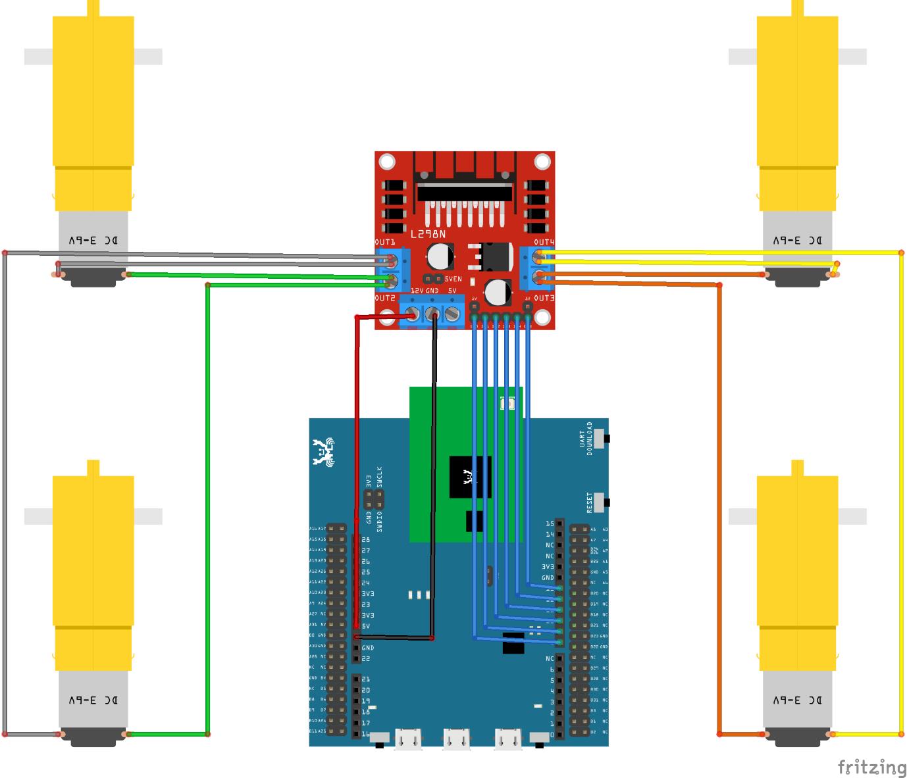
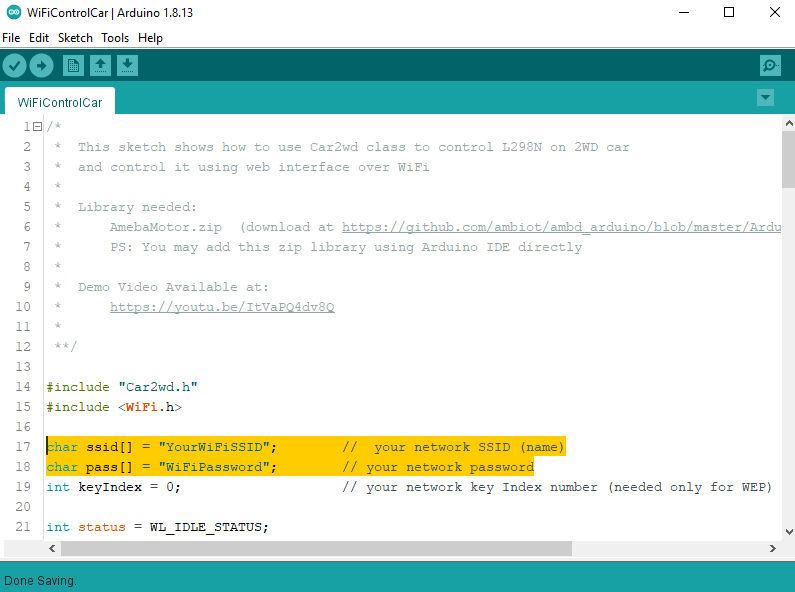
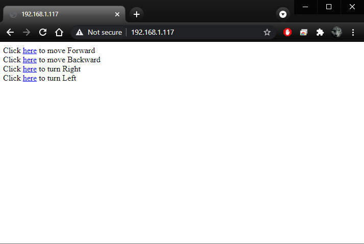

AmebaMotors - Use Ameba as Server to Control Motors
===================================================

.. contents::
  :local:
  :depth: 2

Introduction to AmebaMotors
---------------------------

| AmebaMotors is a library which provides API related to controlling motors.
| Please download the library: `AmebaMotors <https://github.com/Ameba-AIoT/ameba-arduino-d/blob/dev/Arduino_zip_libraries/AmebaMotors.zip>`_
| And add the library to Ameba: https://www.arduino.cc/en/Guide/Libraries#toc4

Materials
---------

- AmebaD [AMB21 / AMB22] x 1
- L298N H-Bridge x 1
- 4-wheel motorcar or 2-wheel motorcar+Universal wheel

Example
-------

Procedure
~~~~~~~~~

| In this example, we connect Ameba to WiFi and use Ameba as server, the user can control a 4-wheel/2-wheel motorcar through a webpage.

| First, connect Ameba to the L298N H-Bridge and the motorcar.

| To know more about motor movement and the technical details of the L298N H-Bridge, please check out this `link <https://www.amebaiot.com/en/ameba-arduino-amebamotors-basic/>`_.

| Open the example, ``“Files” → “Examples” → “WiFi” → “WiFiControlCar”``.

| You will see we use the following pins in the example:

   +-----+-----+-----+-----+-----+-----+
   | ENA | IN1 | IN2 | IN3 | IN4 | ENB |
   +=====+=====+=====+=====+=====+=====+
   | 8   | 9   | 10  | 11  | 12  | 13  |
   +-----+-----+-----+-----+-----+-----+

Wiring:

|image01|

.. note::

    - We connect Ameba 5V to L298N +12V to supply power. However, not every L298N accepts 5V power supply, if this does not work, please connect L298N +12V to other power supply (e.g., +12V) and use L298N +5V to supply power to Ameba.
    - The correct wiring of the motor depends on each model (may be opposite). Please run the test program first, make sure it runs correctly before assembling the motorcar.
    - For convenience purposes, it's recommended to use Dupont line to organize the wiring of motors and L298N.

| Every time you modify your program, please remember to unplug the power of L298N to avoid the motor running unexpectedly. Connect Ameba to power, upload the program, and then connect L298N to power when you are going to test the program.

| Then, upload the code to Ameba

| In the sample code, modify the highlighted snippet to corresponding information.

|image02|

| Upload the code and press the reset button on Ameba. When the connection is established, you will see the message “To see this page in action, open a browser to http://xxx.xxx.xxx.xxx” in the Arduino IDE, as shown in the figure:

|image03|

| Next, open the browser of a computer or a cell phone under the same WiFi domain, enter the address in the message.

|image04|

| In the webpage, you can press the corresponding button to control the motor car in any of the 4 directions.

Demo Video
----------

.. raw:: html 

    

        <iframe width="560" height="315" src="https://www.youtube.com/embed/ItVaPQ4dv8Q" title="Ameba WiFi Remote Control Car" frameborder="0" allow="accelerometer; autoplay; clipboard-write; encrypted-media; gyroscope; picture-in-picture" allowfullscreen></iframe>        
    

Code Reference
--------------

| Use ``WiFi.begin()`` to establish WiFi connection.
| https://www.arduino.cc/en/Reference/WiFiBegin

To get the information of a WiFi connection:

| Use ``WiFi.SSID()`` to get SSID of the current connected network.
| https://www.arduino.cc/en/Reference/WiFiSSID

| Use ``WiFi.RSSI()`` to get the signal strength of the connection.
| https://www.arduino.cc/en/Reference/WiFiRSSI

| Use ``WiFi.localIP()`` to get the IP address of Ameba.
| https://www.arduino.cc/en/Reference/WiFiLocalIP

| Use ``WiFiServer server()`` to create a server that listens on the specified port.
| https://www.arduino.cc/en/Reference/WiFiServer

| Use ``server.begin()`` to tell the server to begin listening for incoming connections.
| https://www.arduino.cc/en/Reference/WiFiServerBegin

| Use ``server.available()`` to get a client that is connected to the server and has data available for reading.
| https://www.arduino.cc/en/Reference/WiFiServerAvailable

| Use ``client.connected()`` to get whether or not the client is connected.
| https://www.arduino.cc/en/Reference/WiFiClientConnected

| Use ``client.println()`` to print data followed by a carriage return and newline.
| https://www.arduino.cc/en/Reference/WiFiClientPrintln

| Use ``client.print()`` to print data to the server that a client is connected to.
| https://www.arduino.cc/en/Reference/WiFiClientPrint

| Use ``client.available()`` to return the number of bytes available for reading.
| https://www.arduino.cc/en/Reference/WiFiClientAvailable

| Use ``client.read()`` to read the next byte received from the server the client is connected to.
| https://www.arduino.cc/en/Reference/WiFiClientRead

| Use ``client.stop()`` to disconnect from the server the client is connected to.
| https://www.arduino.cc/en/Reference/WiFIClientStop

.. |image03| image::  ../../../../_static/amebad/Example_Guides/AmebaMotors/image03.png
   :width: 854
   :height: 413
