Ameba ARDUINO with AMB25 (RTL8720DF)
====================================

Introduction
------------

Realtek RTL8720DF is a Wi-Fi and Bluetooth IC that supports 2.4GHz and 5GHz dual bands for Wi-Fi communication,
and Bluetooth Low Energy (BLE) 5.0.
The module is a highly integrated Wi-Fi and Bluetooth module with the RTL8720DF as the main SoC (System on Chip),
it can be regarded as an SoC for the Wi-Fi and Bluetooth application with typical SBCs.
AMB25 board is a development board that integrated with the module.
AMB25 uses USB Type C connector and has Auto Upload circuit.

**AMB25 board**
~~~~~~~~~~~~~~~

|image01|

The size of the board is 50.7*17.8 mm. It uses Type C USB to supply power, which is common in many smart devices.
Please refer to the following figure and table for the pin diagram and functions.

|image02|

+---+-------------+--------------+---------+----------+---------------------+------------------+----------------+--------------+----------------+
|   | **GPIO Pin**| **GPIO INT** | **ADC** | **PWM**  |     **UART**        |     **SPI**      |    **I2C**     |   **IR**     |     **SWD**    |
+===+=============+==============+=========+==========+=====================+==================+================+==============+================+
| 0 | PA15        |  ✓           |         |          |                     | SPI1_SS          |                |              |                |
+---+-------------+--------------+---------+----------+---------------------+------------------+----------------+--------------+----------------+
| 1 | PA14        |  ✓           |         |          |                     | SPI1_SCLK        |                |              |                |
+---+-------------+--------------+---------+----------+---------------------+------------------+----------------+--------------+----------------+
| 2 | PA13        |  ✓           |         |  ✓       | SERIAL2_RX          | SPI1_MISO        |                |              |                |
+---+-------------+--------------+---------+----------+---------------------+------------------+----------------+--------------+----------------+
| 3 | PA12        |  ✓           |         |  ✓       | SERIAL2_TX          | SPI1_MOSI        |                |              |                |
+---+-------------+--------------+---------+----------+---------------------+------------------+----------------+--------------+----------------+
| 4 | PA30        |  ✓           |         |  ✓       |                     |                  |                |              |                |
+---+-------------+--------------+---------+----------+---------------------+------------------+----------------+--------------+----------------+
| 5 | PA28        |  ✓           |         |  ✓       |                     |                  |                |              |                |
+---+-------------+--------------+---------+----------+---------------------+------------------+----------------+--------------+----------------+
| 6 | PA26        |  ✓           |         |  ✓       |                     |                  |I2C_SDA         | IR_RX (a)    |                |
+---+-------------+--------------+---------+----------+---------------------+------------------+----------------+--------------+----------------+
| 7 | PA25        |  ✓           |         |  ✓       |                     |                  |I2C_SCL         | IR_TX (a)    |                |
+---+-------------+--------------+---------+----------+---------------------+------------------+----------------+--------------+----------------+
| 8 | PA27        |  ✓           |         |          |                     |                  |                |              |  SWD_DATA      |
+---+-------------+--------------+---------+----------+---------------------+------------------+----------------+--------------+----------------+
| 9 | PB3         |  ✓           | A6      |          |                     |                  |                |              |  SWD_CLK       |
+---+-------------+--------------+---------+----------+---------------------+------------------+----------------+--------------+----------------+
|10 | PB2         |  ✓           | A5      |          |                     |                  |                |              |                |
+---+-------------+--------------+---------+----------+---------------------+------------------+----------------+--------------+----------------+
|11 | PB1         |  ✓           | A4      |          |                     |                  |                |              |                |
+---+-------------+--------------+---------+----------+---------------------+------------------+----------------+--------------+----------------+
|12 | PA7         |  ✓           |         |          | LOG_TX              |                  |                |              |                |
+---+-------------+--------------+---------+----------+---------------------+------------------+----------------+--------------+----------------+
|13 | PA8         |  ✓           |         |          | LOG_RX              |                  |                |              |                |
+---+-------------+--------------+---------+----------+---------------------+------------------+----------------+--------------+----------------+
|14 | PB23        |  ✓           |         |  ✓       |                     |                  |                | IR_TX (b)    |                |
+---+-------------+--------------+---------+----------+---------------------+------------------+----------------+--------------+----------------+
|15 | PB22        |  ✓           |         |  ✓       |                     |                  |                | IR_RX (b)    |                |
+---+-------------+--------------+---------+----------+---------------------+------------------+----------------+--------------+----------------+
|16 | PB19        |  ✓           |         |  ✓       | SERIAL1_TX          | SPI_MISO         |                |              |                |
+---+-------------+--------------+---------+----------+---------------------+------------------+----------------+--------------+----------------+
|17 | PB18        |  ✓           |         |  ✓       | SERIAL1_RX          | SPI_MOSI         |                |              |                |
+---+-------------+--------------+---------+----------+---------------------+------------------+----------------+--------------+----------------+
|18 | PB21        |  ✓           |         |  ✓       |                     | SPI_SS           |                |              |                |
+---+-------------+--------------+---------+----------+---------------------+------------------+----------------+--------------+----------------+
|19 | PB20        |  ✓           |         |  ✓       |                     | SPI_SCLK         |                |              |                |
+---+-------------+--------------+---------+----------+---------------------+------------------+----------------+--------------+----------------+

There are 2 buttons besides USB connector.
"RST" button is on the left and "Burn" button is on the right as shown on above figures.
Refer the following table for the functions of the buttons.

+---------------------------+------------------------------------------+
| **Button Functions**      | **Button Process**                       |
+===========================+==========================================+
| **Reset board**           | 1. Press then release "RST"              |
+---------------------------+------------------------------------------+
| **Enter upload mode**     | 1. Press and hold "Burn"                 |
|                           |                                          |
|                           | 2. Press then release "RST"              |
|                           |                                          |
|                           | 3. Release "Burn"                        |
+---------------------------+------------------------------------------+

The Upload Mode is required by board when erase flash or upload firmware. BW16 Type C has Auto Upload circuit. It can skip manually enter the Upload Mode.

Setting up Development Environment
----------------------------------

Step 1. OS Environment
~~~~~~~~~~~~~~~~~~~~~~

AMB25 (RTL8720DF) board currently supports Windows OS 32-bits or 64-bits, Linux OS (Ubuntu) and macOS. To have the best experiences, please use the latest version of OS.
For any Linux OS (Ubuntu) related issues, refer to https://forum.amebaiot.com/t/ubuntu-linux-environment/2259.
For any macOS related issues, refer to https://forum.amebaiot.com/t/macos-environment/2260.

Step 2. Set up Arduino IDE
~~~~~~~~~~~~~~~~~~~~~~~~~~~

From version 1.6.5, Arduino IDE supports third-party hardware.
Arduino IDE is used to develop applications on the board, and the Arduino basic examples
(refer to `basic example link
<https://www.amebaiot.com.cn/amebad-mini-arduino-compatible-ex/>`__).

Arduino IDE can be downloaded in the Arduino website: https://www.arduino.cc/en/Main/Software

When the installation is finished, open Arduino IDE. Go to :guilabel:`"File" -> "Preferences"`.

And paste the following URL into :guilabel:`"Additional Boards Manager URLs"` field::

   https://github.com/ambiot/ambd_arduino/raw/master/Arduino_package/package_realtek.com_amebad_index.json

Next, go to :guilabel:`"Tools" -> "Board" -> "Boards Manager"`:

|image03|

The "Boards Manager" requires several seconds to refresh all hardware files (if the network is in bad condition, it may take longer). Search "Realtek"
then find "Realtek Ameba Boards (32-bits ARM Cortex-M33 @200MHz)" in the list, click "Install", then the Arduino IDE starts to download required files for AmebaD family includes AMB25.

|image04|

If there is downloading issue (Bad internet or GitHub access), please refer to the following link at "Download/Software Development Kit". There are 3 sections.
1. "AmebaD_Arduino_patch1_SDK", please select at least 1 of the SDKs. There are 5 latest released SDK options.
2. "AmebaD_Arduino_patch2_Tools", please select according to operating system. There are Windows, Linux, and macOS.
3. "AmebaD_Arduino_Source_Code", this section is optional. Download for the latest source code.
https://www.amebaiot.com.cn/en/ameba-arduino-summary/
Download the files selected, then unzip (patch1 and patch2 are compulsory). There are "Install.doc"/"Install.pdf" for you to refer to installation steps. According to your system, please run the installation tool in the "Offline_SDK_installation_tool" folder.
After the installation, select AmebaD as current connected board in :guilabel:`"Tools" -> "Board" -> "Ameba ARM (32-bits) Boards" -> "AMB23 (RTL8722DM MINI)"`

|image05|

Step 3. Install the Serial port
~~~~~~~~~~~~~~~~~~~~~~~~~~~~~~~

First, connect the board to computer via Type C USB.
After connected, the USB driver will be automatically installed. If there is any driver issue of connecting board, please go to https://www.prolific.com.tw/US/ShowProduct.aspx?p_id=225&pcid=41l for PLC2303GC driver. Check the COM Port number in Device Manager for Windows OS user:

|image06|

Go to "Tools" -> "Port" and select the correct COM port.

|image07|

Go to "Tools" -> "Serial Monitor", set the baud rate as "115200", and press the RST button to check the serial port connection.

|image08|

|image09|

Step 4. Erase flash
~~~~~~~~~~~~~~~~~~~

Depending on the batch of manufacturing, some boards require to erase first before using.

|image10|

Then enter the enter the upload mode.
•	Manually. Press and hold "Burn" button, press then release "RST" button and release "Burn" button.
•	Auto. Select "Tools" -> "Auto Upload Mode" -> "Enable". Note that only boards with auto upload circuit built-in can use the Auto Upload Mode, otherwise it will back to normal upload mode and wait for 5 seconds.
Next, Select "Sketch" -> "Upload". "Erase flash done." will show up.

|image11|

|image12|

Check the serial monitor and reset board by press RST button. If only "#" shows that means erase flash success. Remember to select "Tools" -> "Erase Flash" -> "Disable".

|image13|

Try the First Example
---------------------

Step 1. Compile & Upload
~~~~~~~~~~~~~~~~~~~~~~~~

Arduino IDE provides many built-in examples, which can be compiled,
uploaded and run directly on the boards. Here, we take the "Blink"
example as the first try.

Open :guilabel:`"File" -> "Examples" -> "01.Basics" -> "Blink"`:

|image14|

|image15|

There is no "LED_BUILTIN", must redefine any GPIO pin as the LED output.

|image16|

Then connect an LED to board as show.

|image17|

Next, compile the sample code directly. "Sketch" -> "Verify/Compile". Then if there is no compile error, followed by "Sketch" -> "Upload".

*	Check and select "Tools" -> "Erase Flash" -> "Disable".
*	Enter the Upload Mode. Manual or Auto. Select "Tools" -> "Auto Upload Mode" -> "Enable"/ "Disable".
*	"Verify/Compile" and "Upload". "Upload" includes "Verify/Compile", "Verify/Compile" can be skipped.

Successful upload will show "All images are sent successfully!"

|image18|

Step 2.Run the Blink example
~~~~~~~~~~~~~~~~~~~~~~~~~~~~

In each example, Arduino not only provides sample code, but also detailed documentation,
including wiring diagram, sample code explanation, technical details, …etc. These examples can be directly used on AMB23.

So, we find the detailed information of the Blink example: https://www.arduino.cc/en/Tutorial/BuiltInExamples/Blink

In short, the example can be run on both onboard LEDs (green or blue) or external LED (use any GPIO pins for signal output).
Finally, press the RESET button, and you can see the LED blinking.

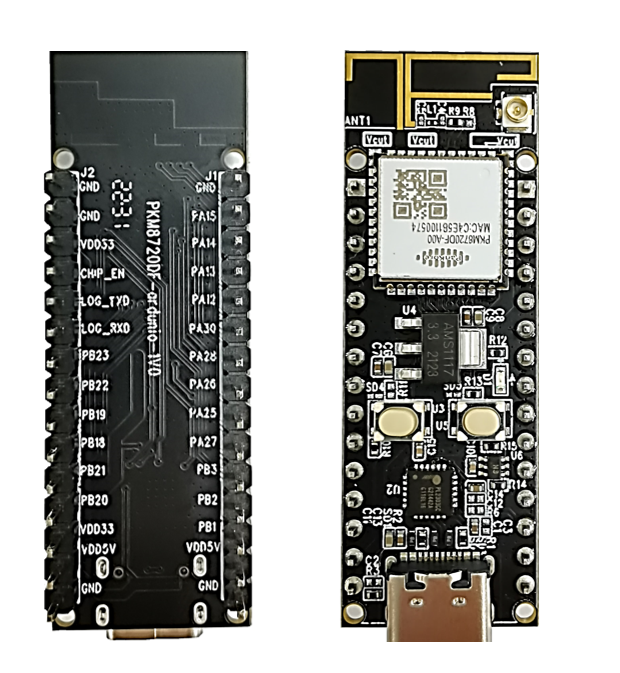
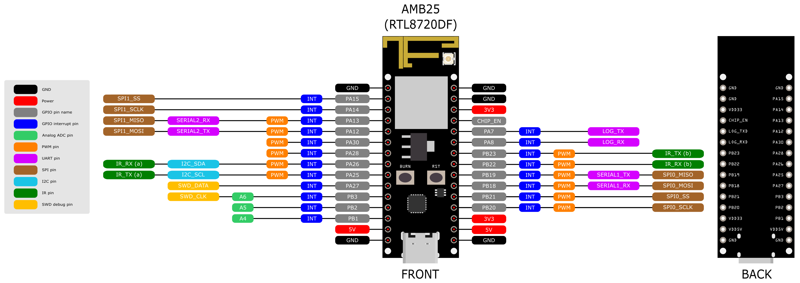
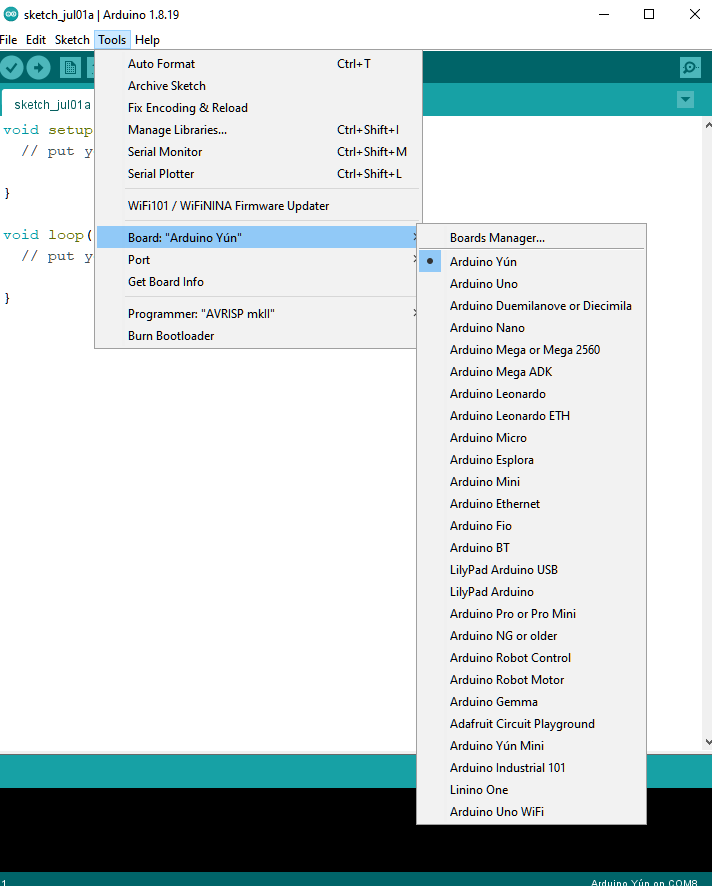
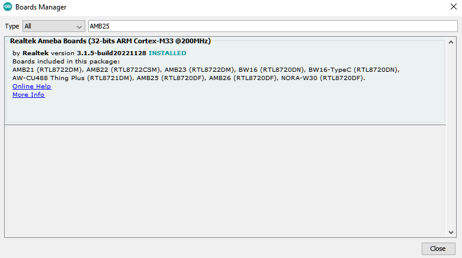
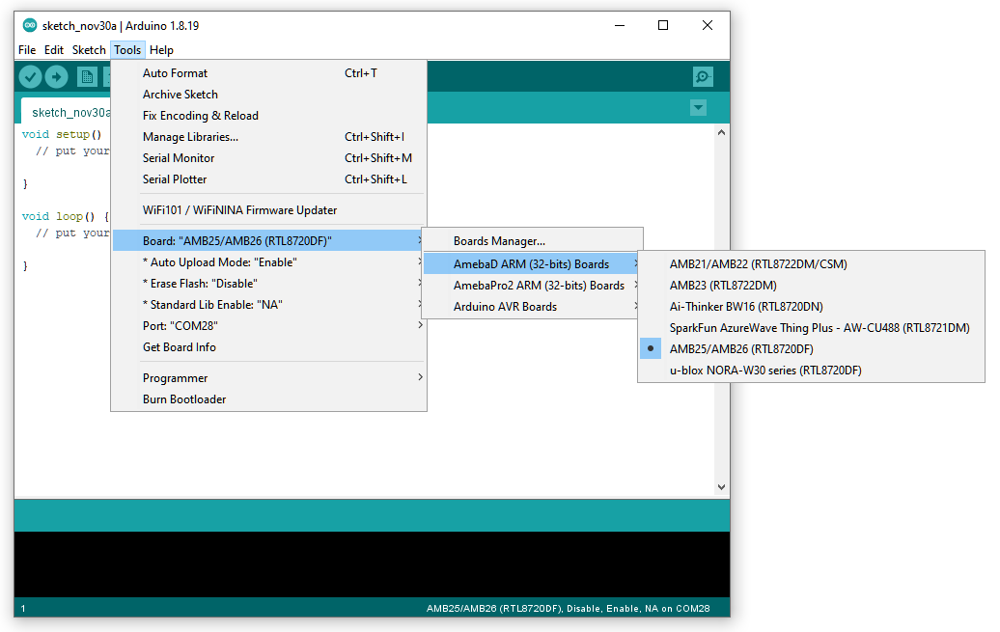
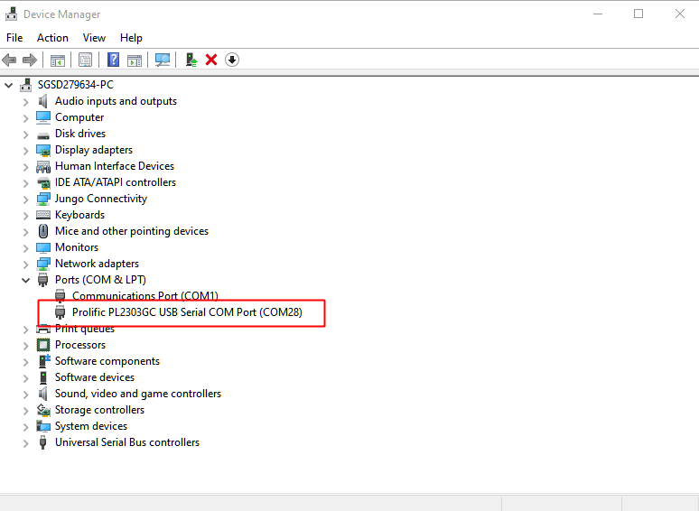
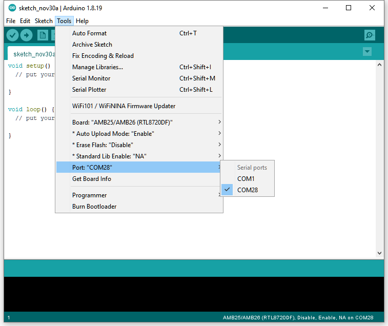
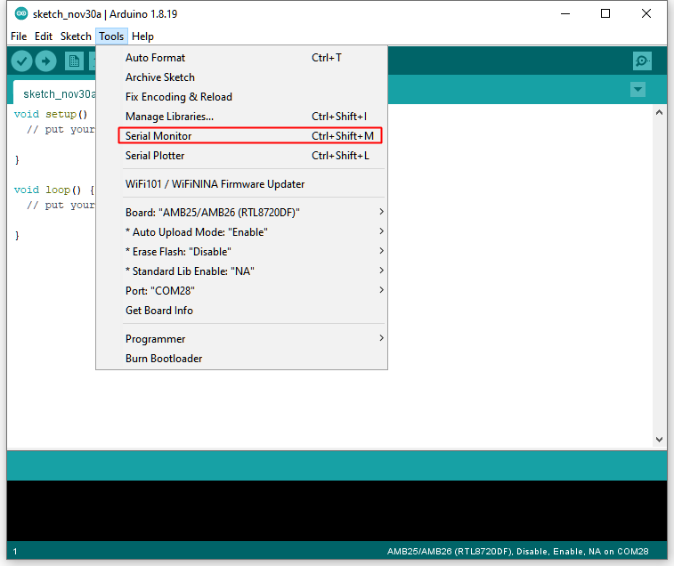
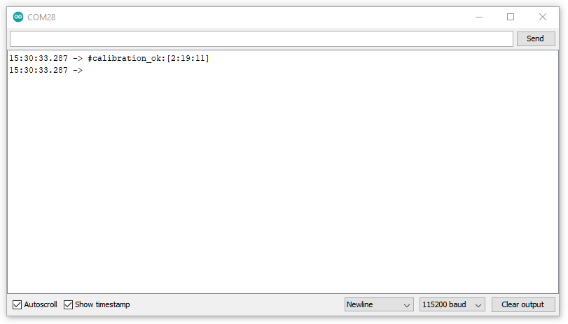
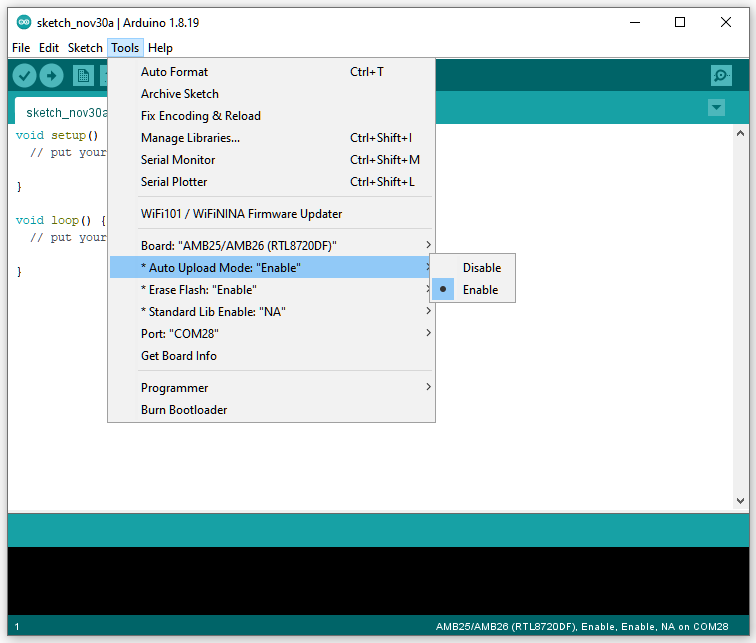
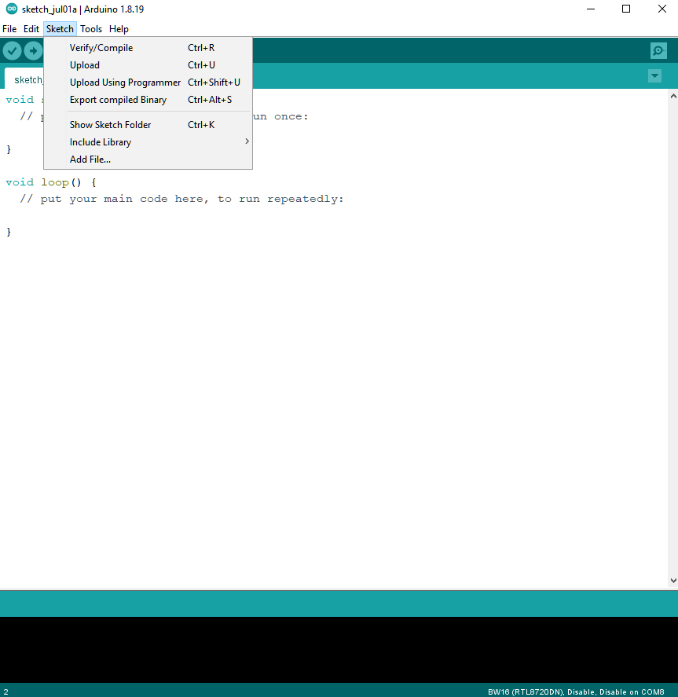
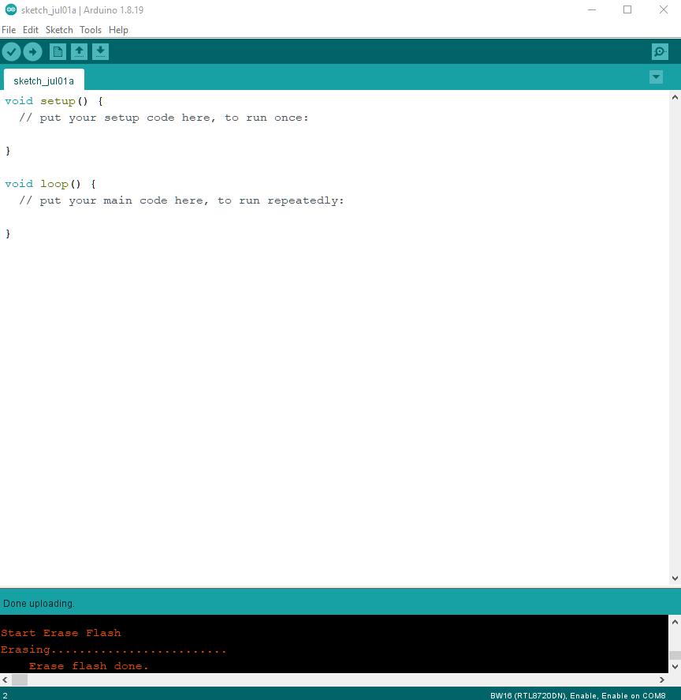
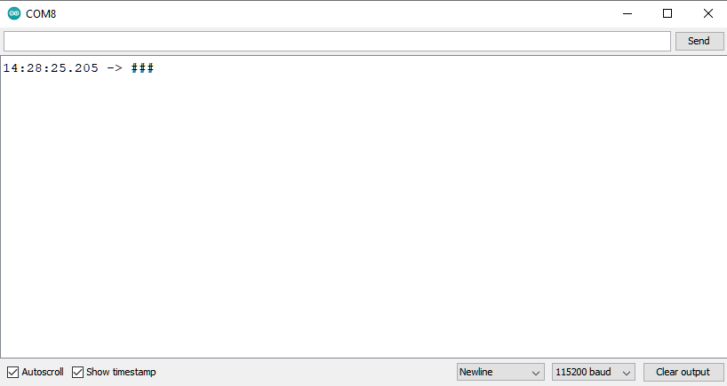
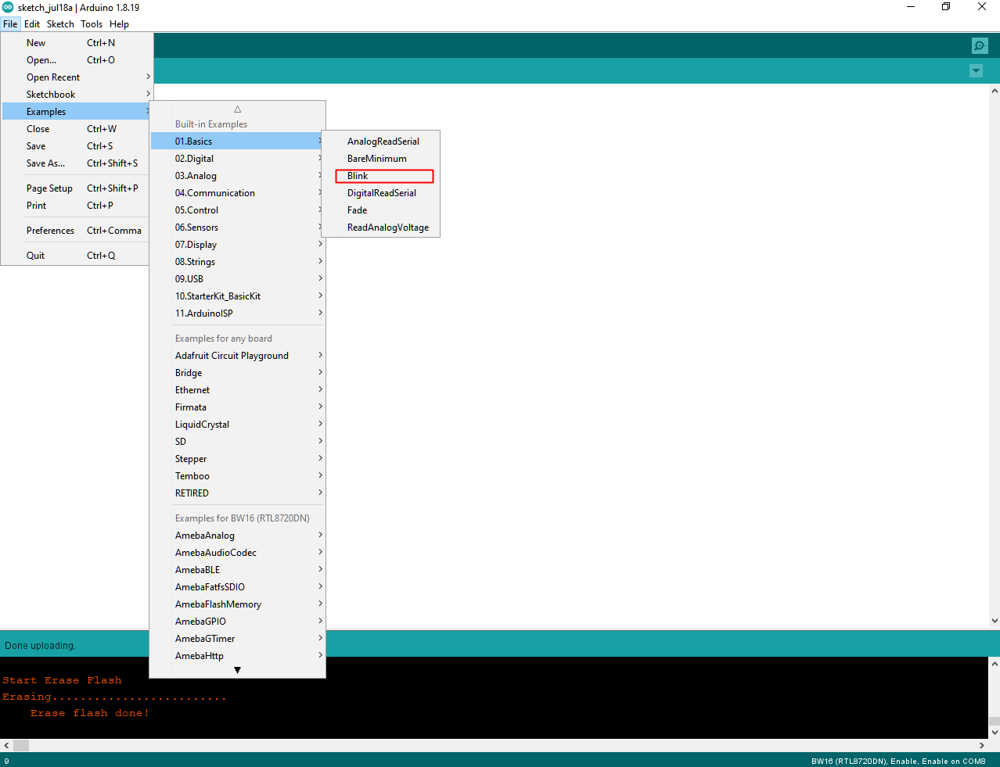
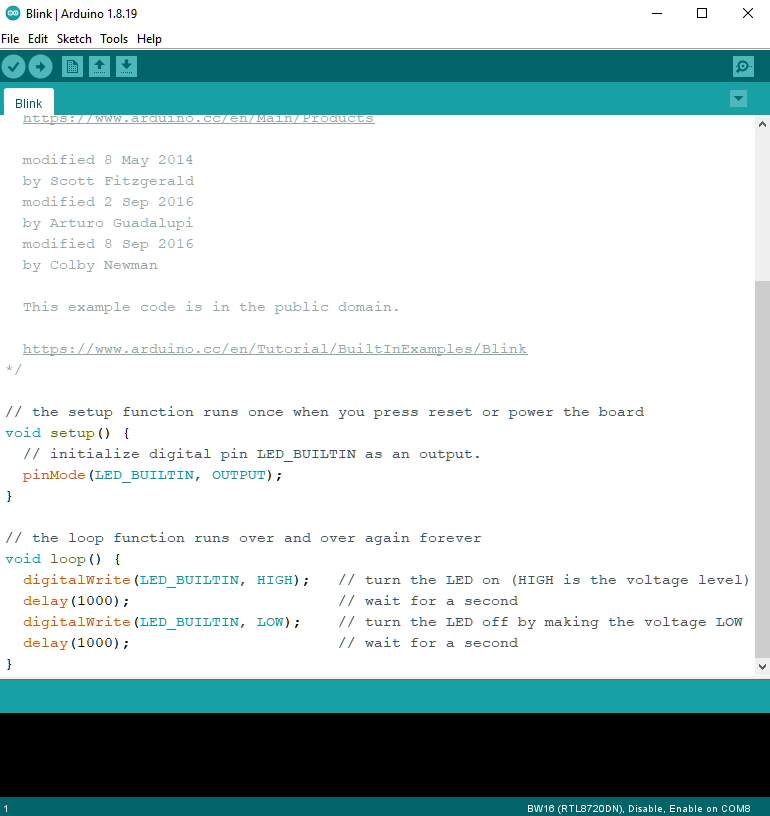
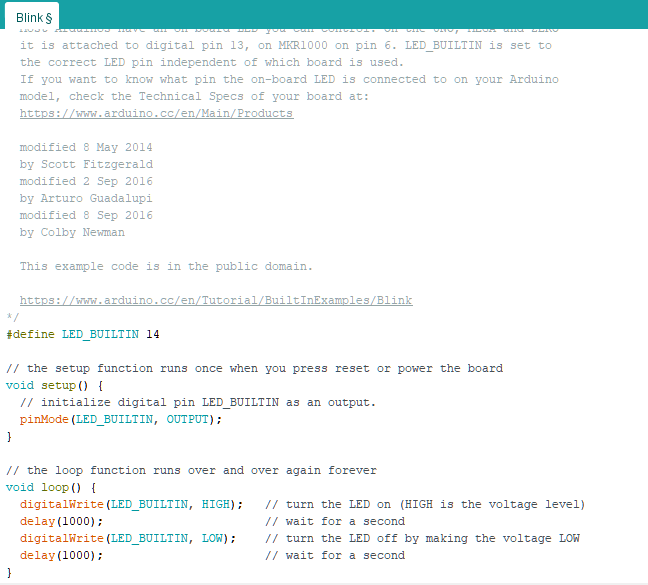
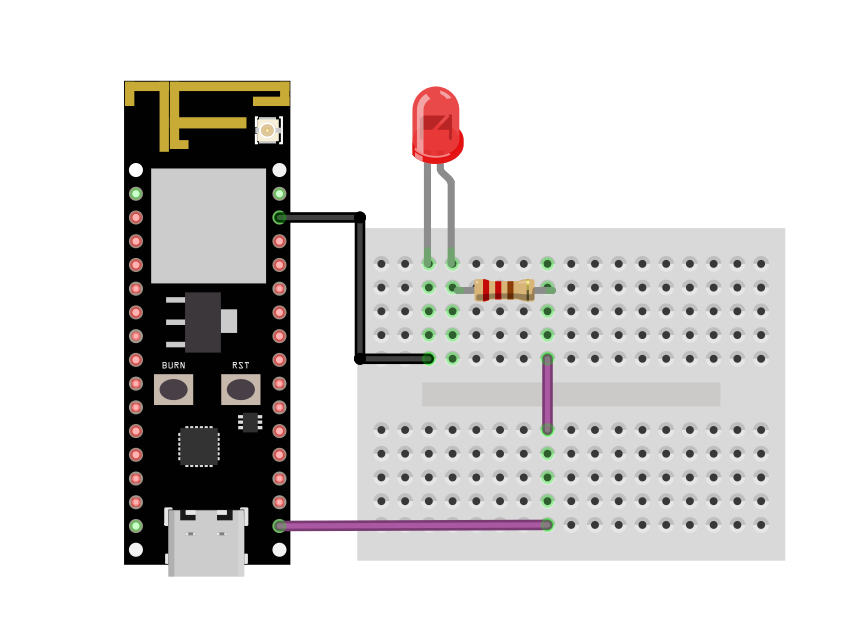
.. |image18| image:: ../../../_static/amebad/Getting_Started/AMB25_getting_started/image18.png
   :width:  403 px
   :height:  89 px
