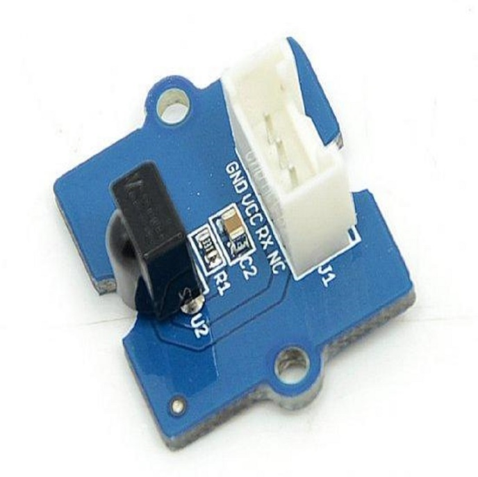
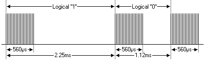
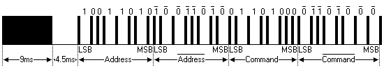

IR - Transmit IR NEC Raw Data and Decode
========================================

Materials
---------

- AmebaD [ AMB21 / AMB22 / BW16 / AW-CU488 Thing Plus / AMB25 / AMB26 ] x 2

- Grove - Infrared Emitter x1 (Figure 1)

- Grove - Infrared Receiver x1 (Figure 2)

Example
-------

In this example, we use two AmebaD boards that connecting with an infrared (IR) Emitter and an IR Receiver separately to transmit and receive IR NEC Raw data.

|image01|

Figure 1: Grove - Infrared Receiver

|image02|

Figure 2: Grove - Infrared Emitter

On the transmission side, the transmitter will send IR NEC raw data. The raw data can be seen as consecutive durations of "marks" and "spaces" (Figure 3) in microseconds (us).

- Mark: a specific period of sending pulses

- Space: a specific period of sending nothing

|image03|

Figure 3: A typical IR transmission and reception setup implementation

For more details, please refer to SB-Projects' topic of `IR Remote Control Theory <https://www.sbprojects.net/knowledge/ir/index.php>`__ to learn the theory of IR remote controls operation and a collection of IR protocol descriptions. In this example, we are going to use NEC (Now Renesas, also known as Japanese Format) as the transmission protocol.

**NEC Features**

- 8-bit address and 8-bit command length.

- Extended mode available, doubling the address size.

- Address and command are transmitted twice for reliability.

- Pulse distance modulation.

- The carrier frequency of 38kHz.

- Bit time of 1.125ms or 2.25ms.

**Modulation**

NEC protocol uses Pulse Distance Encoding of the bits for data communication (Figure 4). A logical "1" is represented by total duration of 2250us, with 560us of "marks" and (2250-560) us of "spaces". While logical "0" is represented by total duration of 1120us, with 560us "marks" and (1120-560) us of "spaces".

|image04|

Figure 4: Modulation of NEC

Since a total number of 32-bit data together with the header and the end-bit will be transferred (Figure 5).

If we separate the data in the time-frame (in us), there will be ( 2 + 32 ) x 2 + 1 = 69 "marks" / "spaces" to be transmitted (Figure 6), which forms the raw NEC data we would like to transmit in our Arduino "\*.ino" file. This part of the code can be modified by users. Details of how to obtain raw data code for your remote devices, you may refer to `Ken Shirriff's blog <http://www.righto.com/2009/08/multi-protocol-infrared-remote-library.html>`__ where it provides multiple libraries provided online.

|image05|

Figure 5: Sample of a Full NEC Data (in logic1 or 0)

|image06|

Figure 6: Sample of a Full NEC RAW Data (in us)

**IR Emitter**

|image17|

**IR receiver**

|image18|

After the connection is being set up correctly, we will move to the coding part for this example. First, make sure the correct Ameba development board is selected in Arduino IDE :guilabel:`Tools -> Board`

Open the "IRSendRAW" example in :guilabel:`File -> Examples -> AmebaIRDevice -> IRSendRAW` and upload to 1st board connected with IR Emitter:

|image19|

After successfully upload the sample code for IRSendRaw, you might need to upload the IRRecvNEC example for the 2nd board connected with IR Receiver from :guilabel:`File -> Examples -> AmebaIRDevice -> IRRecvNEC`

After opening the serial monitor on the IR Receiver side and press the reset buttons on two boards, the data "48" will be received every 3 seconds (due to the delays () function, not compulsory to wait). After decoding the signal from the receiving Pin D8 and transmitting Pin D9 with Logic Analyser and Pulse View, the result is also shown
as "48" after decoding the receiving data with IR NEC Protocol.

|image20|

Code Reference
--------------

| [1] Seeed Official website for Grove - Infrared Receiver
| https://wiki.seeedstudio.com/Grove-Infrared_Receiver/

| [2] Seed Official website for Grove - Infrared Emitter
| https://wiki.seeedstudio.com/Grove-Infrared_Emitter/

| [3] Ken SHirriff's blog on A Multi-Protocol Infrared Remote Library for the Arduino
| http://www.righto.com/2009/08/multi-protocol-infrared-remote-library.html

| [4] SB-Projects: IR Remote Control Project
| https://www.sbprojects.net/knowledge/ir/index.php

.. |image03| image:: ../../../../_static/amebad/Example_Guides/IR/IR_Transmit_IR_NEC_Raw_Data_And_Decode/image03.png
   :width: 531
   :height: 188
   :scale: 100 %

.. |image06| image:: ../../../../_static/amebad/Example_Guides/IR/IR_Transmit_IR_NEC_Raw_Data_And_Decode/image06.png
   :width: 830
   :height: 109
   :scale: 100 %

.. |image19| image:: ../../../../_static/amebad/Example_Guides/IR/IR_Transmit_IR_NEC_Raw_Data_And_Decode/image19.png
   :width: 554
   :height: 537
   :scale: 100 %
.. |image20| image:: ../../../../_static/amebad/Example_Guides/IR/IR_Transmit_IR_NEC_Raw_Data_And_Decode/image20.png
   :width: 1210
   :height: 163
   :scale: 80 %
