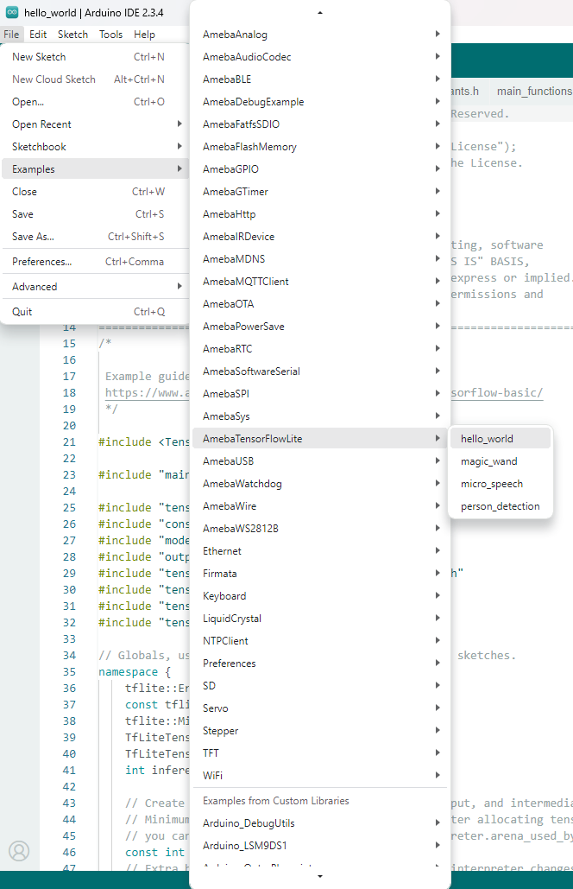
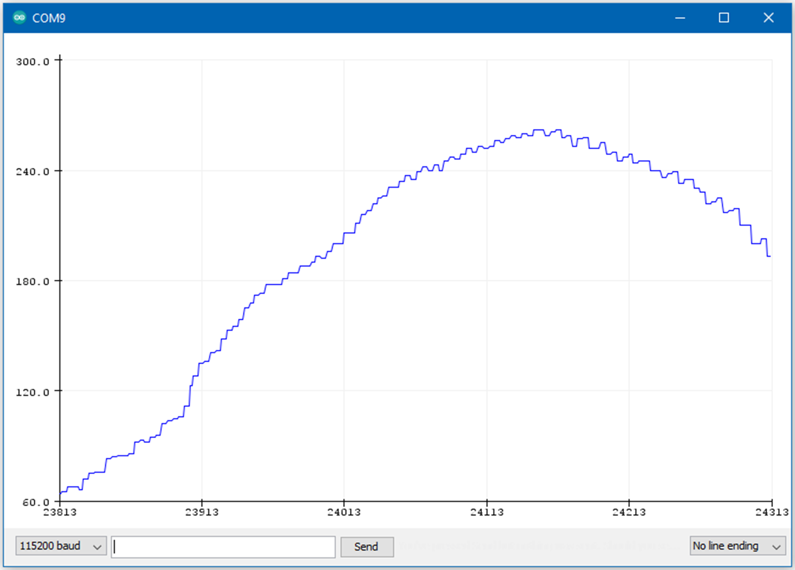

TensorFlow Lite - Hello World
=============================

.. contents::
  :local:
  :depth: 2

Materials
---------

- AmebaD [AMB21 / AMB22 / AMB23 / BW16 / AW-CU488 Thing Plus / AMB25 / AMB26] x 1

- LED x 1

Example
-------

Open the example, "Files" → "Examples" → “AmebaTensorFlowLite” → “hello_world”.

|image01|

Enable TensorFlow Lite option. It is set to disable by default.

|image02|

| Upload the code and press the reset button on Ameba once the upload is finished.
| Connect the LED to digital pin 10 and ground, ensuring that the polarity is correct. You should see the LED fade in and out rapidly.
| In the Arduino serial plotter, you can see the output value of the Tensorflow model plotted as a graph, it should resemble a sine wave.

|image03|

Code Reference
--------------

More information on TensorFlow Lite for Microcontrollers can be found at: https://www.tensorflow.org/lite/microcontrollers

