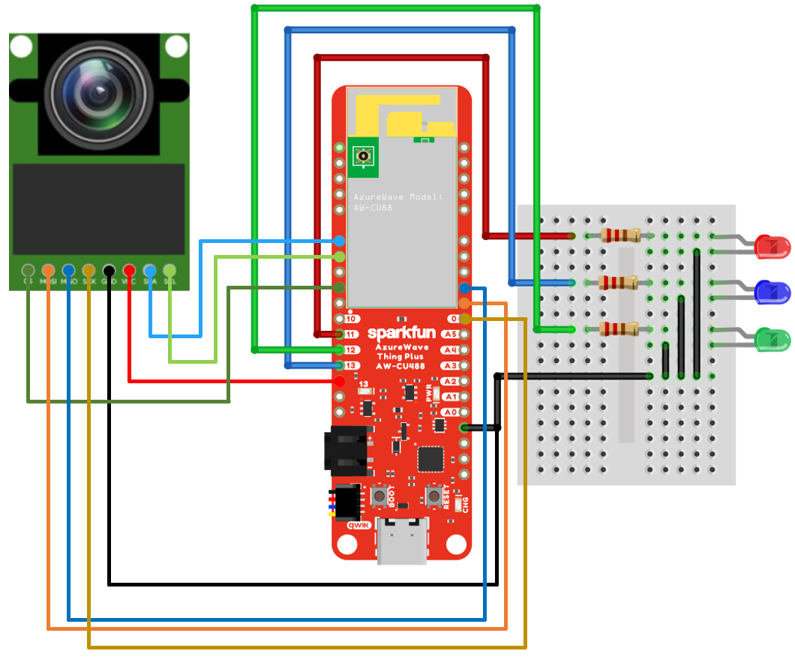
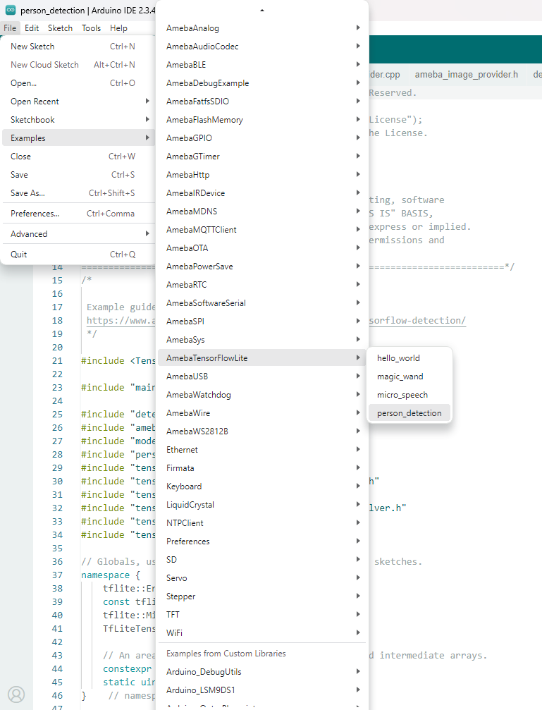
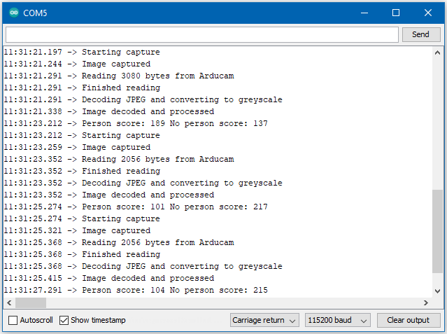

TensorFlow Lite - Person Detection
==================================

.. contents::
  :local:
  :depth: 2

Materials
---------

- AmebaD [AMB21 / AMB22 / AMB23 / BW16 / AW-CU488 Thing Plus / AMB25 / AMB26] x 1

- Arducam Mini 2MP Plus OV2640 SPI Camera Module x 1

- LED x 3

Example
-------

Wiring Diagram: 

Connect the camera and LEDs to the Ameba board according to the diagram below.
  
|image05|

1. Download the Ameba customized version of TensorFlow Lite for Microcontrollers library at https://github.com/Ameba-AIoT/ameba-arduino-d/blob/master/Arduino_zip_libraries/Ameba_TensorFlowLite.zip. Follow the instructions at https://docs.arduino.cc/software/ide-v1/tutorials/installing-libraries to install it.

2. Download Ameba_ArduCAM library at https://github.com/Ameba-AIoT/ameba-arduino-d/blob/master/Arduino_zip_libraries/Ameba_ArduCAM.zip. Follow the instructions at https://docs.arduino.cc/software/ide-v1/tutorials/installing-libraries to install it.

3. In the Arduino IDE library manager, install the "JPEGDecoder" library. This example has been tested with version 1.8.0 of the JPEGDecoder library. Once the library has installed, you will need to configure it to disable some optional components that are not compatible with the RTL8722DM. Open the following file: ``Arduino/libraries/JPEGDecoder/src/User_Config.h`` Make sure that both ``#define LOAD_SD_LIBRARY`` and ``#define LOAD_SDFAT_LIBRARY`` are commented out, as shown in this excerpt from the file:

.. code-block:: c

   //#define LOAD_SD_LIBRARY // Default SD Card library
   //#define LOAD_SDFAT_LIBRARY // Use SdFat library instead, so SD Card SPI can be bit bashed

4. Applying the patch files found at https://github.com/Ameba-AIoT/ameba-arduino-d/tree/master/Ameba_misc/TensorFlowLite_patch by following the “readme.txt” under the same path.

Open the example, "Files" → "Examples" → “TensorFlowLite_Ameba” → “person_detection”.

|image08|

| User can define the LED pins by using any GPIO pins on the boards.  
| Upload the code and press the reset button on Ameba once the upload is finished.

| Once it is running, you should see the blue LED flashing once every few seconds, indicating that it has finished processing an image. 
| The red LED will light up if it determines that there is no person in the previous image captured, and the green LED will light up if it determines that there is a person.

| The inference results are also output to the Arduino serial monitor, which appear as follows:
  
|image09|

Code Reference
--------------

More information on TensorFlow Lite for Microcontrollers can be found at: https://www.tensorflow.org/lite/microcontrollers

