Ameba ARDUINO with AW-CU488 Thing Plus (RTL8721DM)
==================================================

Introduction
------------

Ameba is an easy-to-program platform for developing all kind of IoT applications.
AW-CU488 Thing Plus is equipped with various peripheral interfaces, including WiFi, GPIO INT, I2C, UART, SPI, PWM, ADC.
Through these interfaces, AW-CU488 Thing Plus can connect with electronic components such as LED, switches, manometer, hygrometer, PM2.5 dust sensors, …etc.
The collected data can be uploaded via WiFi and be utilized by applications on smart devices to realize IoT implementation.

**AW-CU488 Thing Plus Board**
~~~~~~~~~~~~~~~~~~~~~~~~~~~~~

|image01|

AW-CU488 Thing Plus uses Type C USB to supply power, which is quite common in many smart devices. It also has an Auto Upload Circuit.
Please refer to the following figure and table for the pin diagram and functions.

|image02|

+---+-------------+--------------+----------+---------------------+------------------+-------------------+--------------+--------------------+----------------+
|   | **GPIO Pin**| **GPIO INT** | **PWM**  |     **UART**        |     **SPI**      |      **I2C**      |   **IR**     |  RGB LED           |     **SWD**    |
+===+=============+==============+==========+=====================+==================+===================+==============+====================+================+
| 0 | PA18        |  ✓           |          | SERIAL2_TX          | SPI_SCLK         |                   |              |                    |                |
+---+-------------+--------------+----------+---------------------+------------------+-------------------+--------------+--------------------+----------------+
| 1 | PA16        |  ✓           |          |                     | SPI_MOSI         |                   |              |                    |                |
+---+-------------+--------------+----------+---------------------+------------------+-------------------+--------------+--------------------+----------------+
| 2 | PA17        |  ✓           |          |                     | SPI_MISO         |                   |              |                    |                |
+---+-------------+--------------+----------+---------------------+------------------+-------------------+--------------+--------------------+----------------+
| 3 | PA13        |  ✓           |  ✓       | SERIAL1_RX (a)      | SPI1_MISO (b)    |                   |              |                    |                |
+---+-------------+--------------+----------+---------------------+------------------+-------------------+--------------+--------------------+----------------+
| 4 | PA12        |  ✓           |  ✓       | SERIAL1_TX (a)      | SPI1_MOSI (b)    |                   |              |                    |                |
+---+-------------+--------------+----------+---------------------+------------------+-------------------+--------------+--------------------+----------------+
| 5 | PA26        |  ✓           |  ✓       | SERIAL1_TX (b)      |                  |I2C_SDA (a, qwicc) | IR_RX (a)    |                    |                |
+---+-------------+--------------+----------+---------------------+------------------+-------------------+--------------+--------------------+----------------+
| 6 | PA25        |  ✓           |  ✓       | SERIAL1_RX (b)      |                  |I2C_SCL (a, qwicc) | IR_TX (a)    |                    |                |
+---+-------------+--------------+----------+---------------------+------------------+-------------------+--------------+--------------------+----------------+
| 7 | PA30        |  ✓           |  ✓       |                     |                  |                   |              |                    |                |
+---+-------------+--------------+----------+---------------------+------------------+-------------------+--------------+--------------------+----------------+
| 8 | PA19        |  ✓           |  ✓       | SERIAL2_RX          | SPI_SS           |                   |              |                    |                |
+---+-------------+--------------+----------+---------------------+------------------+-------------------+--------------+--------------------+----------------+
| 9 | PB3         |  ✓           |  ✓       |                     |                  |                   |              |                    |                |
+---+-------------+--------------+----------+---------------------+------------------+-------------------+--------------+--------------------+----------------+
|10 | PB23        |  ✓           |  ✓       |                     |                  |                   | IR_TX (b)    |                    |                |
+---+-------------+--------------+----------+---------------------+------------------+-------------------+--------------+--------------------+----------------+
|11 | PB22        |  ✓           |  ✓       |                     |                  |                   | IR_RX (b)    |                    |                |
+---+-------------+--------------+----------+---------------------+------------------+-------------------+--------------+--------------------+----------------+
|12 | PB26        |  ✓           |  ✓       |                     |                  |                   |              |                    |                |
+---+-------------+--------------+----------+---------------------+------------------+-------------------+--------------+--------------------+----------------+
|13 | PB29        |  ✓           |          |                     |                  |                   | IR_RX (c)    | LED_BUILTIN (blue) |                |
+---+-------------+--------------+----------+---------------------+------------------+-------------------+--------------+--------------------+----------------+
|14 | PB4         |  ✓           |  ✓       |                     | SPI1_MOSI (a)    |                   |              |                    |                |
+---+-------------+--------------+----------+---------------------+------------------+-------------------+--------------+--------------------+----------------+
|15 | PB5         |  ✓           |  ✓       |                     | SPI1_MISO (a)    |                   |              |                    |                |
+---+-------------+--------------+----------+---------------------+------------------+-------------------+--------------+--------------------+----------------+
|16 | PB6         |  ✓           |          |                     | SPI1_SCLK (a)    |                   |              |                    |                |
+---+-------------+--------------+----------+---------------------+------------------+-------------------+--------------+--------------------+----------------+
|17 | PB7         |  ✓           |  ✓       |                     | SPI1_SS   (a)    |                   |              |                    |                |
+---+-------------+--------------+----------+---------------------+------------------+-------------------+--------------+--------------------+----------------+
|18 | PB1         |  ✓           |          | SERIAL1_TX (c)      |                  |                   |              |                    |                |
+---+-------------+--------------+----------+---------------------+------------------+-------------------+--------------+--------------------+----------------+
|19 | PB2         |  ✓           |          | SERIAL1_RX (c)      |                  |                   |              |                    |                |
+---+-------------+--------------+----------+---------------------+------------------+-------------------+--------------+--------------------+----------------+
|20 | PB31        |  ✓           |          |                     |                  |                   | IR_TX (c)    |                    |                |
+---+-------------+--------------+----------+---------------------+------------------+-------------------+--------------+--------------------+----------------+
|21 | PA0         |  ✓           |          |                     |                  |                   |              |                    |                |
+---+-------------+--------------+----------+---------------------+------------------+-------------------+--------------+--------------------+----------------+
|22 | PA4         |  ✓           |          |                     |                  |                   |              |                    |                |
+---+-------------+--------------+----------+---------------------+------------------+-------------------+--------------+--------------------+----------------+
|23 | PA2         |  ✓           |          |                     |                  |                   |              |                    |                |
+---+-------------+--------------+----------+---------------------+------------------+-------------------+--------------+--------------------+----------------+
|24 | PA7         |  ✓           |          | LOG_TX              |                  |                   |              |                    |                |
+---+-------------+--------------+----------+---------------------+------------------+-------------------+--------------+--------------------+----------------+
|25 | PA8         |  ✓           |          | LOG_RX              |                  |                   |              |                    |                |
+---+-------------+--------------+----------+---------------------+------------------+-------------------+--------------+--------------------+----------------+
|26 | PA28        |  ✓           |  ✓       |                     |                  |                   |              |                    |                |
+---+-------------+--------------+----------+---------------------+------------------+-------------------+--------------+--------------------+----------------+
|27 | PA27        |  ✓           |          |                     |                  |                   |              |                    |   SWD_DATA     |
+---+-------------+--------------+----------+---------------------+------------------+-------------------+--------------+--------------------+----------------+
|28 | PA15        |  ✓           |          |                     | SPI1_SS   (b)    |                   |              |                    |                |
+---+-------------+--------------+----------+---------------------+------------------+-------------------+--------------+--------------------+----------------+
|29 | PA14        |  ✓           |          |                     | SPI1_SCLK (b)    |                   |              |                    |                |
+---+-------------+--------------+----------+---------------------+------------------+-------------------+--------------+--------------------+----------------+

Setting up Development Environment
----------------------------------

Step 1. OS Environment
~~~~~~~~~~~~~~~~~~~~~~

AW-CU488 Thing Plus (RTL8721DM) board currently supports Windows OS 32-bits or 64-bits, Linux OS (Ubuntu) and macOS. To have the best experiences, please use the latest version of OS.
For any Linux OS (Ubuntu) related issues, refer to https://forum.amebaiot.com/t/ubuntu-linux-environment/2259.
For any macOS related issues, refer to https://forum.amebaiot.com/t/macos-environment/2260.

Step 2. Set up Arduino IDE
~~~~~~~~~~~~~~~~~~~~~~~~~~~

From version 1.6.5, Arduino IDE supports third-party hardware.
Arduino IDE is used to develop applications on the board, and the Arduino basic examples
(refer to the  `basic example link
<https://www.amebaiot.com.cn/amebad-mini-arduino-compatible-ex/>`__).

Arduino IDE can be downloaded in the Arduino website: https://www.arduino.cc/en/Main/Software

When the installation is finished, open Arduino IDE. Go to :guilabel:`File -> Preferences`

And paste the following URL into :guilabel:`Additional Boards Manager URLs` field::

   https://github.com/ambiot/ambd_arduino/raw/master/Arduino_package/package_realtek.com_amebad_index.json

Next, go to :guilabel:`Tools -> Board -> Boards Manager`

|image03|

The "Boards Manager" requires several seconds to refresh all hardware files (if the network is in bad condition, it may take longer). Search "Realtek"
then find "Realtek Ameba Boards (32-bits ARM Cortex-M33 @ 200MHz)" in the list, click "Install", then the Arduino IDE starts to download required files for AmebaD family including AW-CU488 Thing Plus.

|image04|

If there is downloading issue (Bad internet or GitHub access), please refer to the following link at "Download/Software Development Kit". There are 3 sections.
1. "AmebaD_Arduino_patch1_SDK", please select at least 1 of the SDKs. There are 5 latest released SDK options.
2. "AmebaD_Arduino_patch2_Tools", please select according to operating system. There are Windows, Linux, and macOS.
3. "AmebaD_Arduino_Source_Code", this section is optional. Download for the latest source code.
https://www.amebaiot.com.cn/en/ameba-arduino-summary/
Download the files selected, then unzip (patch1 and patch2 are compulsory). There are "Install.doc"/"Install.pdf" for you to refer to installation steps. According to your system, please run the installation tool in the "Offline_SDK_installation_tool" folder.
After the installation, select AmebaD as current connected board in :guilabel:`Tools -> Board -> Ameba ARM (32-bits) Boards -> AW-CU488 Thing Plus (RTL8721DM)`

|image05|

Step 3. Install the Serial port
~~~~~~~~~~~~~~~~~~~~~~~~~~~~~~~

First, connect the board to computer via Type C USB.

|image06|

After connected, the USB driver will be automatically installed. If there is any driver issue of connecting board, please go to https://www.silabs.com/developers/usb-to-uart-bridge-vcp-drivers?tab=downloads for the USB driver. Check the COM Port number in the Device Manager for Windows OS user:

|image07|

Go to :guilabel:`Tools -> Port` and select the correct COM port.

|image08|

Go to :guilabel:`Tools -> Serial Monitor` set the baud rate as "115200", and press the RST button to check the serial port connection.

|image09|

Try the First Example
---------------------

Step 1. Compile & Upload
~~~~~~~~~~~~~~~~~~~~~~~~

Arduino IDE provides many built-in examples, which can be compiled,
uploaded and run directly on the boards. Here, we take the "Blink"
example as the first try.

Open :guilabel:`File -> Examples -> 01.Basics -> Blink`

|image10|

|image11|

There are onboard LED on AW-CU488 Thing Plus, the default "LED_BUILTIN" is blue.

Next, compile the sample code directly. :guilabel:`Sketch -> Verify / Compile` Then if there is no compile error, followed by :guilabel:`Sketch -> Upload`

|image12|

Arduino IDE prints the compiling message in the bottom area of the IDE window. When the compilation is finished, you will get the message as following.

|image13|

Afterwards, we will upload the compiled code to board.
Remember to enable the Auto Upload Mode. In :guilabel:`Tools -> Auto Upload Mode -> Enable / Disable`

|image14|

Please make sure the board is connected to your computer, then click :guilabel:`Sketch -> Upload`
Successful Upload will be shown with a message "All images are sent successfully!"

|image15|

Step 2.Run the Blink example
~~~~~~~~~~~~~~~~~~~~~~~~~~~~

In each example, Arduino not only provides sample code, but also detailed documentation, including wiring diagram, sample code explanation, technical details, …etc. These examples can be directly used on AMB23.

So, we find the detailed information of the Blink example: https://www.arduino.cc/en/Tutorial/BuiltInExamples/Blink

In short, the example can be run on both onboard LEDs (green or blue) or external LED (use any GPIO pins for signal output).
Finally, press the RESET button, and you can see the LED blinking.

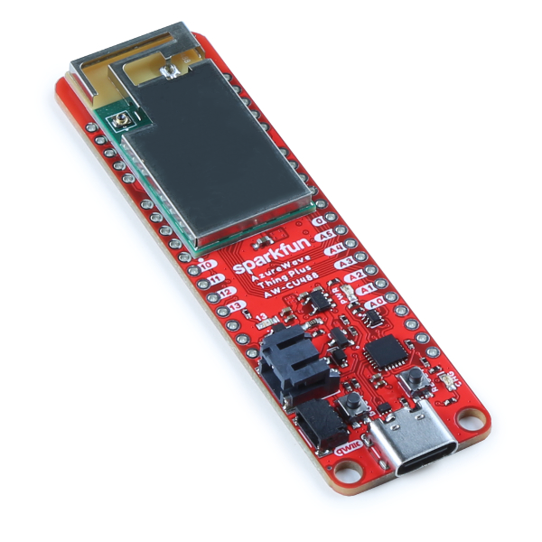
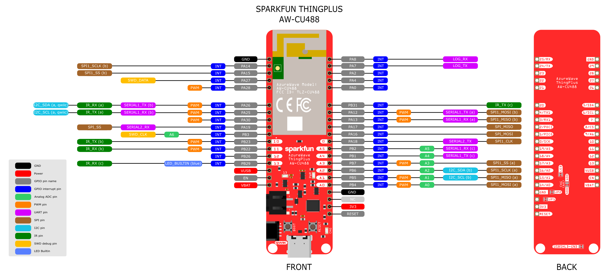
.. |image03| image:: ../../../_static/amebad/Getting_Started/AW-CU488_getting_started/image03.png
   :width:  712 px
   :height:  886 px
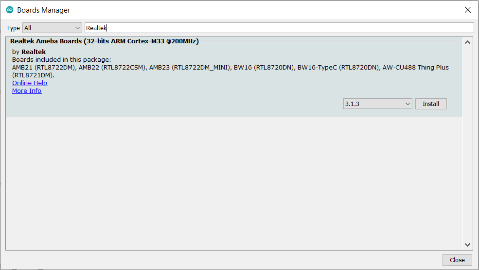
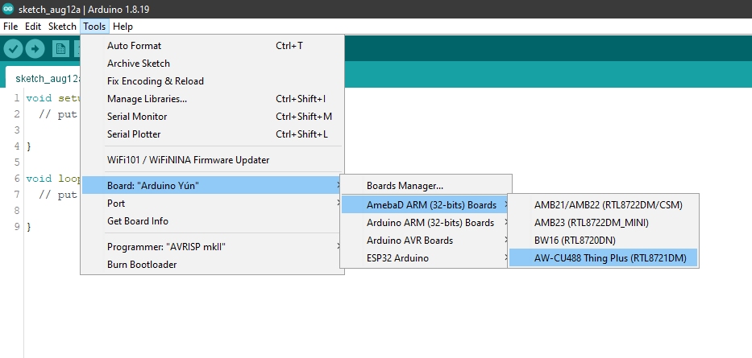
.. |image06| image:: ../../../_static/amebad/Getting_Started/AW-CU488_getting_started/image06.png
   :width:  1526 px
   :height:  1831 px
   :scale: 50%
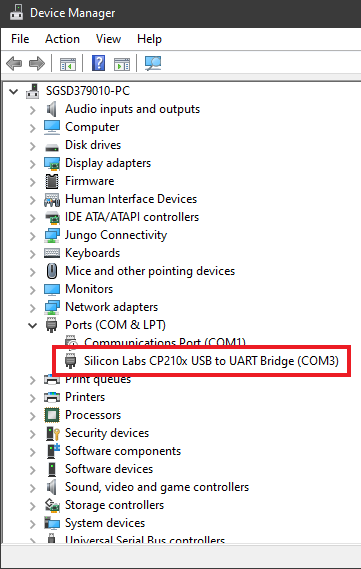
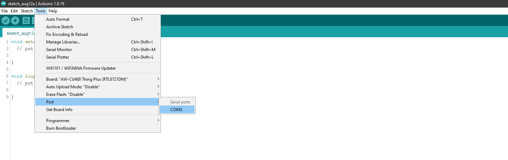
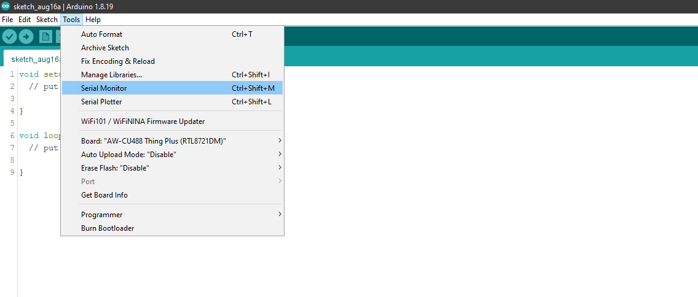
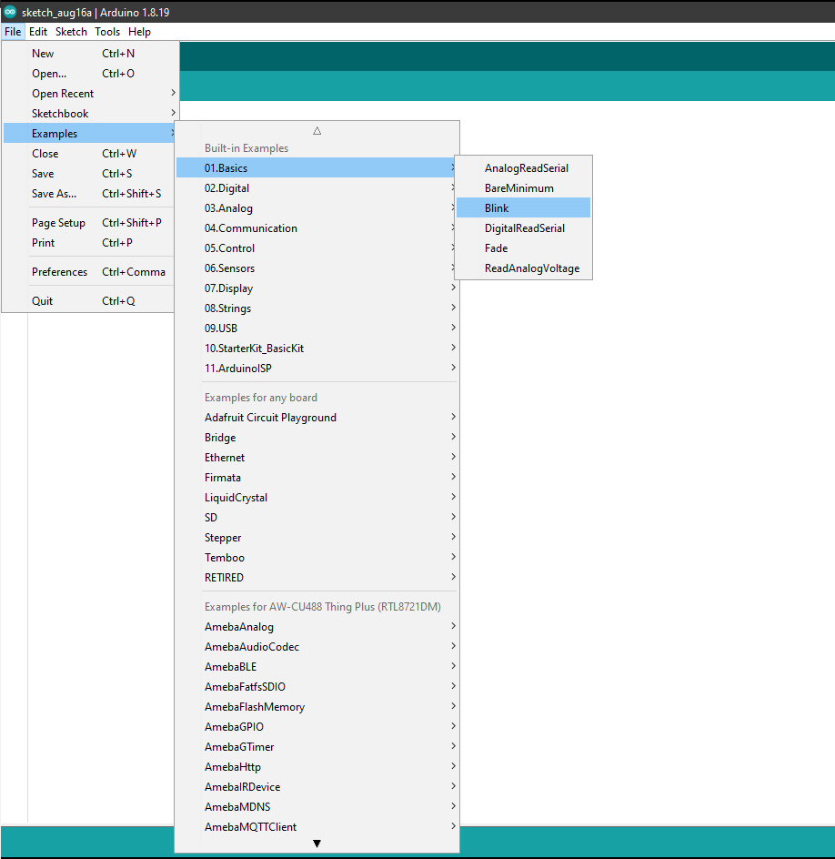
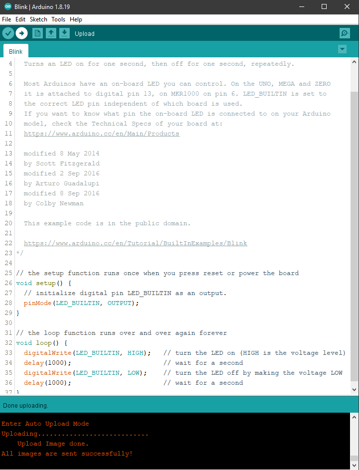
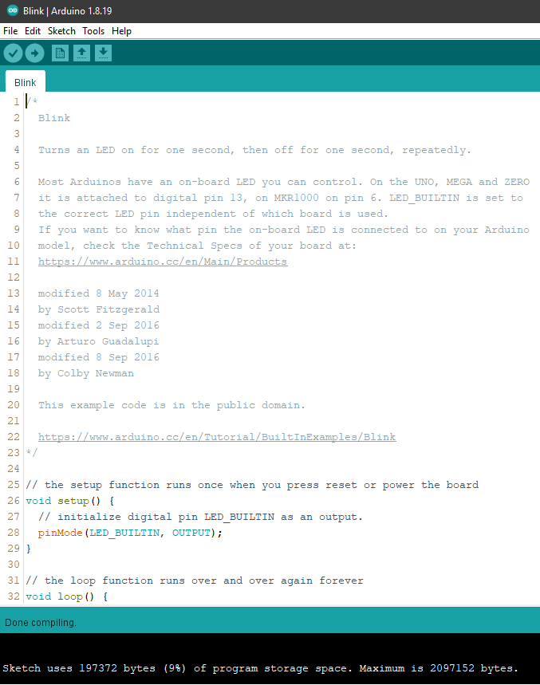
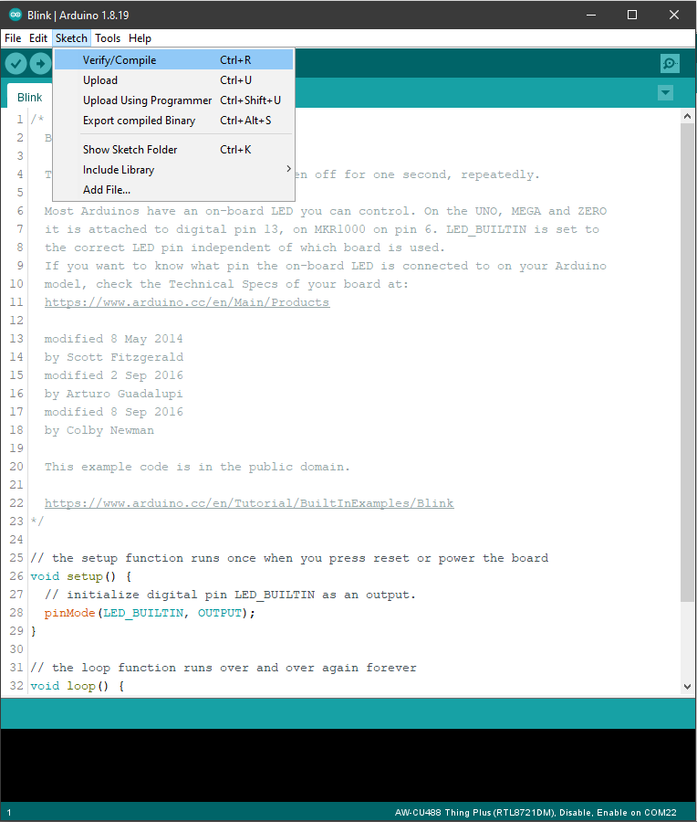
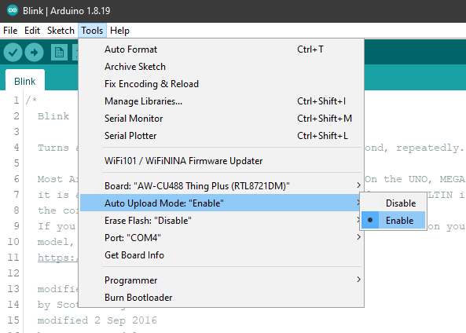
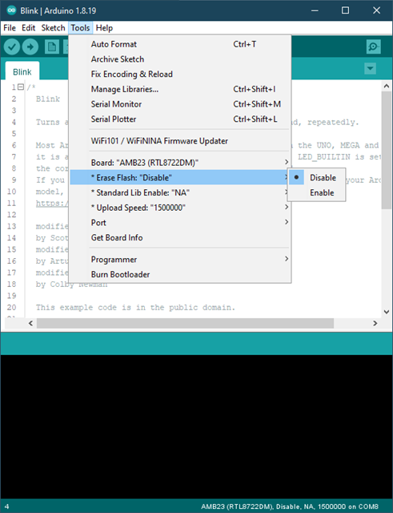
