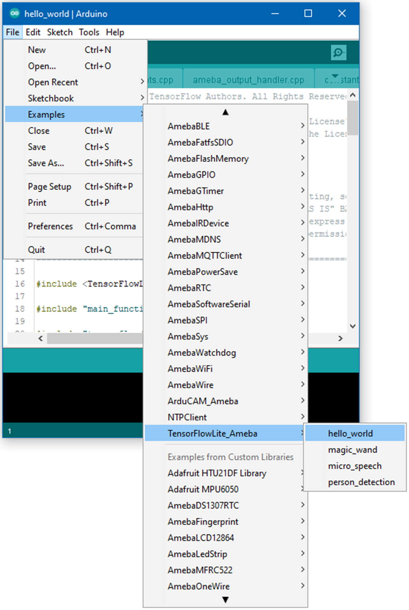

TensorFlow Lite - Hello World
=============================

.. contents::
  :local:
  :depth: 2

Materials
---------

- AmebaD [AMB21 / AMB22 / AMB23 / BW16 / AW-CU488 Thing Plus / AMB25 / AMB26] x 1

- LED x 1

Example
-------

Download the Ameba customized version of TensorFlow Lite for Microcontrollers library at https://github.com/Ameba-AIoT/ameba-arduino-d/blob/master/Arduino_zip_libraries/Ameba_TensorFlowLite.zip.

Follow the instructions at https://docs.arduino.cc/software/ide-v1/tutorials/installing-libraries to install it. 

Ensure that the patch files found at https://github.com/Ameba-AIoT/ameba-arduino-d/tree/master/Ameba_misc/TensorFlowLite_patch are also installed.

Open the example, "Files" → "Examples" → “TensorFlowLite_Ameba” → “hello_world”.

|image01|

| Upload the code and press the reset button on Ameba once the upload is finished.
| Connect the LED to digital pin 10 and ground, ensuring that the polarity is correct. You should see the LED fade in and out rapidly.
| In the Arduino serial plotter, you can see the output value of the Tensorflow model plotted as a graph, it should resemble a sine wave.

|image02|

Code Reference
--------------

More information on TensorFlow Lite for Microcontrollers can be found at: https://www.tensorflow.org/lite/microcontrollers

.. |image02| image:: ../../../../_static/amebad/Example_Guides/TensorFlowLite/TensorFlow_Lite_Hello_World/image02.png
   :width: 1880
   :height: 1349
   :scale: 40 %