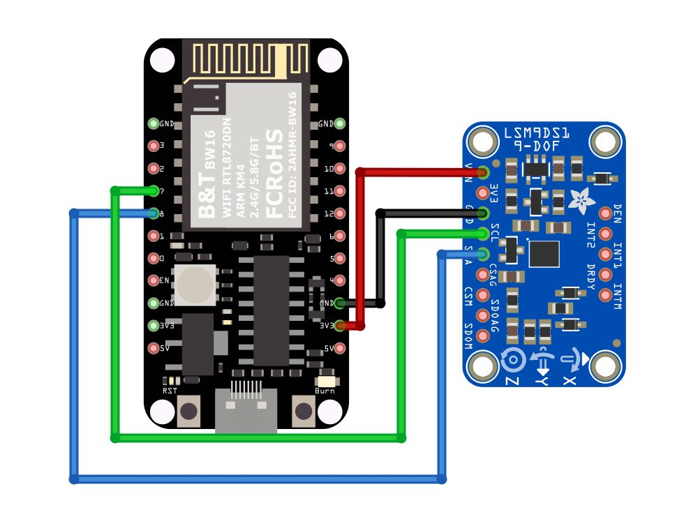
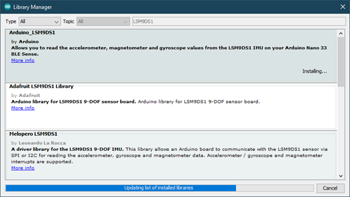
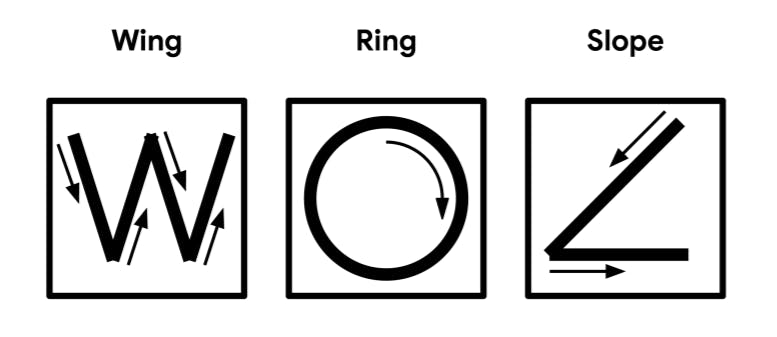

TensorFlow Lite - Magic Wand
============================

.. contents::
  :local:
  :depth: 2

Materials
---------

- AmebaD [AMB21 / AMB22 / AMB23 / BW16 / AW-CU488 Thing Plus / AMB25 / AMB26] x 1

- Adafruit LSM9DS1 accelerometer

- LED x 2

Example
-------

Wiring Diagram:

Connect the accelerometer and LEDs to the BW16 according to the diagram below.

|image04|

In the Arduino IDE library manager, install the Arduino_LSM9DS1 library. This example has been tested with version 1.1.0 of the LSM9DS1 library.

|image08|

Open the example, "Files" → "Examples" → “AmebaTensorFlowLite” → “magic_wand”.
  
|image09|

Enable TensorFlow Lite option. It is set to disable by default.

|image12|

Upload the code and press the reset button on Ameba once the upload is finished.

Holding the accelerometer steady, with the positive x-axis pointing to the right and the positive z-axis pointing upwards, move it following the shapes as shown, moving it in a smooth motion over 1 to 2 seconds, avoiding any sharp movements.
  
|image10|

If the movement is recognised by the Tensorflow Lite model, you should see the same shape output to the Arduino serial monitor. Different LEDs will light up corresponding to different recognized gestures. Note that the wing shape is easy to achieve, while the slope and ring shapes tend to be harder to get right.

|image11|

Code Reference
--------------

More information on TensorFlow Lite for Microcontrollers can be found at: https://www.tensorflow.org/lite/microcontrollers

.. |image09| image:: ../../../../_static/amebad/Example_Guides/TensorFlowLite/TensorFlow_Lite_Magic_Wand/image09.png
   :width: 771
   :height: 1001
   :scale: 100 %

.. |image11| image:: ../../../../_static/amebad/Example_Guides/TensorFlowLite/TensorFlow_Lite_Magic_Wand/image11.png
   :width: 639
   :height: 458
   :scale: 100 %
.. |image12| image:: ../../../../_static/amebad/Example_Guides/TensorFlowLite/TensorFlow_Lite_Magic_Wand/image12.png
   :width: 758
   :height: 562
   :scale: 100 %